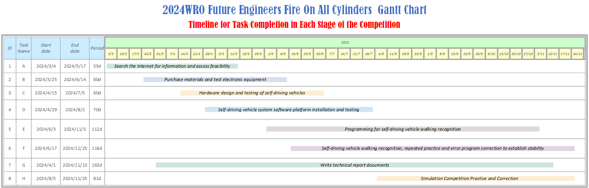

 

- This is the official GitHub repository for the WRO TAIWAN team "__Fire On All Cylinders.__" All code, documentation, and files are located here.
- The design inspiration for both the hardware and software of this self-driving car came from last year’s model created by our sister team (Shinan-Fire-On-All-Cylinders) and drew upon the strengths of the world championship-winning model from last year. Based on this, we made improvements by upgrading the main controller from the "Raspberry Pi 4B" to the "Nvidia Jetson Nano" to enhance performance and introduce innovative design elements, making the vehicle more competitive.
- Here you can find the links to the technical report content and setup instructions, organized separately for learners and judges, for easy access during either learning or assessment. 
- In this technical document, the directory will be established based on the scoring criteria, and the directory headings will be hyperlinked for easy access for judges or learners to navigate to the key content of the technical document, facilitating quick assessment.
- **Special Reminder:** Due to internet speed factors, images may not display properly. If this occurs, please try refreshing the webpage to resolve the issue.
    #### [For Learners](learners_contents.md)
## Rubric for Judging Engineering Documentation 
- ###  ${{\color{red} Hardware Overview }} $ 
  #### 1. Mobility Management
    * [1-1 Vehicle 2D/3D Models in CAD ](models/Vehicle_2D_3D/README.md)
    * [1-2 Vehicle Chassis Design ](schemes/Vehicle_Chassis_Design/README.md)
    * [1-3 Motor Selection ](schemes/Motor/README.md)

    
  #### 2. Power and Sense Management
    - __2-1 Vehicle Design__
      - [2-1-1 BOM Parts List ](schemes/Parts_List/README.md)
      - [2-1-2 Circuit Design ](models/Circuit_Design/README.md)
      - [2-1-3 Hardware Fool-Proof Design ](schemes/Fool-Proof-Design/README.md) 
      - [2-1-4 Assembly Instructions & Wiring Diagrams ](schemes/Assembly_Instructions/README.md)    
      
    - __2-2 Power Management__
      - [2-2-1 Battery choice for self-driving cars ](schemes/Battery/README.md)  
      - [2-2-2 Power Supply System ](schemes/Power_Supply_System/README.md) 
   
    - __2-3 Controller Selection__
      - [2-3-1 Main Controller Comparison ](schemes/Main_Controller_Choosing/README.md)
      - [2-3-2 Motor & Sensor Intermediate I/O Controller Comparison ](schemes/Motor_Sensor_Controller_Choosing/README.md)
    - __2-4 Sense Management__
      - [2-4-1 Ultrasonic rangefinder ](schemes/HC-SR04/README.md)
      - [2-4-2 Gyroscope orientation sensor ](schemes/BNO055/README.md)
      - [2-4-3 Camera Selection ](schemes/Camera/README.md)
  
- ### ${{\color{red} Software Overview }} $ 
  #### 3. Obstacle Management
    - [3-1 Software Platform Construction ](src/System_Platform_Software/README.md)
    - [3-2 OpenCV Introduction ](src/OpenCV/README.md)
    - __3-3 Image Recognition Processing and Steering__
      - [3-3-1 Image Recognition Processing ](src/Image_Recognition_Processing/README.md)  
      - [3-3-2 Steering Control ](src/Steering_Control/README.md) 
      - [3-3-3 Automatically record the HSV values of the field ](src/Automatically_record_HSV/README.md)
    - __3-4 Programming__
      - [3-4-1 Open Challenge Code Overview ](src/Programming/Open_Challenge/README.md)
      - [3-4-2 Obstacle Challenge Code Overview ](src/Programming/Obstacle_Challenge/README.md)
      - [3-4-3 Distinctive Pseudo Code ](src/Distinctive_Pseudo_Code/README.md)
      - [3-4-4 Parking Instruction ](src/parking/README.md)
    - __3-5 Remote Connection__
      - [3-5-1 NoMachine Introduction ](other/NoMachine/README.md)
- ### ${{\color{red} Other}} $
  #### 4. Pictures – Team and Vehicle
    - [4-1 Team Members Introduction ](t-photos/README.md)
    - [4-2 Vehicle Photos ](v-photos/README.md)  
  #### 5. Performance Videos
    - [5-1 Open Challenge ](video/Open_Challenge/video.md)
    - [5-2 Obstacle Challenge ](video/Obstacle_Challenge/video.md)
    - [5-3 Self-Driving Car Design Process Video](video/Design_Process_Video/video.md)
  #### 6. GitHub Utilization
    - [6-1 GitHub Edit(VScode Edit/GIT) ](src/GitHub_Edit/README.md)
    - [6-2 GitHub Web Editing Languages ](src/GitHub_Languages/README.md)  
  #### 7. Engineering Factor  
    - [7-1 Work Diary](other/work_diary/README.md)
- ### ${{\color{red} CompetitionSchedule}} $  
# 

 

