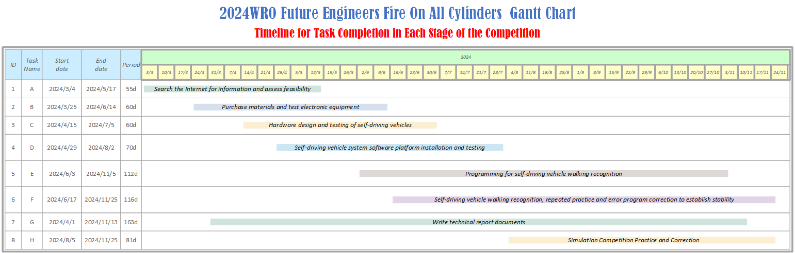

 

## For Learners ## 

- ### Hardware Selection
    - [Main Controller Comparison](./schemes/Main_Controller_Choosing/README.md)
    - [Motor & Sensor Intermediate I/O Controller Comparison](./schemes/Motor_Sensor_Controller_Choosing/README.md)
    - [Moter Selection](./schemes/Motor/README.md)
    - [Ultrasonic rangefinder](./schemes/HC-SR04/README.md)
    - [Gyroscope orientation sensor](./schemes/BNO055/README.md)
    - [Camera Selection](./schemes/Camera/README.md)
    
- ### Vehicle Design
    - [Vehicle 2D/3D Models in CAD](./models/Vehicle_2D_3D/README.md)
    - [BOM Parts List](./schemes/Parts_List/README.md)
    - [Vehicle Chassis Design](./schemes/Vehicle_Chassis_Design/README.md)
    - [Circuit Design](./models/Circuit_Design/README.md)
    - [Hardware Fool-Proof Design](./schemes/Fool-Proof-Design/README.md) 
    - [Assembly Instructions & Wiring Diagrams](./schemes/Assembly_Instructions/README.md)
    - __power Management__
      - [Battery choice for self-driving cars](./schemes/Battery/README.md)
      - [Power Supply System](./schemes/Power_Supply_System/README.md) 
- ### System Initialization
    - [OpenCV Introduction](./src/OpenCV/README.md)
    - [Software Platform Construction](./src/System_Platform_Software/README.md)
- ### Obstacle Management
    - __Image Recognition Processing and Steering__
      - [Image Recognition Processing](./src/Image_Recognition_Processing/README.md)  
      - [Steering Control](./src/Steering_Control/README.md)  
      - [Automatically record the HSV values of the field](src/Automatically_record_HSV/README.md)
    - __Programming__
      - [Open Challenge Code Overview](./src/Programming/Open_Challenge/README.md)
      - [Obstacle Challenge Code Overview](./src/Programming/Obstacle_Challenge/README.md)
      - [Distinctive Pseudo Code](./src/Distinctive_Pseudo_Code/README.md)
      - [Parking Instruction](./src/parking/README.md)
      - [NoMachine Introduction](./other/NoMachine/README.md)
- ### Pictures – Team and vehicle
    - [Team Members Introduction](./t-photos/README.md) 
    - [Vehicle Photos](./v-photos/README.md) 
- ### Performance videos
    - [Open Challenge](./video/Open_Challenge/video.md)
    - [Obstacle Challenge](./video/Obstacle_Challenge/video.md)
    - [Self-Driving Car Design Process Video](./video/Design_Process_Video/video.md)
- ### GitHub Utilization
    - [GitHub Edit(VScode Edit/GIT)](./src/GitHub_Edit/README.md)
    - [GitHub Web Editing Languages](./src/GitHub_Languages/README.md)
- ### Work Dairy
    - [March](./other/work_diary/README.md#20240304--20240310)
    - [April](./other/work_diary/README.md#20240401--20240407)
    - [May](./other/work_diary/README.md#20240429--20240505)
    - [June](./other/work_diary/README.md#20240527--20240602)
    - [July](./other/work_diary/README.md#20240701--20240707)
    - [August](./other/work_diary/README.md#20240729--20240804)
    - [September](./other/work_diary/README.md#20240826--20240901)
    - [October](./other/work_diary/README.md#20240930--20241006)
    - [November](./other/work_diary/README.md#20241028--20241103)
- ### ${{\color{red} Competition Schedule}} $  
# 

 
