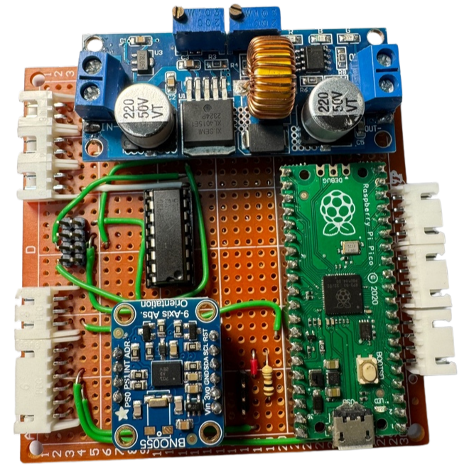
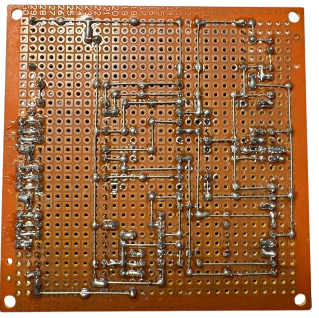
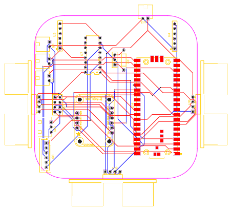
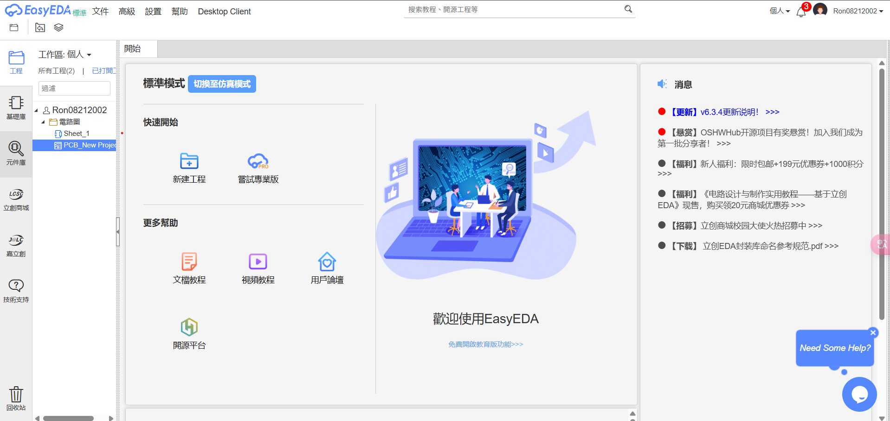
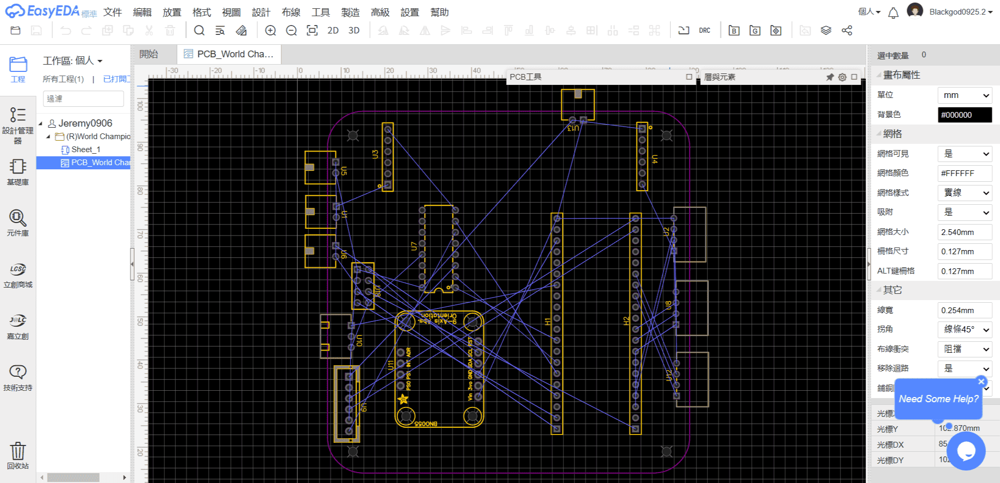

 ## 
 Circuit Design 

  - 在我們自動駕駛車輛的電路板設計中，我們採用EasyEDA這款電路設計軟體，它提供了直觀的圖形化介面。這項工具能顯著提升焊接過程中的佈線準確度，減少錯誤發生，並有效降低元件燒毀的風險。
  - For our autonomous vehicle's circuit board design, we employ EasyEDA, a circuit design software that provides an intuitive graphical interface. This aids significantly in the soldering process by enhancing wiring accuracy, reducing errors, and effectively mitigating the risk of component burnout.
  - 在實驗過程中，我們經常需要修改電路設計。為了便於快速調整與修改，我們採用通用型酚醛電路板，依照電路原理圖進行電子元件的焊接作業。這種實驗方法能為電路優化提供更高的設計彈性與操作便利性。
  - During our experiments, we frequently needed to modify the circuit. To facilitate adjustments and revisions, we used a general-purpose phenolic board to solder electronic components according to the circuit diagram. This approach offers greater flexibility and convenience in circuit improvements.
  - 電路板的主要功能在於為各類感測器、馬達及控制器提供電力與訊號連接，確保這些元件之間能夠實現無縫通訊與協同運作。
  - The primary function of a circuit board is to provide power and signal connections for various sensors, motors, and controllers, ensuring seamless communication and cooperation among them.

 - ### Circuit Board

<table>
  <tr align="center">
      <th> Circuit Board Top View</th><th>Circuit Board Button View</th>
  </tr>
  <tr align="center">
     <td>  </td><td></td>
  </tr>
</table>

- ### Circuit Schematic Drawing

<table>
  <tr align="center">
      <th>電路圖/Circuit Diagram</th><th>PCB佈局圖/PCB Layouts</th><th>原理圖/Circuit Schematic</th>
  </tr>
  <tr align="center">
     <td></td>
     <td></td>
     <td></td>
  </tr>
</table>

 ***
- ### Supplementary Information
 
 - #### EasyEDA Introduction

    __EasyEDA__ is a free online Electronic Design Automation (EDA) software used for designing, simulating electronic circuits, and creating printed circuit boards (PCBs). It offers a simple and user-friendly graphical interface, with a variety of features that make it ideal for both hobbyists and professional engineers.
    - EasyEDA can be used directly in a web browser without the need for software installation, making it cross-platform accessible. It supports circuit design, simulation, PCB creation, and also allows teams to collaborate on electronic projects.

    __The main features of EasyEDA include:__

    __中文__ 
    - 原理圖設計：使用其廣泛的元件庫設計電路圖，其中包括電阻器、電容器、電晶體、積體電路 (IC) 等。原理圖設計：使用其廣泛的元件庫設計電路圖，其中包括電阻器、電容器、電晶體、積體電路 (IC) 等。
    - PCB 設計：支援多層 PCB 設計並提供自動佈線功能，幫助使用者有效率地佈局電路板。
    - 類比：內建的 SPICE 模擬允許使用者在製造之前虛擬測試電路。
    - 元件庫：提供龐大的元件庫，並支援從其他 CAD 工具匯入零件或建立自訂元件。
    - 協作工具：允許使用者與隊友分享設計以進行協同工作。
    - 雲端儲存：設計文件可以保存在雲端，方便從任何地方修改和訪問，並方便與團隊成員的協作。
    - 製造集成：EasyEDA 與 JLCPCB 無縫集成，允許用戶直接提交設計進行生產並輕鬆訂購客製化 PCB。
    __英文__
    - Schematic Design: Design circuit diagrams using its extensive component library, which includes resistors, capacitors, transistors, integrated circuits (ICs), and more.Schematic Design: Design circuit diagrams using its extensive component library, which includes resistors, capacitors, transistors, integrated circuits (ICs), and more.
    - PCB Design: Supports multi-layer PCB design and provides an auto-routing feature to help users efficiently layout their boards.
    - Simulation: Built-in SPICE simulation allows users to virtually test circuits before manufacturing.
    - Component Library: Offers a vast component library and supports importing parts from other CAD tools or creating custom components.
    - Collaboration Tools: Allows users to share designs with teammates for collaborative work.
    - Cloud Storage: Design files can be saved in the cloud, making it easy to modify and access from anywhere, as well as facilitating collaboration with team members.
    - Manufacturing Integration: EasyEDA is seamlessly integrated with JLCPCB, allowing users to directly submit designs for production and easily order custom PCBs.

    __Overall, EasyEDA is a powerful and easy-to-use tool for electronic design. Whether you're a beginner or a professional engineer, it offers features to meet your needs. Its cloud-based accessibility, simple operation, and integration with manufacturers make it an excellent choice for designing and producing electronic circuits.__

    - Software link：[EasyEDA](https://easyeda.com/)
 

    <table>
    <tr>
    <th>EasyEDA 官方網站/EasyEDA of Official website.</th>
    <th>方案設計/Schematic Design</th>
    </tr><tr>
    <td></td>
    <td></td>
    </tr>
    </table>
    

# 
[Return Home](../../)
  