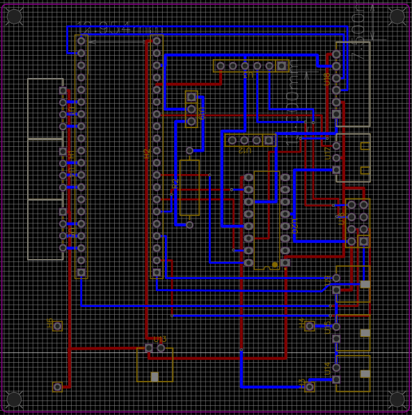

 ## 
 Circuit Design 

  - For our autonomous vehicle's circuit board design, we employ EasyEDA, a circuit design software that provides an intuitive graphical interface. This aids significantly in the soldering process by enhancing wiring accuracy, reducing errors, and effectively mitigating the risk of component burnout.
  - During our experiments, we frequently needed to modify the circuit. To facilitate adjustments and revisions, we used a general-purpose phenolic board to solder electronic components according to the circuit diagram. This approach offers greater flexibility and convenience in circuit improvements.
  - The primary function of a circuit board is to provide power and signal connections for various sensors, motors, and controllers, ensuring seamless communication and cooperation among them.

 - ### Circuit Board

<table>
  <tr align="center">
      <th> Circuit Board Top View</th><th>Circuit Board Button View</th>
  </tr>
  <tr align="center">
     <td>  </td><td></td>
  </tr>
</table>

- ### Circuit Schematic Drawing

<table>
  <tr align="center">
      <th>Circuit Diagram</th><th>PCB Layouts</th><th>Circuit Schematic</th>
  </tr>
  <tr align="center">
     <td></td>
     <td></td>
     <td></td>
  </tr>
</table>

 ***
- ### Supplementary Information
 
 - #### EasyEDA Introduction

    __EasyEDA__ is a free online Electronic Design Automation (EDA) software used for designing, simulating electronic circuits, and creating printed circuit boards (PCBs). It offers a simple and user-friendly graphical interface, with a variety of features that make it ideal for both hobbyists and professional engineers.
    - EasyEDA can be used directly in a web browser without the need for software installation, making it cross-platform accessible. It supports circuit design, simulation, PCB creation, and also allows teams to collaborate on electronic projects.

    __The main features of EasyEDA include:__
    - Schematic Design: Design circuit diagrams using its extensive component library, which includes resistors, capacitors, transistors, integrated circuits (ICs), and more.Schematic Design: Design circuit diagrams using its extensive component library, which includes resistors, capacitors, transistors, integrated circuits (ICs), and more.
    - PCB Design: Supports multi-layer PCB design and provides an auto-routing feature to help users efficiently layout their boards.
    - Simulation: Built-in SPICE simulation allows users to virtually test circuits before manufacturing.
    - Component Library: Offers a vast component library and supports importing parts from other CAD tools or creating custom components.
    - Collaboration Tools: Allows users to share designs with teammates for collaborative work.
    - Cloud Storage: Design files can be saved in the cloud, making it easy to modify and access from anywhere, as well as facilitating collaboration with team members.
    - Manufacturing Integration: EasyEDA is seamlessly integrated with JLCPCB, allowing users to directly submit designs for production and easily order custom PCBs.

    __Overall, EasyEDA is a powerful and easy-to-use tool for electronic design. Whether you're a beginner or a professional engineer, it offers features to meet your needs. Its cloud-based accessibility, simple operation, and integration with manufacturers make it an excellent choice for designing and producing electronic circuits.__

    - Software link：[EasyEDA](https://easyeda.com/)
 

    <table>
    <tr>
    <th>EasyEDA of Official website.</th>
    <th>Schematic Design</th>
    </tr><tr>
    <td></td>
    <td></td>
    </tr>
    </table>
    

# 
[Return Home](../../)
  