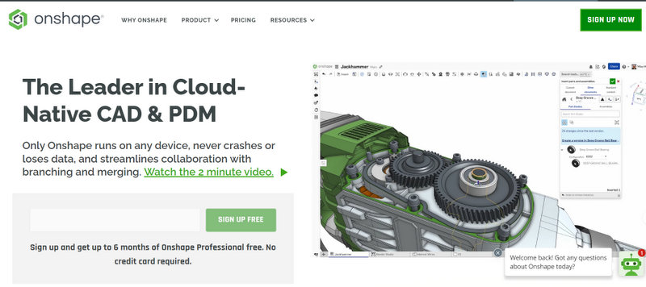
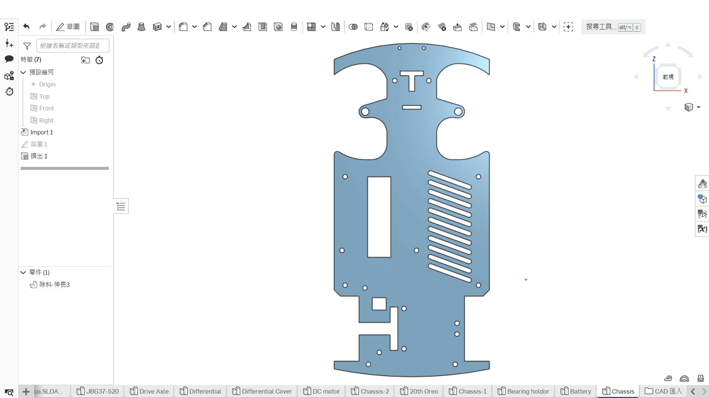

## 
3D Vehicle Model Design

Based on the lessons learned from last year, we upgraded the main controller of the self-driving car from the "Raspberry Pi 4B" to the "Nvidia Jetson Nano" to enhance the speed of obstacle recognition. In addition, we optimized the front steering structure of the vehicle, making the turning operations more flexible and smoother. To better cope with the current competition tasks, we made significant adjustments and improvements to the design and structure of the self-driving car, enhancing overall performance and stability.

The vehicle chassis used in this competition is our in-house, self-developed design. The following will introduce the vehicle chassis design and production process.

We use Onshape to design the 3D model structure of the vehicle, and based on the chassis's characteristics, we manufacture the necessary vehicle parts using equipment such as laser cutting machines and Stereolithography (SLA) 3D Printer.

    <table>
    <tr>
    <th>2023 model using Raspberry Pi </th>
    <th>2024 model using Jetson Nano</th>
    </tr><tr>
    <td></td> 
    <td></td> 
    </tr>
    </table>
 
 

- ### Onshape Model Draft
  - #### 3D modeling software -- Onshape Introduction
    - We use Onshape to design 3D models of self-driving cars. Onshape is a free and easy-to-use web-based CAD software.
    - After creating a model in Onshape, you can output a 2D dimension drawing, which can then be sent to a laser-cutting machine for cutting or converted and sent to a 3D printer for output.
    - All 3D/2D vehicle models created for this competition were designed in OnShape.
    - Software Website：[Onshape](https://www.onshape.com/en/) 
    

    <table>
    <tr>
    <th>Onshape Website </th>
    <th>3D CAD drawing of vehicle chassis components</th>

    </tr><tr>
    <td></td> 
    <td></td> 

    </tr>
    </table>
    
 

  - #### Design and production of 3D/2D models for vehicle parts    
    

    <table>
    <tr>
    <th>3D Vehicle Model </th>
    <th>Vehicle Underfloor</th>
    <th>Vehicle Mid-Deck</th>
    <th>Vehicle Top Deck</th>
    </tr><tr>
    <td></td> 
    <td></td> 
    <td></td> 
    <td></td>
    </tr>
    </table>
    
 
     

    <table>
    <tr>
    <th>3D Vehicle Chassis Design</th>
    <th>3D Vehicle Chassis Models</th>
    </tr><tr>
    <td></td> 
    <td></td> 
    </tr>
    </table>
    
 

  - #### The Production of Vehicle Chassis Panels Introduction - Using a laser-cutting machine
    - A laser-cutting machine is a device that utilizes a laser beam to cut materials. The laser beam has high energy density and can cut a variety of materials, including wood, metal, plastic, paper, and more, quickly and precisely.
    - We use the laser-Cutting machine provided by the school to produce the 'vehicle underfloor,' 'vehicle mid-deck,' and 'vehicle top deck' required for the vehicle chassis. We cut 3mm thick wooden boards according to the self-designed vehicle flat panel dimensions chart.  
    - We use lighter-weight wooden boards as the material for vehicle flat panels to reduce the vehicle's weight. 
    - With the upgrade of the main controller from the "Raspberry Pi 4B" to the "Nvidia Jetson Nano," the structure and dimensions of the vehicle chassis were also adjusted accordingly to better accommodate the needs of the new system.
    - When designing the vehicle structure, we first used 3D modeling software Onshape to create draft designs and generate engineering drawings (DXF files). These drawings were then imported into the laser cutter's editing software (LaserWorkV) for detailed adjustments. Finally, based on the design drafts, we outlined the lines and cut the wooden boards into shape.

 
  - #### Vehicle Chassis Panels Dimensions Chart 
    

    <table>
    <tr>
    <th>Vehicle Underfloor</th> 
    <th>Vehicle Mid-Deck</th>
    <th>Vehicle Top Deck</th>
    </tr><tr>
    <td></td> 
    <td></td> 
    <td></td>
    </tr>
    </table>
    
 

  - #### Vehicle Body Wooden Panels Produced Using a Laser Cutting Machine
     

     <table>
     <tr>
     <th>Vehicle Underfloor</th>
     <th>Vehicle Mid-Deck</th>
     <th>Vehicle Top Deck</th>
     </tr>
     <tr>
     <td></td>
     <td></td>
     <td></td>
     </tr>
     </table>
     

  - ####  Operation of Laser-Cutting Machine
    

 - ###  3D Vehicle Model - Onshape Model Sketch.
     We used Onshape for the design and employed a Stereolithography (SLA) 3D Printer to manufacture the 3D-printed parts for the vehicle chassis needed for this competition. The design and production process is as follows:
    - #### The usage and introduction of Stereolithography (SLA) 3D printers 
      - Stereolithography (SLA) 3D printing technology uses liquid photosensitive resin as the material and forms objects layer by layer through laser curing.  SLA printers excel in producing high-precision parts with complex geometries, making them especially suitable for prototyping and model making where fine details are required.
      - To address the limitations in printing range and quality of last year's SLA 3D printer, we specifically adopted an 8K resolution SLA 3D printer (Phrozen Sonic Mini 8K) and an ultraviolet curing box to enhance print quality and precision.

       - __The usage process of SLA 3D printers typically includes the following steps:__ 
         - __Design and Preparation:__ First, design the 3D model in CAD software and convert it into a printable STL file.
         - __Print Setup:__ Load the STL file into the slicing software of the SLA printer, and set printing parameters such as layer thickness and resin type.
         - __Printing Process:__ The SLA printer uses a laser to cure the resin layer by layer, forming the model. Since each layer is precisely cured by the laser, the printed product has high precision and a smooth surface.
         - __Post-Processing:__ After printing, the finished product is removed from the resin vat, cleaned to remove excess resin, and subjected to secondary curing in a UV curing box to increase hardness and stability.
      
          SLA 3D printers are widely used in industries such as manufacturing, healthcare, jewelry, and industrial design. Due to their high precision and fine surface treatment, they are particularly suitable for producing parts that require high quality and detailed features.

      - #### Comparison between Stacked 3D Printer and  Stereolithography (SLA) 3D Printer
         By conducting practical printing and operation comparisons of the 3D vehicle parts, we have reached the following conclusions:
        

        <table>
        <tr align="center">
        <th rowspan="2">Photo</th>
        <th> Stacked 3D Printe</th>
        <th> Stereolithography (SLA) 3D Printer(Phrozen Sonic Mini 8K)</th>
        </tr><tr align="center">
        <td></td>
        <td></td>
        </tr><tr align="">
        <td>The required printing time</td>
        <td>Faster</td>
        <td>Slower</td>
        </tr><tr>
        <td>Exterior</td>
        <td>Exterior with signs of layering</td>
        <td>Smooth</td>
        </tr><tr>
        <td>Hardness</td>
        <td>Dependent on the density</td>
        <td>Dependent on the exposure time</td>
        </tr>
        </tr><tr>
        <td>Size dimensions.</td>
        <td>Supports larger dimensions but does not support overly small dimensions.</td>
        <td>Supports smaller dimensions.</td>
        </tr>
        </table>
        

     - #### Description of the resin used in "Stereolithography (SLA) 3D Printer."
       The types of resin used in Stereolithography (SLA) 3D printers vary, and different resins offer distinct performance comparisons. Common types of SLA resins include:
        - __Standard resin:__ Suitable for general use, offering good surface finish, but relatively lower strength and durability.
        - __High-strength resin:__ Provides higher tensile strength and rigidity, ideal for parts that need to withstand force.
        - __Flexible resin:__ Has elasticity and flexibility, suitable for parts that require some degree of deformation.
        - __High-temperature resin:__ Excellent heat resistance, suitable for parts that need to operate at high temperatures.
        - __Impact-resistant resin:__ Offers good impact resistance and toughness, ideal for parts that are prone to collisions.

          Each type of resin has different advantages in terms of physical properties, surface quality, strength, and durability, and the choice of resin depends on the specific application requirements.

        During the competition, the vehicle often collided with side walls and obstacles, causing parts like the "Steering shaft holder" and "Cross pin" to break. As a result, we conducted experimental tests with impact-resistant resin and high-strength resin. The tests showed that parts made from impact-resistant resin were too soft to meet the requirements. In the end, we chose to use high-strength resin to manufacture these parts, improving their durability and strength.

    

    <table>
    <tr>
    <th>High-strength resin</th>
    <th>Impact-resistant resin</th>
    <th>Printing completed<th>
    </tr><tr>
    <td></td> 
    <td></td> 
    <td><td>
    </tr>
    </table>
    
 

    - ####  3D Vehicle Model Dimension Diagram
      

      <table>
      <tr>
      <th>Front Assembly</th>
      <th>Steering Knuckle</th>
      <th>Bearing Holder</th>
      <th>Rear differential housing</th>

    </tr><tr>
      <td></td> 
      <td></td> 
      <td></td>
      <td></td>
      </tr>
      </table>
      
 
       

      <table>
      <tr>
      <th>Steering shaft holder</th>
      <th>Cross pin</th>
      <th>Motor Holder</th>
  

    </tr><tr>
      <td></td>
      <td></td>
      <td></td>
      </tr>
      </table>
      
 

  - ####  Vehicle body support components produced with Stereolithography (SLA) 3D Printer
      

      <table>
      <tr>
      <th>Front Assembly</th>
      <th>Steering Knuckle</th>
      <th>Steering shaft holder</th>
      <th>Cross pin</th>
      </tr><tr>
      <td></td> 
      <td></td> 
      <td></td> 
      <td></td>
      </tr>
      </table>
      
 
      

      <table>
      <tr>
      <th>Bearing Holder</th>
      <th colspan="2"> Rear differential housing</th>
      <th>Motor Holder</th>
      </tr><tr>
      <td></td> 
      <td></td>
      <td></td>
      <td></td>
      </tr>
      </table>
      
 

 ***
- ### Supplementary Information
    - __Maintenance Process:__

       Without regular maintenance, a stereolithography 3D printer may become clogged with resin and become unusable, requiring periodic cleaning. So we recorded the cleaning methods we learned from our seniors and started cleaning ourselves.
     
    1. After printing is completed, the object will adhere to the printing platform, so we remove the platform for cleaning.
    2. Place the platform on a rack and put it into the UV curing washing machine.    
    3. Set the time and wait for the washing machine to complete the cleaning. The machine will rotate the alcohol in the washing tank to perform the first cleaning of the platform and the object.
    4. Rinse the alcohol off the finished product with water.
    5. Use a scraper to remove the object from the platform.
    6. Remove the support structures from the edges of the object.
    7. Perform a second cleaning with alcohol to thoroughly clean the resin off the object.
    8. Clean any remaining resin off the platform with alcohol.
    9. Finally, dry the platform and reinstall it back onto the stereolithography 3D printer of machine.

    

    <table>
    <tr>
    <td>Step 1</td>
    <td>Step 2</td> 
    <td>Step 3</td></tr>
    <tr align="center">
    <td></td>
    <td></td> 
    <td></td>
    </tr>
    <td>Step 4</td>
    <td>Step 5</td> 
    <td>Step 6</td></tr>
    <tr align="center">
    <td></td>
    <td></td>
    <td></td>
    </tr>
    <td>Step 7</td>
    <td>Step 8</td>
    <td>Step 9</td></tr>
    <tr>
    <td></td>
    <td></td>
    <td></td>
    </tr>
    </table>
    

   - Since the parts printed by the stereolithography (SLA) 3D printer are relatively soft, we need to place them in an ultraviolet curing box, where they are exposed to UV light for secondary curing. This process hardens the parts and reduces deformation, thereby preventing any negative impact on the vehicle's movement.

   

    <table>
    <tr>
    <th>Ultraviolet curing box</th>
    </tr><tr>
    <td></td>
    </tr>
    </table>
    

   

# 
[Return Home](../../)
  
  
