<div align="center"></div>

# <div align="center">Work Diary</div>

The following is a development record of the self-driving car model design and task-solving, covering mechanical design and manufacturing, circuit design and implementation, electronic device selection, programming and testing, and the overall problem-solving process.
## 2024/03/04 ~ 2024/03/10  

**Member:** HU,SIAN-YI、LAI,MENG-CHENG、HUANG,KE-FU

**Content:**  

My partner, "HU, SIAN-YI," has participated in the Future Engineering Competition multiple times over the past few years, accumulating substantial experience in mechanical design and programming. However, since the competition themes change or introduce new challenges each year, we decided after discussion to use last year's models from our seniors and the design of last year's world champion team as references for this year's competition model.

<div align="center">
<table>
<tr align="center">
<th colspan="2">Last year's senior's model</th>
</tr>
<tr align="center">
<td> </td>
<td></td>
</tr>
<tr align="center">
<th colspan="2">Refer to the seniors GitHub reports(參考學長姐們的Github報告)</th>
</tr>
<tr align="center">
<td> </td>
<td></td>
</tr>
</table>
</div>

## 2024/03/11 ~ 2024/03/17

**Member:** HU,SIAN-YI、LAI,MENG-CHENG、HUANG,KE-FU

**Content:**

- In order to smoothly advance the competition activities while balancing academic work, we have developed a work schedule to ensure the timely completion of each task, as detailed in the diagram below.
- We first familiarized ourselves with the model designed by our seniors and attempted to get the vehicle running smoothly. However, we found that there were still some technical details we were unfamiliar with, such as the calibration and use of LiDAR sensors, installation of the Raspberry Pi controller, and programming, which led to the self-driving car not yet operating successfully.

  **Completion Time Planning Table for Each Stage of the Competition Activities (Gantt Chart)**

<div align="center" >
  
</div>

### Writing the program and adjusting the machine

<div align="center" >
<table >
<tr align="center">
<th>Writing the program</th>
<th>Adjusting the machine</th>
<tr align="center">
<td>
</td>
<td>
</td>
</tr>
</table>
</div>

## 2024/03/18 ~ 2024/03/24

**Member:** HU,SIAN-YI、LAI,MENG-CHENG、HUANG,KE-FU  

**Content:**  

#### Raspberry pi 4

- We began writing the code for the qualifying round, and with the assistance of our seniors, our progress accelerated significantly, allowing us to successfully complete the coding for the qualifying round.
- We started writing the obstacle avoidance program for the task competition and practiced techniques for adjusting the camera. Since the accuracy of the camera may shift after a few days, which can easily lead to misdetections, we placed particular emphasis on practicing adjustments in this area.

#### Practice situation

<div align="center" >
<table >
<tr align="center">
<th>Adjust the camera</th>
<th>Write the program</th>
<tr align="center">
<td>
</td>
<td>
</td>
</tr>
</table>
</div>


## 2024/03/25 ~ 2024/03/31  

**Member:** HU,SIAN-YI、LAI,MENG-CHENG、HUANG,KE-FU

**Content:** 

- Since the model designed by our seniors used radar, we discovered during testing that the radar data was unstable, and we also faced challenges with camera control. Even after camera calibration, errors still existed. Therefore, we plan to redesign a new machine. To be prudent, we decided to continue developing and refining the Raspberry Pi system while designing the new machine, to ensure that we still have a reliable self-driving car available for the competition.
- After discovering issues with the Raspberry Pi system, we referred to the self-driving car used by the previous competition's champion, which utilized the Jetson Nano as the main controller. This significantly improved the efficiency of visual recognition and reduced reliance on less stable sensors such as LiDAR and color sensors. Therefore, we plan to use the Jetson Nano as the main controller to design a brand-new self-driving car.
- Currently, the self-driving car using the Raspberry Pi system is still being revised by MENG-CHENG, while the development of the new self-driving car is being designed and built by the experienced partners SIAN-YI and KE-FU.

  <div align=center>
  <table>
  <tr>
  <th rowspan="2" width=300>Photo</th>
  <th>Nvidia Jetson Nano</th>
  <th>Raspberry Pi 4B</th>
  </tr><tr>
  <td><div align=center></td>
  <td><div align=center></td>
  </tr><tr>
  <th>Number of Pins</th>
  <td>40P</td>
  <td>40P</td>
  </tr><tr>
  <th>CPU</th>
  <td>Quad-core ARM® Cortex®-A57 MPCore</td>
  <td>1.5GHz 64-bit Quad-core ARM Cortex-A72 CPU</td>
  </tr><tr>
  <th>GPU</th>
  <td>NVIDIA Maxwell™ architecture with 128 NVIDIA CUDA®  cores</td>
  <td>Broadcom VideoCore VI<br> H.265 (4kp60 decode)<br> H264 (1080p60 decode, 1080p30 encode) OpenGL ES 3.1<br> Vulkan 1.0</td>
  </tr><tr>
  <th>Storage Spac</th>
  <td>4 GB 64-bit LPDDR4</td>
  <td>8GB LPDDR4-3200 SDRAM</td>
  </tr><tr>
  <th>Built-in Bluetooth and Wireless WiFi Connectivity</th>
  <td>Requires external Bluetooth and wireless WiFi connectivity</td>
  <td>Built-in</td>
  </tr><tr>
  <th>Gflops</th>
  <td>472</td>
  <td>13.5</td>
  </tr><tr>
  <th>Price</th>
  <td>Expensive</td>
  <td>Cheap</td>  
  </tr>
  </table>
  </div>

- **Supplementary Information**

  **Aspects of deep learning acceleration**
   - Jetson Nano: Supports NVIDIA CUDA and cuDNN, which can accelerate deep learning workloads. For tasks like image classification and object detection, the GPU in Jetson Nano significantly enhances processing speed.
   - Raspberry Pi 4: Lacks a dedicated GPU and deep learning acceleration capabilities; image recognition tasks rely entirely on CPU processing, which is far less efficient than the GPU acceleration of Jetson Nano.

## 2024/04/01 ~ 2024/04/07

**Member:** HU,SIAN-YI、LAI,MENG-CHENG、HUANG,KE-FU

**Content:**

- We decided to conduct tests separately, with one team continuing to test and refine the Raspberry Pi 4B, while the other began studying the Nvidia Jetson Nano.
- We started researching the Jetson Nano and began setting up its system environment.
- We documented the system installation process in <a href="../../src/System_Platform_Software/README.md">3-1 Software Platform Construction</a>.
<div align="center" >
<table >
<tr align="center">
<th>Jetson nano environment setup</th>
<tr align="center">
<td></td>
</tr>
</table>
</div>

## 2024/04/08 ~ 2024/04/14

**Member:** HU,SIAN-YI、LAI,MENG-CHENG、HUANG,KE-FU  

**Content:**  
- After reviewing the I/O control aspects of the Jetson Nano, we identified the following drawbacks:

  - Processing Limitations: While the Jetson Nano excels in handling AI and machine learning tasks, its CPU is relatively limited and may face performance bottlenecks when performing extensive I/O control tasks, especially when handling complex computations and I/O operations simultaneously.
  - GPIO Latency: Compared to dedicated microcontrollers (such as Arduino, ESP32, etc.), the Jetson Nano may have higher latency when using Python or other high-level languages for GPIO control, which affects applications requiring high real-time performance.
  - Limited Hardware Interfaces: The number of GPIO pins provided by the Jetson Nano is relatively limited. If a large number of I/O interfaces are needed, expansion boards may be required, increasing development costs and complexity.
  - Software Driver Support Issues: Certain I/O devices may not be fully supported by the Jetson Nano’s drivers or may require additional development and debugging to communicate properly with specific peripherals.
  - Voltage Incompatibility: The GPIO on the Jetson Nano typically operates at 3.3V, which can be incompatible with some 5V I/O devices, necessitating the use of voltage converters for level matching.
- Due to the Jetson Nano's inability to handle too many sensors simultaneously, we need to use additional microcontrollers as extension boards to facilitate more efficient signal communication between the sensors and the Jetson Nano main controller.
- The Raspberry Pi Pico and ESP32 WiFi, two commonly used microcontroller boards in Taiwan, are well-equipped to handle sensor data and motor control tasks.
- To facilitate the selection of the optimal intermediate I/O controller for our autonomous vehicle, we will conduct a comparative analysis of the specifications and costs of these two options.
- The Raspberry Pi Pico  offers simplicity, low power consumption, and affordability, making it ideal for applications with low wireless demands. It also aligns well with the requirements of this competition. Therefore, we have chosen the Raspberry Pi Pico as a relay management controller for the Nvidia Jetson Nano, responsible for managing motors and sensors.


<div align=center>
<table>
<tr>
<th rowspan="2" width=300>Photo</th>
<th>Raspberry Pi Pico</th>
<th>Esp32 wifi</th>
</tr><tr>
<td><div align=center>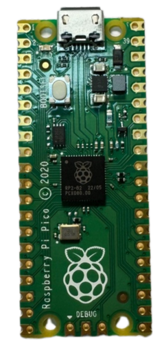</td>
<td><div align=center></td>
</tr><tr>
<th>CPU</th>
<td>Dual-core ARM Cortex-M0+ @ 133 MHz</td>
<td>Dual-core Xtensa LX6 @ 160/240 MHz</td>
</tr>
<tr>
<th>RAM</th>
<td>264 KB SRAM</td>
<td>520 KB SRAM</td>
</tr>
<tr>
<th>WIFI</th>
<td>None</td>
<td>Wi-Fi 802.11b/g/n (2.4 GHz), Bluetooth (v4.2)</td>
</tr>
<tr>
<th>Storage</th>
<td>2 MB Flash</td>
<td>Supports external Flash (typically 4 MB to 16 MB)</td>
</tr>
<tr>
<th>GPIO</th>
<td>26 GPIO pins</td>
<td>34 GPIO pins</td>
</tr>
<tr>
<th>ADC</th>
<td>3-channel ADC (12-bit).</td>
<td>18-channel ADC (12-bit).</td>
</tr>
<tr>
<th>PWM</th>
<td>Configurable PWM output.</td>
<td>Supports multi-channel PWM</td>
</tr>
<tr>
<th>Data transmission interface</th>
<td>I2C, SPI, UART</td>
<td>I2C, SPI, UART, CAN, I2S</td>
</tr>
<tr>
<th>Voltage input</th>
<td>1.8V - 5.5V</td>
<td>2.2V - 3.6V</td>
</tr>
<tr>
<th>size</th>
<td>51 x 21 mm</td>
<td>18 x 25 mm</td>
</tr>
<tr>
<th>Price</th>
<td>cheap</td>
<td>Relatively expensive</td>
</tr>
<tr>
<th>Development environment</th>
<td>MicroPython、C/C++</td>
<td>Arduino IDE、MicroPython、ESP-IDF</td>
</tr>
</tbody>
</table>
</div>


## 2024/04/15 ~ 2024/04/21  

**Member:** HU,SIAN-YI、LAI,MENG-CHENG、HUANG,KE-FU  

**Content:**  

#### Raspberry pi 4

- We began adjusting the Raspberry Pi program for the final round of the obstacle-avoidance task. The first step is to fine-tune the P value for obstacle avoidance to optimize the control response. Once the machine operates stably, we will further adjust the lines on the camera display, fine-tuning the vehicle's response to the x-axis of the blocks. This will enhance the overall obstacle avoidance performance. These steps will progressively improve the system's stability and accuracy, ensuring the successful completion of the obstacle-avoidance task.

#### Jetson nano

- Since we are using the Jetson Nano as the main controller and retaining the Ackermann mechanism components from the Raspberry Pi version of the self-driving car, we need to design a new vehicle chassis to meet our requirements. We used Onshape to draw the chassis sketch and attempted to cut the wooden board using a laser cutter, initiating the assembly process.
- For detailed information about the chassis construction process, please refer to <a href="../../models/Vehicle_2D_3D/README.md"> 1-1 Vehicle 2D/3D Models in CAD</a>.
- We ordered various sensor components online to be used with the Jetson Nano (such as a gyroscope and camera module), a 12V to 5V buck converter, motor driver board, motors, and a microcontroller board (Raspberry Pi Pico) to support the design and development of the vehicle.

<div align="center" width=100%>
<table >
<tr align="center">
  <th>Program adjustments</th>
  <th>board</th>
  <th>onshape <a href="https://www.onshape.com/en/" target="_blank">website</a></th>
  </tr>
<tr align="center">
  <td>  </td>
  <td>  </td>
  <td>
  </td>
  </tr>
</table>
</div>
 
## 2024/04/22 ~ 2024/04/28 

**Member:** HU,SIAN-YI、LAI,MENG-CHENG、HUANG,KE-FU  
**Content:**  

#### Raspberry pi 4

- This week, we have nearly finished adjusting the Raspberry Pi's obstacle-avoidance program. However, we noticed that during turns, the machine would often collide with nearby blocks. After identifying the issue, we first checked whether other blocks were in the line of sight, but no blocks were detected. Despite this, the problem persisted, so we shifted our focus to the timing of the turns. Eventually, we decided to have the machine travel a little further before making a turn. This adjustment successfully resolved the issue and prevented the machine from colliding with the nearby blocks.

<div align="center" width=100%>
<table >
<tr align="center">
  <th>Colliding with blocks</th>
  </tr>
<tr align="center">
  <td>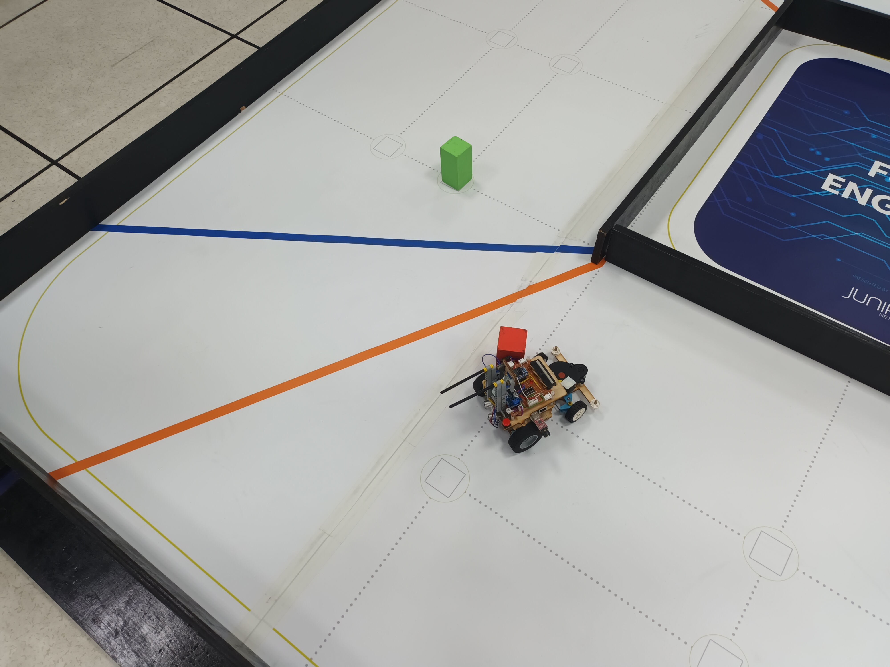  </td>
  </td>
  </tr>
</table>
</div>

#### Jetson nano

- We purchased DC motors with model numbers JGB37-520, MG513-P20, and MG513-P30 online to be used as the vehicle's rear-drive motors, and conducted actual tests on their rotational speed and torque.
- Through experiments, we learned that the speed and torque of the MG513-P30 (366 rpm/1 kg.cm) are more suitable for use as the rear-drive DC motor for this competition vehicle.
- When testing the motor operation, simply providing positive and negative terminals cannot effectively control the DC motor's movement or adjust its speed. Therefore, a motor controller is required to implement speed regulation. We have two options: the L293D chip, the L298N module, and the TB6612FNG. To reduce weight, we chose the smaller L293D chip. Its compact size allows us to install more sensors, save space, reduce weight, and enhance the robot's maneuverability.

### Rear-Drive DC Motor

<div align="center">
<table>
<tr ><th colspan="4">DC Motor Comparison</th></tr>
<tr align="center">
<th rowspan="2" >Model</th>
<th >MG513-P20</th>
<th >MG513-P30</th>
<th >JGB37-520</th>
</tr>
<tr align="center">
<td colspan="2"></td>
<td ></td>
</tr>
<tr align="center">
<td >Reduction ratio</td> 
<td >20</td>
<td >30</td>
<td >19</td>
</tr>
<tr align="center">
<td >Speed</td> 
<td >549rpm</td>
<td >366rpm</td>
<td >530rpm</td>
</tr>
<tr align="center">
<td>Torque</td>
<td>0.66kg.cm</td>
<td>1kg.cm</td>
<td>2.2kg.cm</td>
</tr>
</table>
</div>

### Motor Drive Controller

<div align="center">
<table>
<tr><th colspan="4">Motor Control Comparison</th></tr>
<tr align="center" >
<th rowspan="2">Model</th>
<th>L293D</th>
<th>L298N</th>
<th>TB6612FNG</th>
</tr>
<tr align="center">
<td> 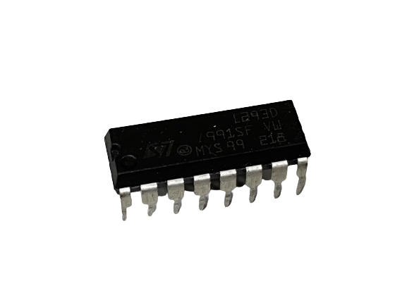</td>
<td ></td>
<td ></td>
</tr>
<tr align="center">
<td>Occupied Area(mm)</td>
<td>29.5x8</td>
<td>43.5x43.5</td>
<td>20.5x20.4</td>
</tr>
<tr align="center">
<td>Output Voltage</td>
<td>4.5V to 36V</td>
<td>5V to 46V</td>
<td>2.5V to 13.5V</td>
</tr>
<tr align="center">
<td>Rated Power </td>
<td>5W</td>
<td>10W</td>
<td>1.36W</td>
</tr>
</table>
</div>


## 2024/04/29 ~ 2024/05/05

**Member:** HU,SIAN-YI、LAI,MENG-CHENG、HUANG,KE-FU

**Content:**  

#### Raspberry pi 4

- When the vehicle was operating, we found that it often misidentified pink and orange as red. Initially, we tried to solve this issue by adjusting the HSV values, but even after making adjustments, we were still unable to effectively filter out these two colors. Therefore, we decided to change the color recording method and switched to using YCrCb color space. This change allowed us to more accurately identify and filter out pink and orange, improving the accuracy of color recognition.

- [References YCrCb and RGB Color Models](https://www.fuji.com.tw/posts/4934#google_vignette)

<div align="center" width=100%>
<table >
<tr align="center">
  <th>Adjusting YCrCb</th>
  </tr>
<tr align="center">
  <td>  </td>
  </td>
  </tr>
</table>
</div>


#### Jetson nano

- Since the vehicle needs to operate for long periods, we chose battery power. Considering that the motor requires a 12V voltage, we decided to use a 12V, 3A battery. We had two options: lithium-ion batteries (18650) and lithium polymer batteries (3S). However, since the 18650 battery is heavier and occupies more space, we chose the lithium polymer battery.

- The Jetson Nano supports a maximum voltage of only 5V, so we needed to use a buck converter to step down the voltage to protect the device. Initially, we planned to use the LM2596 DC-DC adjustable buck converter because it has a voltage display function. However, since its maximum supported current is only 3A, we opted for a constant voltage and constant current buck converter (ADIO-DC36V5A) that supports up to 5A. Although this module does not have a voltage display, we will install a low-voltage alarm to monitor the battery voltage and ensure it remains within a safe range.


### Comparison between 3S Li-Polymer and 18650 Li-ion batteries

<div align="center" width=100%>
<table >
<tr>
  <th> 18650 lithium batteries </th> <th>Li-Polymer 3S Battery 
  </th>
</tr>
<tr>
  <td>
  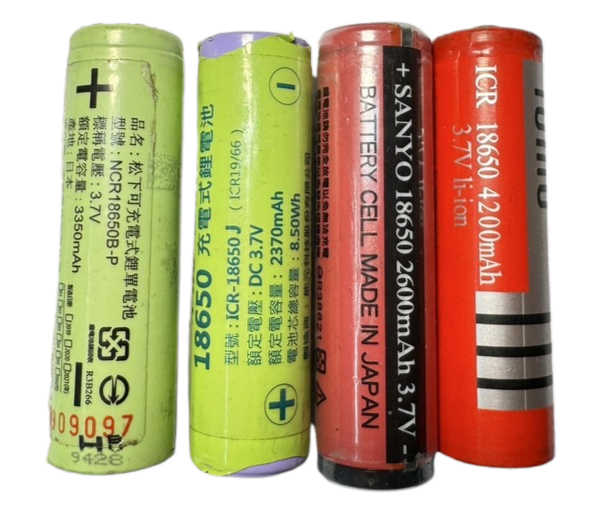 </td>
  <td>
  
  </td>
</tr>
</table>
</div>

### Step-Down power supply Module Selection

<div align="center" width=100%>
<table >
<tr align="center">
  <th> 	LM2596 DC-DC Adjustable Buck Module LM2596 DC-DC </th>
  <th>5A Constant Voltage Constant Current Buck Power Supply Module ADIO-DC36V5A</th>
</tr>
<tr align="center">
  <td>    </td>
  <td>
  </td>
  </tr>
</table>
</div>

### Low Voltage Alarm

<div align="center" width=100%>
<table >
<tr align="center">
  <th> Low Voltage Alarm</th>
</tr>
<tr align="center">
  <td>  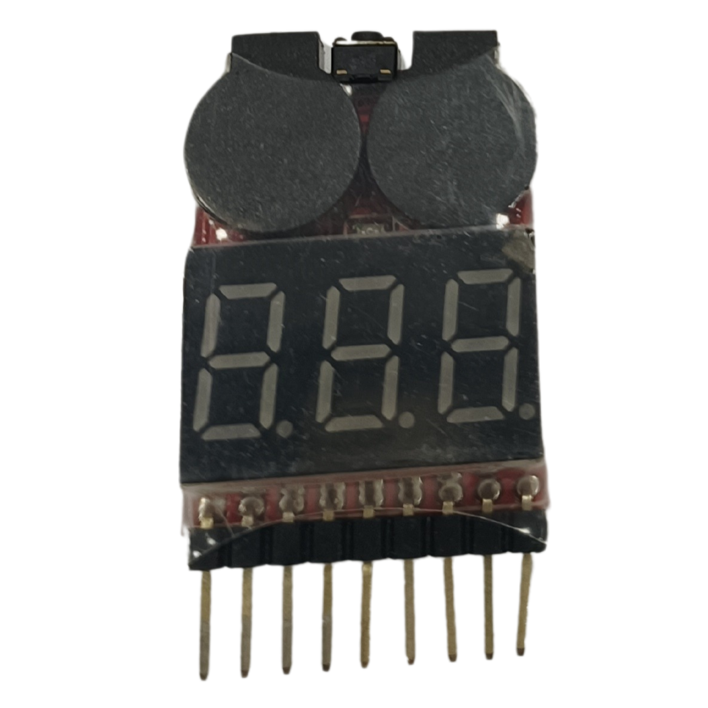  </td>

  </tr>
</table>
</div>

- We chose a lithium polymer battery (3S) as the power source for the vehicle, but an accidental charging error led to a fire and damage to the tabletop. Therefore, we must be extremely careful and cautious when using the lithium polymer battery (3S).
  <div align=center>
  <table>
  <tr>
  <th>Photo of 3S Li-Polymer (LiPo) battery burnout during charging.</th>
  </tr><tr>
  <td></td>
  </tr>
  </table>
  </div>

## 2024/05/06 ~ 2024/05/12

**Member:** HU,SIAN-YI、LAI,MENG-CHENG、HUANG,KE-FU  

**Content:**  

#### Raspberry pi 4

- The evasion issues for the Open Challenge and traffic signal blocks have been resolved. Next, we will start writing the parking action program. We plan to use LiDAR to detect walls in front of the vehicle, and when the distance is less than 50 cm, the vehicle will begin to turn. As for accurately determining the location of the parking area, it remains a challenge. We are continuing to work on solving this problem, with the goal of accurately determining whether the vehicle has entered the parking area and successfully completed the parking maneuver.

<div align="center" width=100%>
<table >
<tr align="center">
  <th>Move forward until the wall is detected</th>
  </tr>
<tr align="center">
  <td>  </td>
  </td>
  </tr>
</table>
</div>

#### Jetson nano

- Next, we selected the servo motor for the front wheel steering mechanism. After researching online, we found that the MG90S and SG90 are common choices. The main difference between the two is the material of the gears; the MG90S uses metal gears, while the SG90 has plastic gears. Considering that our design requires the motor to perform frequent and continuous rotations, we chose the more durable MG90S to reduce the risk of damage.

##### Front Steering Mechanism by Servo Motor

<div align="center">
<table>
<tr align="center">
<th rowspan="2">Model</th>
<th> MG90S</th>
<th >SG90</th>
</tr>
<tr align="center">
<td></td>
<td > </td>
</tr>
<tr align="center">
<td>Rotation angle</td>
<td>90° MAX</td>
<td>360° MAX</td>
</tr>
<tr align="center">
<td>Torque</td>
<td>2.0kg/cm</td>
<td>1.4 kg/cm</td>
</tr>
<tr align="center">
<td>Speed</td>
<td>0.11s</td>
<td>0.1S</td>
</tr>
</table>
</div>

## 2024/05/13 ~ 2024/05/19

**Member:** HU,SIAN-YI、LAI,MENG-CHENG、HUANG,KE-FU  

**Content:**

#### Raspberry pi 4

- This week, we confirmed the national competition rules, determining that the parking zones are located on both sides of the starting area. Although we have a general idea of where the parking zone is, determining whether the parking zone is in the front or rear section after the vehicle enters the end zone remains a challenge. Currently, our preliminary approach is to use infrared sensors to detect the side walls of the parking zone, helping to identify the vehicle's position and determine the specific section of the parking zone.
  <div align="center" width=100%>
  <table >
  <tr align="center">
  <td colspan="2">Infrared Sensor Placement Diagram for Vehicle Position</td>
  </tr>
  <tr>
    <td></td>
    <td></td>
    </tr>
  </table>
  </div>


#### Jetson nano

- Through experiments, we found that the LiDAR sensor was not easy to control, so we decided to try using an ultrasonic module (HC-SR04) as a replacement for the LiDAR sensor's functionality.
- Based on this, we decided to use the ultrasonic module (HC-SR04) to complete this year's new task (parking into a parking lot). We plan to install the ultrasonic module on both sides and the rear of the vehicle to detect the parking lot's side walls, avoiding collisions with the walls. Once the parking space is detected, the vehicle will reverse and park smoothly into the space.

##### HC-SR04 ultrasonic distance sensor

<div align="center" width=100%>
<table >
<tr align="center">
<th colspan="3">HC-SR04 Ultrasonic Distance Sensor Placement Diagram on Vehicle</th>
</tr>
<tr align="center">
  <th>Left</th>
  <th>Right</th>
  <th>Right</th>
  </tr>
<tr>
  <td></td>
  <td>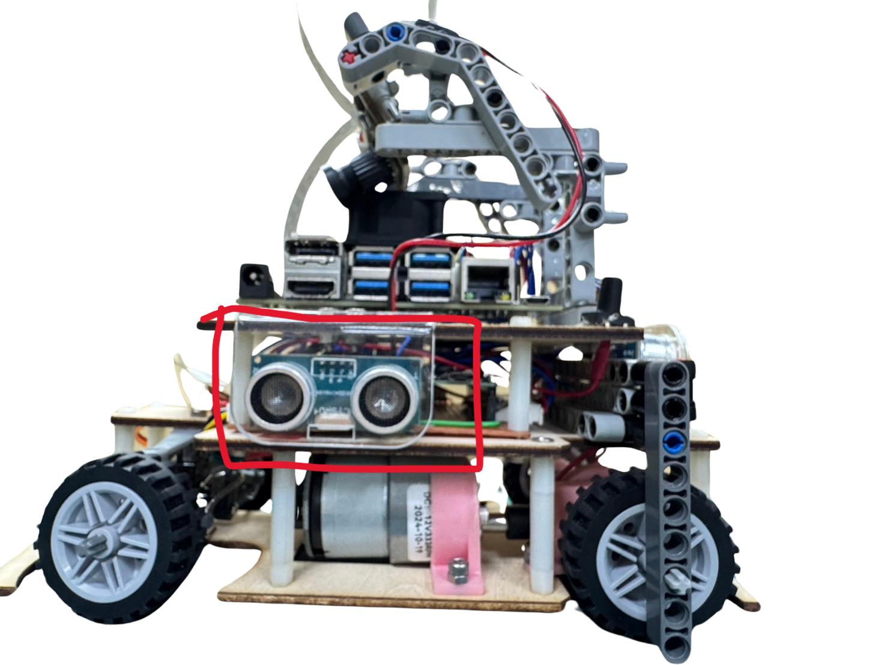</td>
  <td>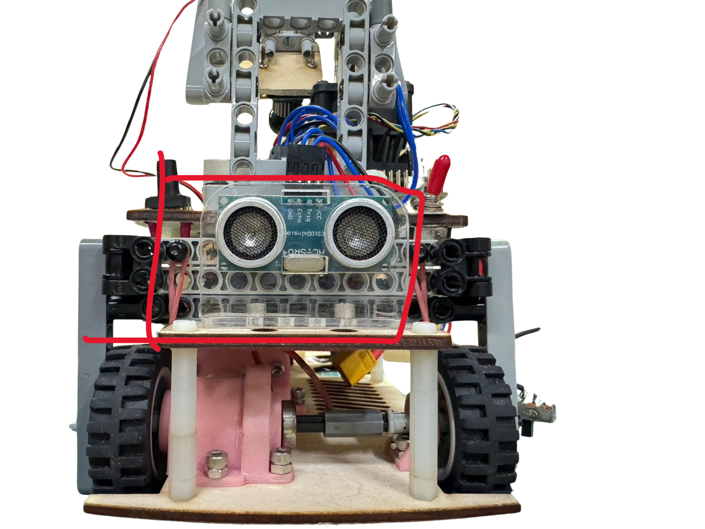</td>
  </tr>
</table>
</div>

## 2024/05/20 ~ 2024/05/26

**Member:** HU,SIAN-YI、LAI,MENG-CHENG、HUANG,KE-FU  

**Content:**  

#### Raspberry pi 4

- This week, we revisited the plan of using infrared sensors. We found that for the infrared sensors to detect the side walls, the vehicle needs to be very close to the walls, which would make the vehicle's width larger. However, an overly wide vehicle could cause it to collide with traffic sign blocks during the task competition. Taking this into consideration, we ultimately decided to abandon the use of infrared sensors.

#### Jetson nano

- This week, due to the change to using the MG513-P30 DC motor for the rear drive and modifications to the Ackermann steering components and bearing mounting brackets in the front steering mechanism, we used Onshape to redraw the revised part models. We then used an SLA (stereolithography) 3D printer to print these components to ensure precise dimensions and high quality.
- After printing, we needed to use a UV curing and cleaning machine to thoroughly remove any residual material, ensuring the parts were clean and ready for assembly.
- During the assembly process, we found that the photopolymer components were relatively brittle and prone to deformation. To address this issue, we performed a secondary UV curing, which effectively reduced deformation and improved the durability of these critical parts.

- ##### Onshape Model Draft

<div align="center" width=100%>
<table >
<tr align="center">
<td>Draw parts</td>
<td>Onshape Model Draft</td>
<td>onshape 3D model CAD</td>
</tr>
<tr>
  <td></td>
  <td></td>
  <td>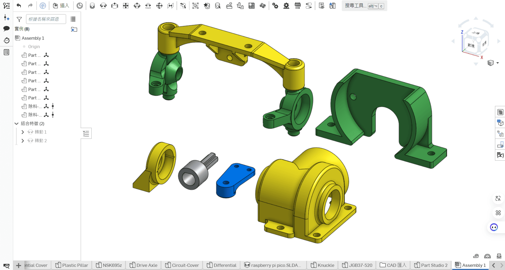</td>
  </tr>
</table>
</div>
- The stereolithography (SLA) 3D printer requires regular cleaning after use. Therefore, we documented the cleaning methods learned from our predecessors and began performing our own cleaning tasks. Detailed instructions for cleaning and maintenance have been recorded in <a href="../../models/Vehicle_2D_3D/README.md#supplementary-information" target="_blank">1-1 Vehicle 2D/3D Models in CAD</a>.
  

  - #####  Vehicle body support components produced with Stereolithography (SLA) 3D Printer
      <div align=center>
      <table>
      <tr>
      <th>Front Assembly</th>
      <th>Steering Knuckle</th>
      <th>Steering shaft holder</th>
      <th>Cross pin</th>
      </tr><tr>
      <td></td> 
      <td>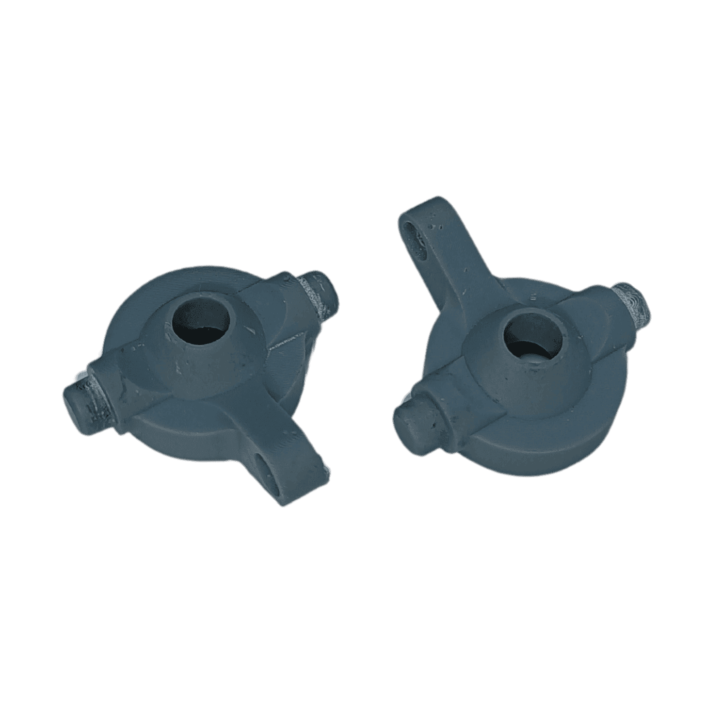</td> 
      <td></td> 
      <td>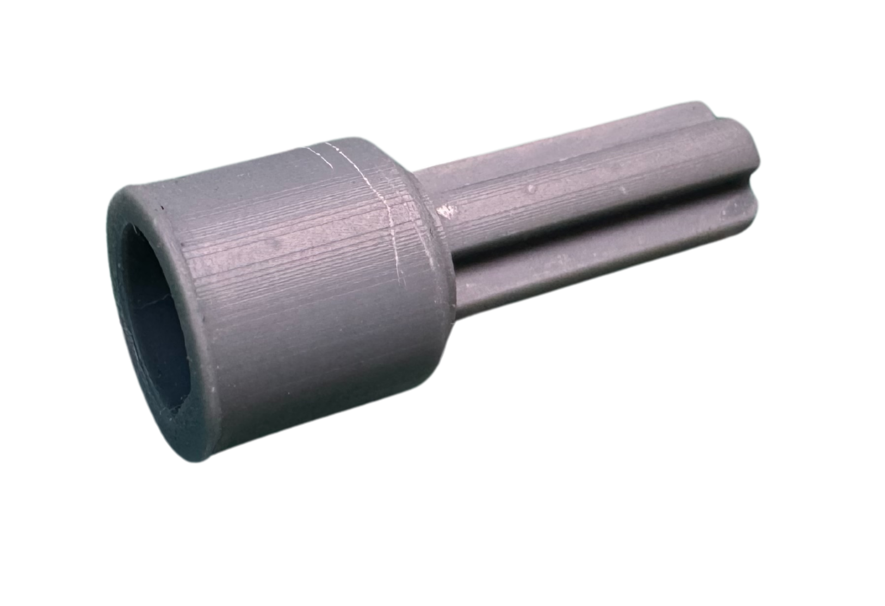</td>
      </tr>
      </table>
      </div> 
      <div align=center>
      <table>
      <tr>
      <th>Bearing Holder</th>
      <th colspan="2">differential housing</th>
      <th>Motor Holder</th>
      </tr><tr>
      <td></td> 
      <td></td>
      <td>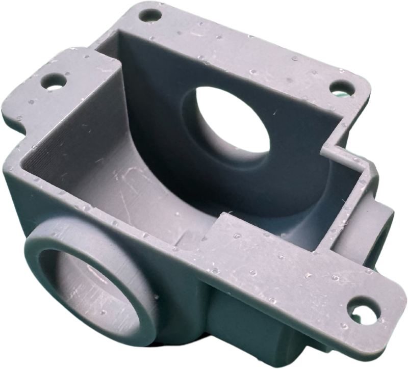</td>
      <td></td>
      </tr>
      </table>
      </div> 


## 2024/05/27 ~ 2024/06/02

**Member:** HU,SIAN-YI、LAI,MENG-CHENG、HUANG,KE-FU  
**Content:**  

#### Raspberry pi 4

- Since the infrared sensor solution was not feasible, we decided to switch to using LiDAR for wall-edge detection. The vehicle will only exit the loop when the distance between the LiDAR and the wall is less than 35 cm and the wall is detected twice; otherwise, it will continue moving forward. To prevent multiple detections of the wall within a short period from causing misjudgment, we added a delay after the detection to ensure the stability of the results. This adjustment helps improve the vehicle's accuracy in recognizing walls, avoiding unnecessary stops or erroneous operations.

<div align="center" width=100%>
<table >
<tr align="center">
  <th>LiDAR wall detection code</th>
  </tr>
<tr align="center">
  <td>  </td>
  </td>
  </tr>
</table>
</div>

#### Jetson nano

- To enable the vehicle to correctly avoid various obstacles in complex environments, we decided to install a high-performance camera module. Considering that we are using the Jetson Nano as the controller, we selected a camera module that is highly compatible with it to ensure system stability. We ultimately chose the IMX477-160 12.3MP high-resolution camera module, which offers excellent resolution and image quality, providing clear image data. This choice not only enhances the vehicle's environmental recognition capability but also effectively improves obstacle avoidance, helping the vehicle more accurately perceive the position of obstacles during the competition.

[IMX477-160 12.3MP Camera](https://shopee.tw/%E7%8F%BE%E8%B2%A8-SONY-IMX477-%E6%94%9D%E5%BD%B1%E9%8F%A1%E9%A0%AD%E6%A8%A1%E7%B5%84-1230%E8%90%AC%E5%83%8F%E7%B4%A0-160%C2%B0%E5%BB%A3%E8%A7%92-%E6%94%AF%E6%8F%B4%E6%A8%B9%E8%8E%93%E6%B4%BECM3-4%E3%80%81Jetson-Nano-i.10207300.8215149686?sp_atk=21737f61-91b3-4fa6-9e87-0f9a4884b88b&xptdk=21737f61-91b3-4fa6-9e87-0f9a4884b88b)

- ### Comparison of Camera Modules
    <div align="center">
    <table>
    <tr align="center" >
    <th rowspan="2">Model</th> 
    <th >SONY IMX219</th>
    <th >SONY IMX477</th>
    </tr>
    <tr align="center">
    <td></td>
    <td></td>
    </tr>
    <tr align="center">
    <td>Sensor</td>
    <td>SONY IMX 219</td>
    <td>SONY IMX 477</td>
    </tr>
    <tr align="center">
    <td>FOV</td>
    <td>160 MAX</td>
    <td>160 MAX</td>
    </tr>
    <tr align="center">
    <td>Resolution</td>
    <td>3280 × 2464 pix</td>
    <td>4056 × 3040 pix</td>
    </tr>
    </tr>
    </table>
    </div>

    __From this, it is clear that in terms of resolution, the SONY IMX 477 is our best choice for the competition environment.__


## 2024/06/03 ~ 2024/06/09  

**Member:** HU,SIAN-YI、LAI,MENG-CHENG、HUANG,KE-FU
**Content:**

### Raspberry pi 4

- This week, during practice, the vehicle's LiDAR sensor exhibited abnormal readings. Initially, we thought the LiDAR itself was damaged, so we replaced it with a new one, but the issue persisted. We then suspected that the adapter might be the problem and replaced it, but the issue still could not be resolved. Currently, we are continuing to investigate the cause of the problem and are striving to find the best solution.

### Jetson Nano

- We installed NoMachine on the Jetson Nano to facilitate remote operations and program adjustments. Through NoMachine, we can directly access and control the Jetson Nano from any device connected to the same network, without needing to connect an HDMI monitor, keyboard, or mouse. This setup not only improved work efficiency but also made the Jetson Nano more versatile, capable of adapting to testing requirements in different locations.

- Since using NoMachine requires being on the same network, we purchased a Wi-Fi receiver and installed it in the USB port of the Jetson Nano to enable wireless connections.

- During practical testing, we found that the Wi-Fi receiver (as shown in the bottom left image) tended to hit nearby traffic signal blocks. To solve this problem, we switched to a USB 3.0 90-degree adapter to shorten the receiver’s extension angle, making it easier to avoid obstacles and prevent collisions.

<div align="center" width=100%>
<table >
<tr align="center">
  <th>NoMachine IP address selection</th>
  <th>NoMachine login screen</th>
  <th>NoMachine connected screen</th>
  </tr>
<tr align="center">
  <td></td>
  <td></td>
  <td></td>
  </tr>
</table>
</div>
<div align="center" width=100%>
<table >
<tr align="center">
  <th>USB Horizontal 180°</th>
  <th>USB Vertical 90°</th>
</tr>
<tr align="center">
  <td align="center"></td>
  <td align="center"></td>
</tr>
</table>
</div>

<div align="center" width=100%>
<table >
<tr align="center">
  <th >Activity photo</th>
  <th >Activity photo</th>
</tr>
<tr>
  <td align="center"></td>
  <td align="center"></td>
</tr>
</table>
</div>

## 2024/06/10 ~ 2024/06/16

**Member:** HU,SIAN-YI、LAI,MENG-CHENG、HUANG,KE-FU  

**Content:**

### Raspberry pi 4

- This week, we encountered issues with abnormal LiDAR readings. Initially, we suspected a malfunction with the LiDAR sensor itself and replaced it with a new one, but the problem persisted. We then considered the adapter might be the cause, but replacing it also did not resolve the issue. We are currently continuing to investigate the root cause to identify the best solution.

### Jetson Nano

- When writing engineering documents, we chose to use VS Code along with Git. This approach not only provides a flexible editing environment but also offers powerful version control capabilities. VS Code supports multiple programming languages and plugins, allowing us to code and write documents simultaneously, while Git enables us to track changes and easily revert to previous versions. Through Git’s branching feature, each member can work on their own branch, avoiding direct impacts on the stability of the main document. When multiple people edit the same document simultaneously, Git highlights conflicts in real time, allowing the subsequent editor to compare and merge changes, thereby improving collaboration efficiency. Additionally, the Git plugin in VS Code simplifies the overall process, enabling us to complete version management directly within the editor, which greatly enhances team collaboration efficiency and document consistency.

 <div align="center">
  
  [Engineering Documentation - WRO2024_FE-Fire-On-All-Cylinders](../../README.md) 
  
 </div>

<div align="center">
<table>
<tr align="center">
<th>To edit in VSCode, simply install Git and enter git clone.</th>
<th>Click on the "Copy Repository" option.</th>
<th>Select the repository you want to clone for editing.</th>
</tr>
<tr>
<td align="center"></td><td>

</td>
<td></td>
</tr>
</table>
</div>

## 2024/06/17 ~ 2024/06/23

**Member:** HU,SIAN-YI、LAI,MENG-CHENG、HUANG,KE-FU  

**Content:**

### Raspberry pi 4

- Since we were unable to resolve the LiDAR issue, we began to suspect that there might be an error in the command used to call the LiDAR. However, as we were not familiar with modifying the calling program and with the competition deadline approaching, we decided to look for alternative solutions. Currently, we are considering switching to ultrasonic sensors for detection.

#### Jetson nano

- During the hardware design process, we encountered several instances where the Jetson Nano failed to power on or the Raspberry Pi Pico was unable to receive signals from the Jetson Nano due to incorrect power connections or data line misplacements. Therefore, we decided to use dual-row female headers, dual-row male headers, and Dupont wires as the connection method between the two.

<div align="center">
<table>
<tr  align="center">
<th></th>
<th></th>
</tr>
</table>
</div>


## 2024/06/24 ~ 2024/06/30  

**Member:** HU,SIAN-YI、LAI,MENG-CHENG、HUANG,KE-FU  

**Content:**

### Raspberry pi 4

- This week, we began using ultrasonic sensors to detect walls. During testing, we found that the vehicle often collided with obstacles while tracking, especially with blocks. Therefore, we decided to temporarily put the parking function development on hold and focus on perfecting the block avoidance function. Once the vehicle can reliably avoid obstacles, we will resume the development of the parking program.

### Jetson Nano

- Before avoiding blocks, we need to first complete three laps around the field. During this process, we found that the vehicle could potentially graze the wall when turning. Therefore, we decided to convert the captured camera images to grayscale and then apply binarization to identify the wall's position. Next, we used a PD control algorithm to keep the vehicle centered in the lane, ensuring it could steadily drive down the middle of the road.

- For detailed documentation on image recognition processing, please refer to <a href="../../src/Image_Recognition_Processing/README.md#adjust-floor-to-boundary-black-and-white-thresholdjetson_nano_binarizedpy" target="_blank">3-3-1 Image Recognition Processing</a>.

<div align="center">
<table>
<tr  align="center">
<th>Vehicle Collides with Side Wall</th>
<th>Highlight detection area in camera view</th>
</tr>
<tr align="center">
<td></td>
<td></td>
</tr>
</table>
</div>

## 2024/07/01 ~ 2024/07/07

**Member:** HU,SIAN-YI、LAI,MENG-CHENG、HUANG,KE-FU  

**Content:**

### Raspberry pi 4

- As the competition date approached, we decided to temporarily set aside the research on the Jetson Nano and focus on finalizing adjustments for the Raspberry Pi 4.
During this week’s testing, we found that the vehicle often detected traffic signal blocks that were too far ahead, causing it to start the avoidance maneuver prematurely and ultimately crash into the wall. To solve this issue, we added a black mask to the top of the image frame so that the vehicle would not detect traffic signal block colors that were too distant. After applying the mask, the vehicle no longer detected overly distant block colors, successfully reducing the chances of interference.

<div align="center">
<table>
<tr align="center">
<th>Uses Black Mask to Block Out-of-Bounds Colors</th>
</tr>
<tr align="center">
<td></td>
</table>
</div>

## 2024/07/08 ~ 2024/07/14

**Member:** HU,SIAN-YI、LAI,MENG-CHENG、HUANG,KE-FU  

**Content:**

### Raspberry pi 4

- After completing the block avoidance program, we began testing the machine's success rate. Initially, we chose a speed of 50%, at which the machine was mostly able to respond smoothly. However, when we increased the speed to 70%, we found that the color sensor sometimes misinterpreted the line colors on the ground due to the higher speed. To solve this issue, we adjusted the program to use LiDAR for measuring left and right directions to identify turning directions, effectively reducing the chances of incorrect turns due to color misjudgment.

#### Detects Turning Direction

```
  if get_left_dis > 100:
      reverse = False
  else:
      reverse = True
  if get_mid_dis > 55:
      servo.angle(-40)
```

## 2023/07/15 ~ 2023/07/21

**Member:** HU,SIAN-YI、LAI,MENG-CHENG、HUANG,KE-FU  

**Content:**

### Raspberry pi 4

- We are now able to complete block avoidance and the third lap around the track. The next goal is to detect the blocks and perform a U-turn. The U-turn action only needs to be executed if the last block in the second lap is red, so we first need to detect the number of laps. We will use the color sensor to record the number of times the vehicle crosses the lines and determine whether the count has exceeded the set number.

- If the count has not reached the specified number, the system will continue recording the color of the nearest traffic signal until the line-crossing count is greater than or equal to the set number, at which point it will stop recording the color.

- Once the color of the nearest traffic signal is successfully recorded, the program will check whether it is red. If the color of the signal is red, the system will set the servo motor to the right-turn angle and keep turning until the vehicle completes the designated turn. If the color of the nearest traffic signal is not red, the vehicle will continue to move forward.

<div align="center">
<table>
<tr align="center">
<th>Displays the Color of the Closest Traffic Sign and the Number of Lines</th>
<th>Adjusting Values</th>
</tr>
<tr align="center">
<td></td>
<td></td>
</table>
</div>

## 2024/07/22 ~ 2024/07/28  

**Member:** HU,SIAN-YI、LAI,MENG-CHENG、HUANG,KE-FU  
**Content:**

- Since the field tasks have been largely completed, we have started working on the technical report. Due to our lack of familiarity with the correct standards for technical reports, we referred to the official website's documentation and found that it needs to include the following sections:

  - module: This folder should contain files related to the vehicle model, such as files for laser cutters and 3D printers. 
  - other: This folder is for data that does not fall into other categories, such as communication protocols and engineering logs. 
  - schemes: This folder is for hardware descriptions, explaining the functions of electronic components and how they are connected. 
  - src: This folder should contain all code files. 
  - t-photos: This folder should contain team photos, including one formal photo and one funny photo. 
  - v-photos: This folder should contain photos of the machine, including six different views.
  - video: This folder should contain a video of the machine in operation, which must be over 30 seconds long.

- While writing the technical documentation, we switched to using a desktop computer to view the GitHub webpage and used a laptop to edit in VS Code, as it required toggling between VS Code and the GitHub webpage.


<div align="center">
<table>
<tr align="center">
<th>Official Website's GitHub Examples</th>
<th>Adjustments for Laptop and Desktop Compatibility</th>
</tr>
<tr align="center">
<td></td>
<td></td>
</table>
</div>

## 2024/07/29 ~ 2024/08/04

**Member:** HU,SIAN-YI、LAI,MENG-CHENG、HUANG,KE-FU  

**Content:**

### Raspberry pi 4

- We have completed organizing and listing the parts inventory and uploaded it to the engineering documentation on GitHub. Additionally, we have finished the drawing work for the vehicle introduction diagram. Throughout this process, we gradually learned and became familiar with the use of GitHub syntax. Although our operation of GitHub is not yet very proficient, we have improved our skill level by consulting related information online. These advancements have provided valuable enhancements to our report.

- This week, as the task competition has been completed, we have started to continue addressing issues related to the parking area.

### Team Members' Practice Status

<div align="center">
<table>
<tr  align="center">
<td></td>
<th></th>
</tr>
</table>
</div>

## 2024/08/05 ~ 2024/08/11

**Member:** HU,SIAN-YI、LAI,MENG-CHENG、HUANG,KE-FU  

**Content:**  

### Raspberry pi 4

- This week, we completed the handling of the parking function. Although the vehicle can park smoothly, accurately projecting and parking in the lot remains a challenge.

- As the technical documentation is due next week, we began revising the content of the report and adjusting the webpage according to the official scoring criteria, while continuing to supplement the technical report and work logs.

- We recorded videos of various task solutions and uploaded them to YouTube for easy linking and referencing in the technical report.

<div align="center">
<table>
<tr align="center">
<th>The directory of engineering documentation on GitHub</th>
</tr>
<tr align="center">
<td> </td>
</tr>
</table>

</div>

  **Open Challenge videos**

- [Open Challenge Full Width 60% Speed](https://www.youtube.com/watch?v=kdZ8KoKKiUw)
 

**Team Members' Practice Status**

<div align="center">
<table>
<tr align="center">
<th>Report writing</th>
<th>Mechanism adjustment</th>
</tr>
<tr align="center">
<td></td>
<td></td>
</table>
</div>

## 2024/08/12 ~ 2024/08/18

**Member:** HU,SIAN-YI、LAI,MENG-CHENG、HUANG,KE-FU  

**Content:**

### Raspberry pi 4

- This week, as our machine has successfully been adjusted to operate basic task competitions on the field smoothly, we began filming the task competition videos.


<div align="center">
<table>
<tr align="center">
<th>Modify the program and test the vehicle</th>
<tr align="center">
<td></td>
</table>
</div>

**Open Challenge videos**

- [Open Challenge videos](https://www.youtube.com/watch?v=n0Pp--26QGQ)

## 2024/08/19 ~ 2024/08/25

**Member:** HU,SIAN-YI、LAI,MENG-CHENG、HUANG,KE-FU  

**Content:**

### Raspberry pi 4

- Since the competition is scheduled to take place this week, we have already started intensive practice, trying different tasks and adjusting the program to adapt to most scenarios. The benefit of trying different tasks is that it helps us identify potential challenges the machine may face and make necessary adjustments in advance. Here is our practice method:
- We labeled the pathways as A, B, C, and D, with each pathway divided into three zones, each containing two inner and outer block placement points. Red blocks indicating turning conditions are placed sequentially, while other blocks are adjusted randomly.

We believe that this approach will help prepare our machine for various situations, ensuring that we are well-prepared for the competition.

- The competition day was August 25th. In the morning qualifiers, our vehicle successfully completed all laps in the first round and achieved full marks; however, in the second round, we had to request repairs due to abnormal radar readings. After the repairs were completed, there was only one minute left before the end of the competition, which allowed us to complete only two laps. Nevertheless, we advanced smoothly to the obstacle Challenge in the afternoon.

- In the first obstacle Challenge, the vehicle collided with a wall due to excessive evasion maneuvers, resulting in the race being halted. After adjustments, the second obstacle Challenge was completed with successful obstacle avoidance. However, the vehicle stopped without entering the finish zone, preventing us from achieving an ideal score. Fortunately, due to an opponent's mistakes, we still managed to advance.


<div align="center">
<table>
<tr align="center">
<th>Waiting for test</th>
<th>Competition photo</th>
<th>Award-winning photo</th>
</tr>
<tr align="center">
<td></td>
<td></td>
<td></td>
</tr>
</table>
</div>

## 2024/08/26 ~ 2024/09/01

**Member:** HU,SIAN-YI、LAI,MENG-CHENG、HUANG,KE-FU  
**Content:**

- Since our team successfully advanced and has the opportunity to participate in the international competition, we began making improvements to the self-driving car to achieve better results. We started testing the Raspberry Pi 5 and Jetson Nano separately, planning to choose one as the new controller.

  - The Raspberry Pi 5's processor speed is 2 to 3 times that of the Raspberry Pi 4, with GPU performance being twice as strong, and the memory and I/O bandwidth also doubling that of the previous generation. It also has lower power consumption for the same tasks.
  - Compared to our original controller, the Raspberry Pi 4, the Jetson Nano has significantly higher performance and a more powerful GPU (Graphics Processing Unit), showing superior performance in camera recognition.

<div align="center">
<table>
<tr align="center">
<th>Raspberry pi 4</th>
<th>Raspberry pi 5</th>
<th>Jetson nano</th>
</tr>
<tr align="center">
<td></td>
<td></td>
<td></td>
</table>
</div>

#### Raspberry pi 5

- Currently, we are unsure which has better recognition performance, Raspberry Pi 5 or Jetson Nano. To verify this, we assembled a machine identical to the one with Raspberry Pi 4 and replaced the controller with Raspberry Pi 5, then started testing the functionality of the Raspberry Pi 5.
- When we attempted to insert the SD card used on the Raspberry Pi 4 into the Raspberry Pi 5, we found that it could not boot successfully. Therefore, we formatted the backup SD card from the Raspberry Pi 4 and burned the Raspberry Pi 5 image onto it, which finally allowed it to boot successfully.
- Next, we began the environment setup process. We first chose to install VNC so that we could operate the Raspberry Pi 5 from a computer for subsequent operations. Then, we installed the software OpenCV and ROS. OpenCV is used for processing camera images, while ROS is needed for handling radar data.

<div align="center">
<table>
<tr align="center">
<th>SD card settings</th>
<th>VNC remote connection installation</th>
<th>OpenCV installation</th>
<th>ROS installation</th>
</tr>
<tr align="center">
<td></td>
<td></td>
<td></td>
<td></td>
</table>
</div>

#### Jetson nano

We have assembled an additional machine specifically for use with the Jetson Nano and have begun delving into its functionalities and applications. This machine will serve as our experimental platform to explore the computational capabilities and hardware integration of the Jetson Nano, laying the groundwork for future development.

- We continued restoring the self-driving car that previously used the Jetson Nano as the main controller and added the capability to recognize blue and orange lines on the field to serve as the basis for determining clockwise or counterclockwise turns.

- Therefore, we must use OpenCV to convert the captured images from RGB to HSV to correctly identify colors. The method for converting to HSV is detailed in section <a href="../../src/Image_Recognition_Processing/README.md">3-3-1 Image Recognition Processing</a>.

##### The detection status of the side walls and the blue and orange lines on the field after image processing.
<div align="center">
<table>
<tr align="center">
<th>Detect walls</th>
<th>Detect ground line (counterclockwise)</th>
</tr>

<tr align="center">
<td></td>
<td></td>
</table>
</div>

- We determine the position of the walls by detecting the inverted white blocks on the left and right sides of the camera feed.。
- The camera detects the blue and orange y-axis to determine the vehicle's distance from the line, which helps in deciding the turning direction.。

#### Raspberry pi 4

We began addressing the issues that occurred during the national competition, using them as preparations for the future.

- In the first round of the mission race, we encountered a failure in the turning maneuver. We adjusted the turning speed and angle to ensure successful turns.

- During both mission races, the parking maneuver could not be executed as planned. Therefore, we decided not to perform parking in the mission races. Now, we are exploring alternative methods for parking.

- At the same time, we made corrections to the self-driving car with the Raspberry Pi 4 as the main controller, aiming to use it as a backup for future competitions.
  - In the first round of the task competition, we encountered a failure in making a U-turn. To address this issue, we adjusted the speed and angle of the U-turn so that the vehicle could complete it smoothly.
  - In both rounds of the task competition, the vehicle's parking actions did not proceed as expected. Therefore, we decided not to perform parking maneuvers during the task competition and plan to try other methods to achieve parking.

## 2024/09/02 ~ 2024/09/08

**Member:** HU,SIAN-YI、LAI,MENG-CHENG、HUANG,KE-FU  
**Content:**

#### Raspberry pi 5

We continued trying to transfer the functions installed on the Raspberry Pi 4 to the Raspberry Pi 5 but found that some functions could not be installed or run. For example, ROS, which is needed for running the radar, and GPIO for reading pins could not be installed and used. Only the VNC system and OpenCV for camera use were successfully installed. After researching online, we discovered that these issues might be due to version incompatibility or unsuitability, preventing us from running the main program and likely unable to be resolved in the short term. Due to these issues, we decided to temporarily pause our research on Raspberry Pi 5 and prioritize optimizing the Raspberry Pi 4 to ensure stable system operation.

<div align="center">
<table>
<tr align="center">
<th>Methods for finding solutions online.</th>
</tr>

<tr align="center">
<td></td>
</table>
</div>

#### Jetson nano

- We use a camera module for recognition and a gyroscope for navigation during vehicle operation. We found that the camera module uses a 160-degree wide-angle lens, which, while expanding the field of view, also causes distortion during image capture. Therefore, we need to perform distortion correction for the wide-angle lens on the Nvidia Jetson Nano. A common correction method is using the correction function in the OpenCV library, with the detailed correction method outlined in section <a href="../../schemes/Camera/README.md#wide-angle-lens-distortion-correction"> 2-4-3 Camera Selection</a>.
- After the camera module was corrected, we combined it with the gyroscope and successfully completed the qualification test.
<div align="center">
<table>
<tr align="center">
<th>Adjust camera angle</th>
<th>Take photos</th>
</tr>

<tr align="center">
<td></td>
<td></td>
</table>
</div>

## 2024/09/09 ~ 2024/09/15

**Member:** HU,SIAN-YI、LAI,MENG-CHENG、HUANG,KE-FU  
**Content:**

#### Raspberry pi 4

- Our Raspberry Pi 4 unexpectedly burned out for unknown reasons. To find the cause, we started by checking the power supply from the Lipo battery, using a multimeter to measure conductivity. Next, we inspected the step-down converter and used the multimeter to measure the output voltage and current of the converter, confirming that the voltage was 5V and the current was 3A. After ensuring the converter was functioning normally, we checked the circuit board wiring to see if there was a reversed polarity issue. Since we had replaced the connection cables between the circuit board and the Raspberry Pi a few days earlier, we could not be sure if the cables had caused a short circuit. After a final inspection, no abnormalities were found. Ultimately, believing that a circuit board malfunction was the most likely cause, we decided to solder a new circuit board to avoid impacting competition timing.

<div align="center">
<table>
<tr align="center">
<th>Testing the buck board</th>
<th>Testing circuit board</th>
</tr>

<tr align="center">
<td></td>
<td></td>
</table>
</div>

#### Jetson nano

- Our self-driving car encountered some issues, and errors occurred when running the program. Upon inspecting the circuit board, we discovered that some pins on the Raspberry Pi Pico board were malfunctioning, which prevented the program from running properly. To resolve this issue, we decided to redesign the circuit diagram. Considering that the computational performance of the Jetson Nano main controller is superior to that of the Raspberry Pi Pico microcontroller, we connected the gyroscope (BNO055) sensor circuitry to the Jetson Nano controller and assigned the numerical processing tasks to the Jetson Nano. This adjustment is expected to allow for faster control of the servo motors and the front steering mechanism.

<div align="center">
<table>
<tr align="center">
<th>Remove circuit board</th>
<th>Plan route</th>
</tr>
<tr align="center">
<td></td>
<td></td>
</table>
</div>

## 2024/09/16 ~ 2024/09/22

**Member:** HU,SIAN-YI、LAI,MENG-CHENG、HUANG,KE-FU  
**Content:**

#### Raspberry pi 4

- Over the past few days, we have completed soldering the new circuit board for the Raspberry Pi 4 controller and have also redesigned the circuit board layout to avoid excessive clutter and make the overall circuit board look more organized.

<div align="center">
<table>
<tr align="center">
<th>soldering circuit board</th>
</tr>

<tr align="center">
<td></td>
</table>
</div>

#### Jetson nano

- Since the self-driving car encounters misdetections during visual recognition due to the color of the vehicle's own signal wires, we decided to first use Onshape to design a cover plate model. We then used photopolymer 3D printing technology to create a cover plate that can fit precisely onto the F-shaped structure at the front of the vehicle. This cover plate effectively blocks the signal wires in front of the vehicle, thereby preventing misdetections during the camera recognition process.

<div align="center">
<table>
<tr align="center">
<th>Isometric View</th>
<th>Bottom View</th>
<th>Right View</th>
</tr>
<tr align="center">
<td></td>
<td></td>
<td></td>
</table>
</div>

## 2024/09/23 ~ 2024/09/29

**Member:** HU,SIAN-YI、LAI,MENG-CHENG、HUANG,KE-FU  
**Content:**

#### Raspberry pi 4

- This week, we found that using ultrasonic sensors did not allow the vehicle to stop accurately at the designated position, so we decided to revert to using radar for detection. After revising and optimizing the logic, we successfully resolved the previous issue of lidar data irregularities. Next, we will continue developing and refining the parking functionality.

#### Jetson nano

- We back up the Jetson Nano's SD card daily because there was an incident where the SD card was damaged, preventing the Jetson Nano from booting. Although the cause of the damage is still unknown, fortunately, we had previously backed up the data, so we didn't need to start from scratch and only had to restore the lost data. This backup habit effectively mitigates the risk of data loss and ensures the continuity of our development work.

<div align="center">
<table>
<tr align="center">
<th>Backup using balenaEtcher software</th>
<th>Activity photo</th>
</tr>

<tr align="center">
<td></td>
<td></td>
</table>
</div>

## 2024/09/30 ~ 2024/10/06

#### Raspberry pi 4

- This week, we successfully got the vehicle to drive to the area in front of the parking zone. However, when turning into the parking area, relying on the lidar sensor to detect the side wall resulted in a noticeable delay in the response to the controller, causing the vehicle to miss the intended parking spot and significantly increasing the difficulty of parking. We are currently working on finding a solution to optimize the response speed in this part, aiming to improve the vehicle's parking accuracy.

#### Jetson nano

- Since we found that the cover plate used to shield the front wires was causing the wires to be compressed, requiring additional side connections, we made modifications to the cover plate. We added a rectangular hole in the middle partition, making it easier to organize the wiring and preventing the wires from being strained, thereby enhancing the overall design's stability and convenience.

<div align="center">
<table>
<tr align="center">
<th>Cover plate without holes.</th>
<th>Cover plate for digging.</th>
</tr>
<tr align="center">
<td></td>
<td></td>
</table>
</div>


## 2024/10/07 ~ 2024/10/13

**Member:** HU,SIAN-YI、LAI,MENG-CHENG、HUANG,KE-FU  
**Content:**

- After team discussions this week, we decided to abandon using the Raspberry Pi 4 as the controller due to frequent issues with color misjudgment, unstable distance measurement by the lidar sensor, and slow response in visual recognition, which hindered our ability to meet the requirements of this competition's tasks. Instead, we chose to use the Jetson Nano-controlled self-driving car as our main competition vehicle.

- This week, we completed filming the demonstration videos for GitHub and tested various combinations in the videos to see if the machine could adapt to different placements. In the qualification round, we tested four different lane width combinations; in the task competition, we tested three different placement positions for the last traffic signal block in the second lap and four different positions for the parking lot along different straight paths. The links to these videos have been recorded in sections <a href="../../video/Open_Challenge/video.md"> 5-1 Open Challenge </a> and <a href="../../video/Obstacle_Challenge/video.md">5-2 Obstacle Challenge</a>.

## 2024/10/14 ~ 2024/10/20

**Member:** HU,SIAN-YI、LAI,MENG-CHENG、HUANG,KE-FU  
**Content:**

- To address the space shortage issue with the USB version of the WiFi adapter, we added two 7mm holes in the wooden top layer of the vehicle, moving the mounting hole for the wired WiFi adapter from the middle layer to the top layer. This not only prevents the machine from becoming too bulky but also effectively utilizes the internal space of the vehicle. Additionally, since we added an HC-SR04 ultrasonic module at the rear of the middle layer for auxiliary detection during parking maneuvers, moving the WiFi adapter to the top layer frees up enough space for the HC-SR04 module's installation, further enhancing the vehicle's functional layout.

<div align="center"> 

 #### Vehicle Top Deck
<table>
<tr align="center">
<th>Before modification</th>
<th>After modification</th>
</tr>
<tr align="center">
<td></td>
<td></td>
</table>

##### Vehicle Mid-Deck

<table>
<tr align="center">
<th>Before modification</th>
<th>After modification</th>
</tr>
<tr align="center">
<td></td>
<td></td>
</table>
</div>


## 2024/10/21 ~ 2024/10/27

**Member:** HU,SIAN-YI、LAI,MENG-CHENG、HUANG,KE-FU  
**Content:**


- This week, we started drafting the script for the vehicle introduction. Before writing, we divided the script structure into three parts: the first part is an introduction to the vehicle's main structure, followed by an introduction to the program structure, and finally, a demonstration and explanation of the vehicle's operation video. After completing the script, we plan to finish filming this introduction video within approximately two weeks while continuing to test the vehicle's performance.

<div align="center">
<table>
<tr align="center">
<th>writing script</th>
<th>script content</th>
</tr>
<tr align="center">
<td></td>
<td></td>
</table>
</div>


## 2024/10/28 ~ 2024/11/03

**Member:** HU,SIAN-YI、LAI,MENG-CHENG、HUANG,KE-FU  
**Content:**

- We discovered that during the competition, the self-driving car needs to be started by shutting down and rebooting. However, each time the Jetson Nano is turned off and restarted, a password is still required to log in, which would disrupt the competition process. Therefore, we decided to disable the login requirement to ensure smooth competition.

- The method to disable the login function on the Jetson Nano controller is as follows: go to System Settings on the Jetson Nano controller, click "User Accounts," then click "Unlock," and switch "Automatic Login" to "ON." This way, logging in will no longer be required during startup, achieving the desired effect.

<div align="center">
<table>
<tr align="center">
<th>User Adminstrator</th>
<th>Unlock</th>
<th>Automatic Login</th>
</tr>
<tr align="center">
<td></td>
<td></td>
<td></td>
</table>
</div>

## 2024/11/04 ~ 2024/11/10

**Member:** HU,SIAN-YI、LAI,MENG-CHENG、HUANG,KE-FU  
**Content:**

- During the testing process, we found that the camera's position was too high. When the vehicle approached the center wall, the camera would capture images of the ground inside the center, which interfered with accurate obstacle recognition. To solve this issue, we replaced the original plastic screws with flat-headed iron screws. The flat screw heads of the iron screws provided more room for downward adjustment, allowing the circuit board to be lowered and the camera's height to be adjusted. This adjustment not only improved the camera's viewing angle but also enhanced overall stability, enabling the machine to detect obstacles more accurately and avoid capturing irrelevant ground images, thus reducing the possibility of misjudgments.

<div align="center">
<table>
<tr align="center">
<th>Plastic screws</th>
<th>Flat-headed iron screws</th>
</tr>
<tr align="center">
<td></td>
<td></td>
</table>
</div>

<div align="center">
<table>
<tr align="center">
<th></th>
<th>Before modification</th>
<th>After modification</th>
</tr>
<tr align="center">
<th>Isometric view</th>
<td></td>
<td></td>
</tr>
<tr align="center">
<th>Side view</th>
<td></td>
<td></td>
</tr>
</table>
</div>

## 2024/11/11 ~ 2024/11/17

**Member:** HU,SIAN-YI、LAI,MENG-CHENG、HUANG,KE-FU  
**Content:**

#### Jetson nano

- During the vehicle testing process, we discovered that the camera would capture images of the inner side of the side wall, leading to misjudgments. To resolve this issue, we attempted to lower the vehicle body so that the camera no longer aligned with the images of the inner wall. However, this adjustment rendered the original front cover panel unsuitable. Therefore, we redesigned the front cover panel to match the modified vehicle structure.

- We shortened the front end of the cover panel and reshaped it to better fit the changes in the machine structure. This adjustment not only ensured the panel's alignment with the vehicle's exterior but also further optimized the camera's operating environment, reducing visual interference and enhancing the accuracy and stability of image detection. As shown in the figure below.

<div align="center">
<table>
<tr align="center">
<th>Competition venue map</th>
<th>Onshape Design View</th>
<th>Isometric view</th>
</tr>
<tr align="center">
<td></td>
<td></td>
<td></td>
</table>
</div>

- After installing the completed front cover plate onto the vehicle, we found that some signal wires were exposed, which could lead to recognition errors. To address this issue, we added partitions on both sides of the cover. This modification not only effectively hides the internal wiring but also enhances the overall appearance of the machine. Additionally, we added a wheel-like shape under the front cover plate, which not only conceals extra wiring but also improves the machine's visual appeal, making the overall design more harmonious and aesthetically pleasing.

<div align="center">
<table>
<tr align="center">
<th>Onshape Design View-Second revision</th>
<th>Isometric view</th>
</tr>
<tr align="center">
<td></td>
<td></td>
</table>
</div>

# <div align="center">[Return Home](../../)</div>
