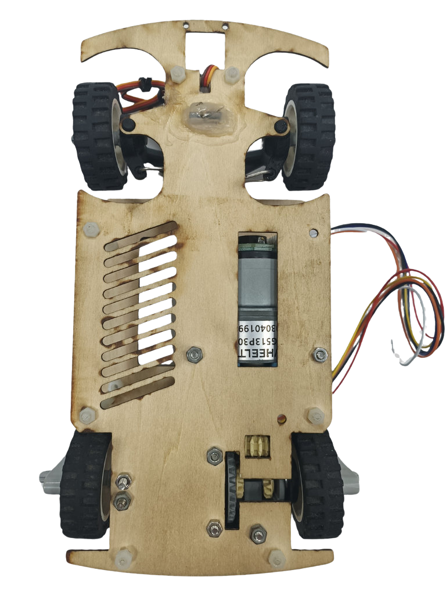

## 
Hardware Assembly Instructions & Wiring diagram

- ### Hardware Configuration of Electronic Equipment
  - The diagram below shows the placement of electronic equipment in the autonomous vehicle.
  
    

*** 
- ### System Operation Process
    
 

- The Nvidia Jetson Nano main controller captures images using a camera module and processes them with OpenCV to detect obstacles and boundary walls. It simultaneously collects directional data from the BNO055 gyroscope orientation sensor via the I2C communication protocol to calculate the travel direction to avoid obstacles and boundary walls. The calculated path data is then transmitted via UART communication to the Raspberry Pi Pico I/O controller for control.
- During parking, the Raspberry Pi Pico, acting as an I/O controller, not only receives data from the Nvidia Jetson Nano main controller but also simultaneously collects distance data from HC-SR04 ultrasonic distance sensors in three directions. Based on this data, it performs calculations to control the movement path for automated parking.
- As an I/O controller, the Raspberry Pi Pico receives vehicle movement control values from the Nvidia Jetson Nano main controller and performs further calculations within the Pico. It then sends the results to the front-wheel servo motor (MG90S) to control the driving direction, thereby completing the obstacle avoidance task.
- At the same time, acting as an I/O controller, the Raspberry Pi Pico processes vehicle movement control values received from the Nvidia Jetson Nano main controller and sends the results to the motor controller (L293D) to control the DC motor’s forward and reverse rotation and speed.

- ### Vehicle Body Structure Display Diagram

<table>
  <tr>
      <th>Top View of the Overall Apparatus</th>
      <th>Middle Layer Structure Top View</th>
      <th>Top View of Vehicle Chassis</th>
      <th>Bottom View of Vehicle Chassis</th>
  </tr>
  <tr align="center">
     <td> </td>
     <td></td>
     <td></td>
     <td></td>
  </tr>
</table>

- ### Circuit Board 

<table>
  <tr align="center">
      <th> Circuit Board of Top View </th><th>Circuit Board of Button View</th>
  </tr>
  <tr align="center">
     <td>  </td><td></td>
  </tr>
</table>

- ### Overview of Important Parts List
  - #### NVIDIA® Jetson Nano™ developer-B01 Controller
    <table border=0 width="100%" >
      <tr>
      <td >

    __Specification:__ 
    - Processor: Quad-core ARM Cortex-A57, 64-bit CPU
    - GPU: 128-core NVIDIA Maxwell GPU
    - Memory: 4GB LPDDR4
    - Connectivity: Gigabit Ethernet, 4×USB 3.0 ports
    - GPIO: 40-pin expansion header, compatible with Raspberry Pi's standard GPIO
    - Dimensions: 100×80×29mm
    - Weight: 140 grams
      

    __Uses in Competition:__ 
    - Responsible for receiving image data from the camera module, performing image recognition via OpenCV, and sending the recognition results to the Raspberry Pi Pico for further processing.
      
    __Purchase URL:<a href="https://robotkingdom.com.tw/product/rk-nvidia-jetson-nano-developer-b01/" target="_blank">NVIDIA® Jetson Nano™ developer-b01</a>__
    </td>
    <td>
       
    </td>
    </tr>
    </table>

  - #### MG513 Rear-Drive DC Motor
    <table border=0 width="100%" >
      <tr>
      <td> 

    __Specifications:__  
    - No-load Speed: 366 rpm
    - Reduction Ratio: 1:30
    - Operating Voltage: 6 - 12V
      

    __Uses in Competition：__
    - Responsible for receiving control signals from the motor driver controller L293D to adjust the vehicle's forward and reverse movements and control the rear wheel speed.
      
    __Purchase URL:[MG513-P30 336RPM DC reduction motor](https://www.amazon.com/-/zh_TW/MG513-12V-%E6%B8%9B%E9%80%9F%E9%BD%92%E8%BC%AA%E9%A6%AC%E9%81%94%E7%B7%A8%E7%A2%BC%E5%99%A8%E4%BB%A3%E7%A2%BC%E9%80%9F%E5%BA%A6%E6%B8%AC%E9%87%8F-DIY-%E8%87%AA%E5%B9%B3%E8%A1%A1%E6%B1%BD%E8%BB%8A%E5%80%92%E7%BD%AE%E6%93%BA/dp/B0B3LXV4PL)__
    </td>
       <td >
       
      </td>
      </tr>
    </table>

  - ### MG90S Front Steering Mechanism by Servo Motor
      <table border=0 width="100%" >
      <tr>
      <td> 

    __Specifications:__
    - Controllable Rotation Angle: 0-180°  
    - Maximum Torque: 2.0 kg/cm (at 4.8V)  
    - Fastest Rotation Speed: 0.11 seconds (at 4.8V)  
    - Operating Voltage: 4.8V - 7.2V  
      

    __Uses in Competition：__
    - Responsible for receiving control values from the Raspberry Pi Pico to adjust the front wheel steering angle, enabling precise steering during driving.
      
    __Purchase URL:<a href="https://www.amazon.com/-/zh_TW/dp/B0BFQLNDPM" target="_blank">MG90s servo motor</a>__
    </td>
       <td >
      
       </td>
      </tr>
    </table>

  - #### Dual H-bridge DC motor driver IC - L293D

    <table border=0 width="100%" >
      <tr>
      <td>  

    __Specifications:__ 
    - 293D is a dual H-bridge DC motor driver IC that can be used to control two DC motors.
    - Wide operating voltage range: 4.5V to 36V.
    - Output current: 600 mA (continuous) and 1.2 A (peak) per channel.
    - Output voltage range: 3 V to 36 V.
      

    __Uses in Competition：__  
    - Primarily responsible for driving the MG513 geared DC motor to control the vehicle’s forward and reverse movement, as well as the motor’s speed.
      
    __Purchase URL:<a href="https://atceiling.blogspot.com/2019/08/arduino54l293d.html" target="_blank">L293D</a>__
    </td>
      <td>
      
      </td>
      </tr>
    </table>

  - #### Li-Polymer 3S Battery
    <table border=0 width="100%" >
      <tr>
      <td> 

    __Specifications:__
    - Maximum Current: 45.5A  
    - Net Weight: Approximately 107g  
    - Rated Voltage: 11.1V
      

    __Uses in Competition：__  
    - Supply power to the vehicle for use.  
      
    __Purchase URL:<a href="https://shopee.tw/product/17393576/2036942264?gclid=Cj0KCQjw6KunBhDxARIsAKFUGs9xoiZB_LrSF3X4XfnN1sxM-tjzbX4T2Sw9XD0c0Rfc_tkPkczAbBcaApCXEALw_wcB" target="_blank">Li-Polymer 3S Battery</a>__
    </td>
    <td>
      
    </td>
    </tr>
    </table>

  - #### Micro switch (TACK-SW)

    <table border=0 width=100% >
      <tr>
      <td>

    __Specifications:__ 
    - Operating Voltage: 3.3V - 5.0V  
    - Number of Pins: 3  
    - Output Signal: Digital  
      

    __Uses in Competition：__
    - Control the vehicle's start and drive switch.
      
    __Purchase URL:<a href="https://www.amazon.com/-/zh_TW/PLKXSEYUJ/dp/B0D4HZFM6S" target="_blank">Micro switch</a>__
    </td>
      <td>
       
      </td>
      </tr>
    </table>

  - #### High Current 5A Constant Voltage Constant Current Buck Power Supply Module ADIO-DC36V5A

    <table border=0 width=100% >
      <tr>
      <td> 

    __Specifications:__ 
    - Input Voltage Range: 4 - 38V
    - Output Voltage Range: 1.25 - 36V, continuously adjustable
    - Output Current Range: Adjustable, maximum of 5A
      

    __Uses in Competition：__  
    - Primarily responsible for stepping down the battery voltage from 11.1V to 5V to provide various stable voltages needed for vehicle operation.
      
    __Purchase URL:<a href="https://shop.cpu.com.tw/product/57434/info/" target="_blank">ADIO-DC36V5A</a>__
    </td>
      <td>
       
      </td>
      </tr>
    </table>

 
  - #### SONY IMX477 Camera Module
    <table border=0 width="100%" >
      <tr>
      <td>

    __Specifications:__
    - Viewing Angle: 160 degrees
    - pixels: 4056 x 3040
    - Maximum aperture: F2.0
    - Focal length: 7.9mm
    - Interface: CSI (Camera Serial Interface)
    - Operating Voltag：3.3V
      

    __Uses in Competition：__  
    - Responsible for capturing images and transmitting them to the Jetson Nano for image recognition to detect the presence of obstacles or boundary walls.
      
    __Purchase URL:<a href="https://shopee.tw/%E7%8F%BE%E8%B2%A8-SONY-IMX477-%E6%94%9D%E5%BD%B1%E9%8F%A1%E9%A0%AD%E6%A8%A1%E7%B5%84-1230%E8%90%AC%E5%83%8F%E7%B4%A0-160%C2%B0%E5%BB%A3%E8%A7%92-%E6%94%AF%E6%8F%B4%E6%A8%B9%E8%8E%93%E6%B4%BECM3-4%E3%80%81Jetson-Nano-i.10207300.8215149686?srsltid=AfmBOor9HmpX2guySAnFvW5drNG4qJtdwx98_e6muraV4LUtXM50YR5Q" target="_blank">SONY IMX477</a>__
    </td>
       <td >
        
       </td>
      </tr>
    </table>

  - #### BNO055 Gyroscope orientation sensor
    <table border=0 width="100%" >
      <tr>
      <td> 

    __Specifications:__
    - 9-Axis Sensing: Includes accelerometer, gyroscope, and magnetometer for motion and orientation detection
    - Operating Voltage: 3.6V - 5V
    - Interface: Supports both I²C and UART, making it compatible with various devices
    - Orientation Data: Provides direct angle data for accurate positioning
      

    __Uses in Competition：__  
    - Responsible for detecting the vehicle's current orientation values, which are provided to the  Jetson Nano controller for processing and decision-making.
      
    __Purchase URL:<a href="https://www.remisys.com.tw/product-page/bno055-absolute-orientation-sensor" target="_blank">BNO055</a>__
    </td>
       <td >
        
       </td>
      </tr>
    </table>

  - #### HC-SR04 ultrasonic distance sensor
    <table border=0 width="100%" >
      <tr>
      <td> 

    __Specifications:__
    - Measuring Range: 2 cm to 400 cm, capable of detecting objects within a distance of 2 cm to 4 meters.
    - Measurement Accuracy: Approximately 3 mm, with a margin of error around ±3 mm.
    - Operating Voltage: 5V, powered by direct current.
    - Ultrasonic Frequency: 40kHz, measuring distance by emitting a 40kHz ultrasonic signal.
    - Transmission Interface: Includes Trig and Echo pins, where Trig sends out the ultrasonic signal and Echo receives the reflected signal to calculate the distance.
      

    __Uses in Competition：__  
    - Primarily responsible for collecting distance data from HC-SR04 ultrasonic distance sensors in three directions and providing it to the Raspberry Pi Pico controller for calculations to control the vehicle's direction.
      
    __Purchase URL:<a href="https://robotkingdom.com.tw/product/hc-sr04p-ultrasonic-ranger/" target="_blank">HC-SR04</a>__
    </td>
       <td >
        
       </td>
      </tr>
    </table>

# 
[Return Home](../../)
 
