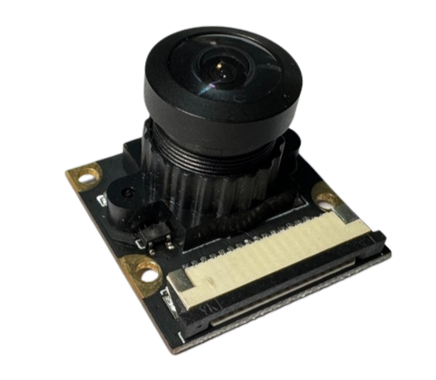
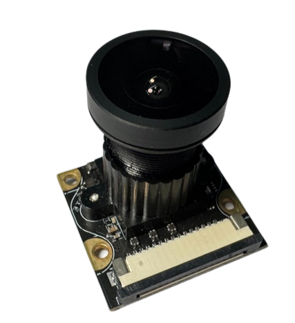
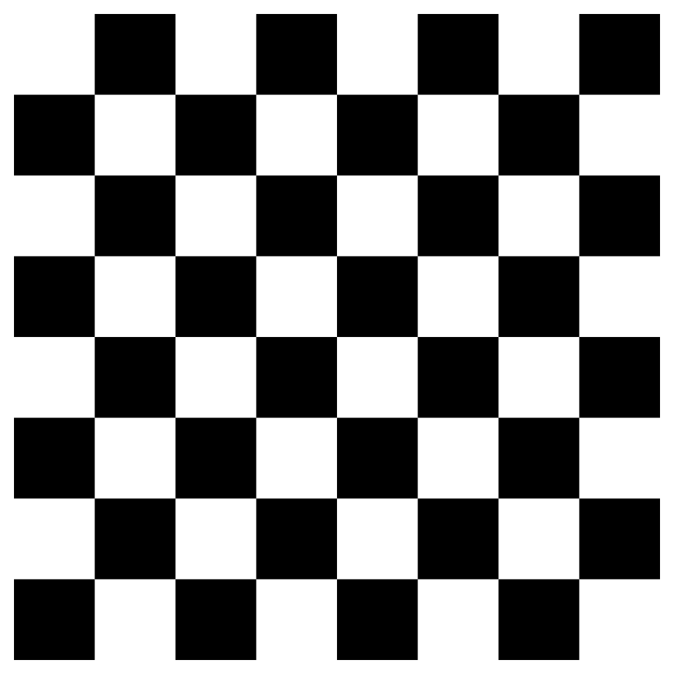
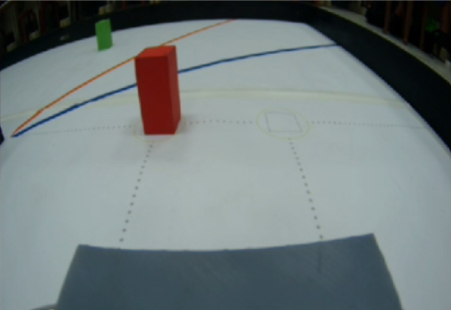

## 
Camera Selection
 
  <ol><li>To enable a vehicle to accurately detect obstacles on the track, the selection of a camera module has become a key factor influencing competition outcomes. Choosing a high-resolution, low-latency, high-sensitivity camera module can improve image clarity and enhance the vehicle’s ability to recognize obstacles, allowing for more precise obstacle avoidance and navigation maneuvers. This directly impacts the performance of autonomous vehicles in competitions.</li>
  <li>Previously, we used the Nvidia Jetson Nano as the main controller, so it is necessary to select a camera module compatible with the Nvidia Jetson Nano to ensure proper functionality. Below is a comparison of commonly used camera modules in Taiwan.</li>
  </ol>

- ### Comparison of Camera Modules
    

    <table>
    <tr align="center" >
    <th rowspan="2">Model</th> 
    <th >SONY IMX219</th>
    <th >SONY IMX477</th>
    </tr>
    <tr align="center">
    <td></td>
    <td></td>
    </tr>
    <tr align="center">
    <td>Sensor</td>
    <td>SONY IMX 219</td>
    <td>SONY IMX 477</td>
    </tr>
    <tr align="center">
    <td>FOV</td>
    <td>160 MAX</td>
    <td>160 MAX</td>
    </tr>
    <tr align="center">
    <td>Resolution</td>
    <td>3280 × 2464 pix</td>
    <td>4056 × 3040 pix</td>
    </tr>
    </tr>
    </table>
    

    __From this, it is clear that in terms of resolution, the SONY IMX 477 is our best choice for the competition environment.__

- ### Wide-angle lens distortion correction
  The purpose of wide-angle lens distortion correction is to reduce or eliminate the deformation effects produced when capturing images with a wide-angle lens. These deformations often include "barrel distortion" or "pincushion distortion," which cause straight objects in the image to appear curved or distorted. Through correction, images can be restored to proportions and shapes closer to reality, enhancing the accuracy and realism of the image. This is particularly suitable for applications requiring precise measurement or detailed capture, such as machine vision, architectural surveying, and autonomous driving technology.
  - ### Correction Methods
    To perform wide-angle lens distortion correction on the Nvidia Jetson Nano, the correction functions in the OpenCV library are commonly used. Here are the basic steps:
    <ol>
    <li>
    <strong>Capture Calibration Images:</strong> Place a checkerboard or dot array within the field of view of the wide-angle lens and capture multiple images from different angles. These images are used to calculate calibration parameters.</li>
        

    <table>
    <tr align="center" >
    <th >Checkerboard Image</th> 
    </tr>
    <tr align="center">
    <td></td>
    </tr>  
    </table>
    

    <li>
    <strong>Detect Checkerboard Corners:</strong> Use OpenCV's findChessboardCorners() function to automatically detect the corner positions of the checkerboard. For each calibration image, this step finds the corner coordinates needed for calculating the correction parameters.</li>
    Calculate Calibration Parameters: Use the calibrateCamera() function to calculate the camera's intrinsic parameters and distortion coefficients. These parameters include focal length, optical center, and radial and tangential distortion coefficients of the lens.</li>
    <li>
    <strong>Apply Correction Parameters:</strong> In actual images, use the undistort() function to apply the correction parameters to each frame. This corrected image will reduce the distortion caused by the wide-angle lens, making the image closer to true proportions.</li>
    <li>
    <strong>Real-Time Processing (If Needed):</strong> If real-time correction is required on the Jetson Nano, ensure efficiency in image processing. Given the limited performance of the Jetson Nano, consider adjusting image resolution or optimizing processing steps to enhance correction speed.</li>
    </ol>

    __A simple code example is as follows:__
    - ### python Code

          import cv2
          import numpy as np

          # Load calibration images
          images = ["image1.jpg", "image2.jpg", ...]  # Replace with your image paths
          chessboard_size = (9, 6)  # Chessboard dimensions
          obj_points = []  # Real world coordinates points
          img_points = []  # Image coordinates points

          # Define corner points for the chessboard
          objp = np.zeros((chessboard_size[0] * chessboard_size[1], 3), np.float32)
          objp[:, :2] = np.mgrid[0:chessboard_size[0], 0:chessboard_size[1]].T.reshape(-1, 2)

          for image in images:
              img = cv2.imread(image)
              gray = cv2.cvtColor(img, cv2.COLOR_BGR2GRAY)
              ret, corners = cv2.findChessboardCorners(gray, chessboard_size, None)
              
              if ret:
                  img_points.append(corners)
                  obj_points.append(objp)

          # Calibrate camera parameters
          ret, mtx, dist, rvecs, tvecs = cv2.calibrateCamera(obj_points, img_points, gray.shape[::-1], None, None)

          # Read the image to be undistorted
          img = cv2.imread('test_image.jpg')
          h, w = img.shape[:2]
          newcameramtx, roi = cv2.getOptimalNewCameraMatrix(mtx, dist, (w,h), 1, (w,h))

          # Apply distortion correction
          dst = cv2.undistort(img, mtx, dist, None, newcameramtx)

          # Crop the image
          x, y, w, h = roi
          dst = dst[y:y+h, x:x+w]

          cv2.imshow('Undistorted Image', dst)
          cv2.waitKey(0)
          cv2.destroyAllWindows()

      Experimental results indicate that setting the resolution to __640x480__ optimizes system performance. This configuration effectively reduces the computational load on the Jetson Nano while significantly enhancing the efficiency of image capture and recognition.  
     ### Comparison image of before and after correction.
    
    

    <table>
    <tr align="center" >
    <th>Item</th>
    <th >Before</th>
    <th >After</th>
    </tr>
    <tr align="center">
    <th>Photo</th>
    <td></td>
    <td></td>
    </tr>
    </table>
    

# 
[Return Home](../../)
  