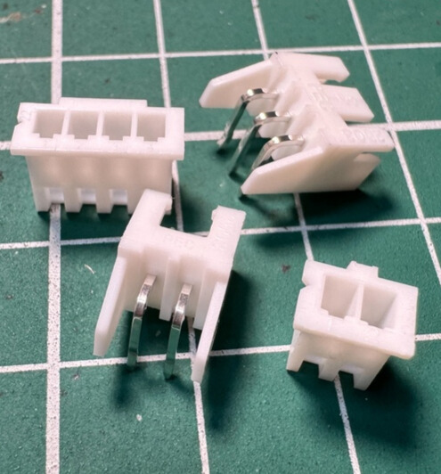
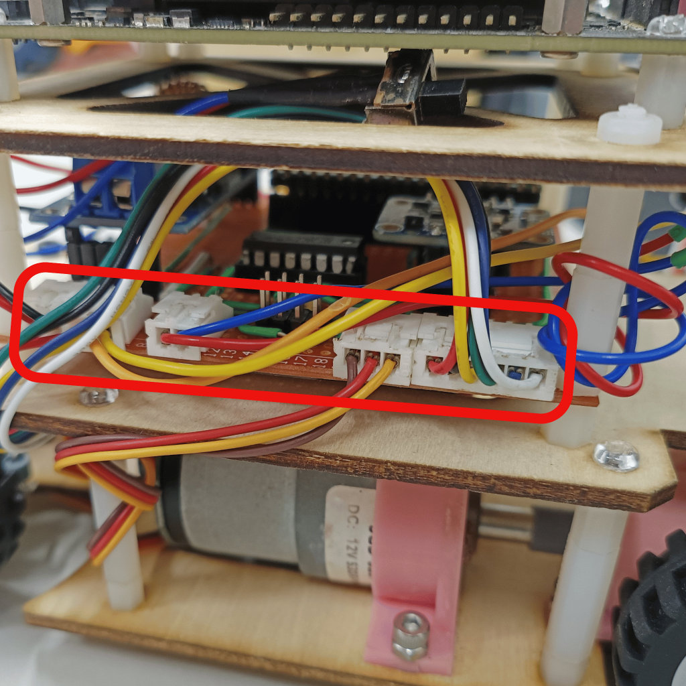

## 
Hardware Fool-Proof Design

In the actual hardware design process, we frequently encountered issues where the Jetson Nano controller or IC would get damaged due to incorrect power connections or data line misplacements. To prevent these occurrences, we implemented male and female connectors for power supply and data transmission and used soldering to secure the circuit on a bakelite board, ensuring correct wiring. This improvement effectively reduced the risk of burnout for the Jetson Nano controller or IC, enhancing system stability and increasing product reliability and lifespan.

<table>
<tr>
<th>2.5mm Connector 2/3 Pin Male/female Adapter Right Angle Pin Header White Socket</th>
<th>Circuit real-life photo</th>
</tr><tr>
<td></td> 
<td></td> 
</tr>
</table>

 

# 
[Return Home](../../)
  
