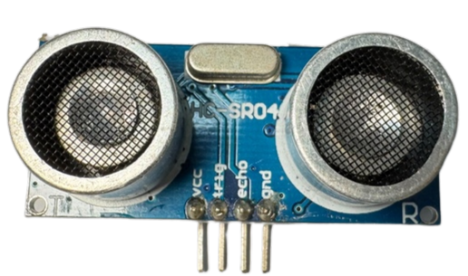
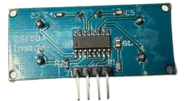
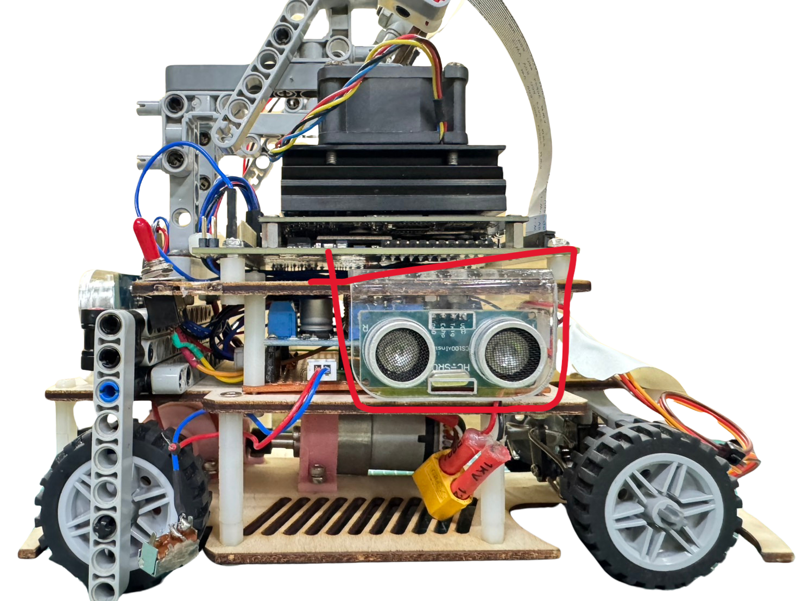
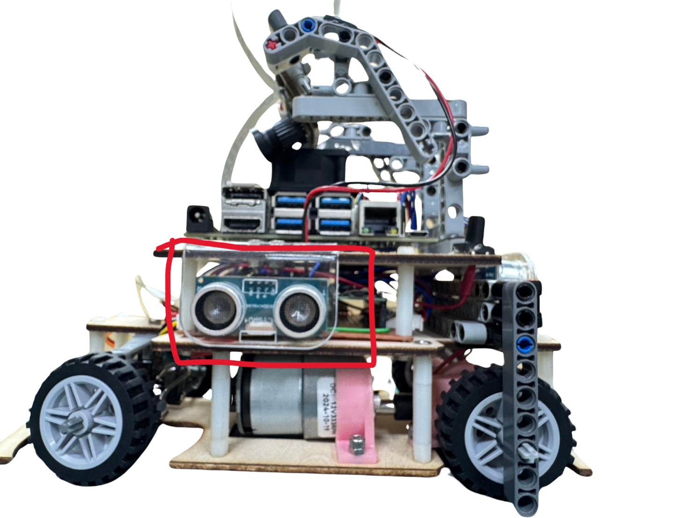
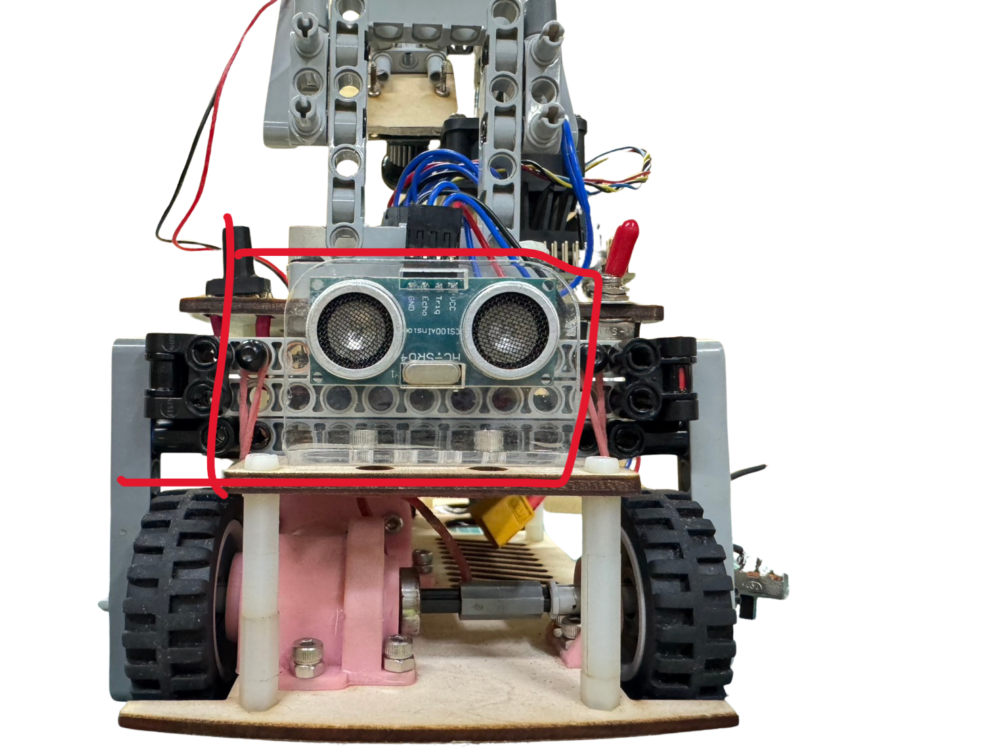
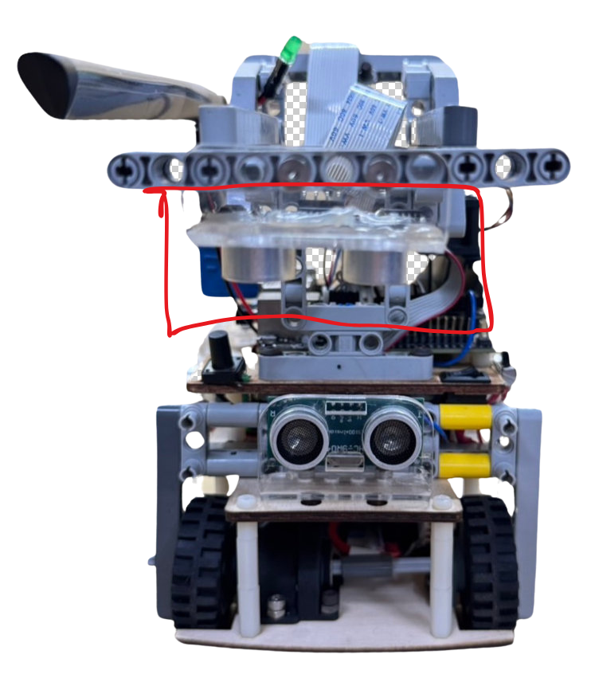

，

## 
Ultrasonic rangefinder Introduction
 

- ### __Instruction to HC-SR04 ultrasonic distance sensor__
    

    <table>
    <tr>  
    <td>
    <ol>
        <li>The HC-SR04 ultrasonic distance sensor is a cost-effective and user-friendly solution for distance measurement. It operates by transmitting ultrasonic pulses and measuring the time of flight to determine the distance to an object. With a measurement range of 2cm to 400cm and a precision of 3mm, it provides highly accurate and reliable distance data, making it suitable for a wide range of applications including obstacle avoidance, autonomous navigation, and object detection.
        </li>
        <li>The HC-SR04 ultrasonic distance sensor helps us detect the distance between the vehicle and the side wall when entering the parking area, facilitating parking maneuvers. By programming precise control based on the detected distance, we can guide the vehicle into the parking area smoothly, helping us successfully complete the task.
        </li>

    </ol>
    </td>
    <td width=300 align="center">

    <strong>Supports 3.3V operating voltage</strong>
    

        
        
    </td>
    </tr>
    </table>
    

   <ol>
    <li>We installed HC-SR04 ultrasonic distance sensors on the left, right, and rear of the vehicle and connected them to the Raspberry Pi Pico controller to detect the distance between the vehicle and the side walls. The measured distance data is transmitted to the main program for processing, serving as a basis for parking maneuvers.</li>
    <li>It is worth noting that the maximum signal voltage read by the Raspberry Pi Pico controller is 3.3V, while commercially available HC-SR04 ultrasonic distance sensors typically output a maximum signal voltage of 5V. Therefore, when selecting or using the sensor, special attention should be paid to its operating voltage to avoid operational issues or potential damage to the controller due to voltage mismatch.</li>
    </ol>
 
    

    <table >
    <tr align="center">
    <th colspan="4">HC-SR04 Ultrasonic Distance Sensor Placement Diagram on Vehicle</th>
    </tr>
    <tr align="center">
      <th>Left</th>
      <th>Right</th>
      <th colspan="2">Rear</th>
      </tr>
    <tr>
      <td></td>
      <td></td>
      <td></td>
      <td></td>
      </tr>
    </table>
    

   - #### Wiring steps for connecting the HC-SR04 to the Raspberry Pi Pico:

        - VCC (HC-SR04) connects to the 3.3V (pin 36) on the Raspberry Pi Pico: Provides power to the ultrasonic sensor.
        - GND (HC-SR04) connects to the GND pin on the Raspberry Pi Pico: Ensures a common ground between both devices.
        - Trig (HC-SR04) connects to the GPIO pins on the Raspberry Pi Pico:
            - pin 18 (left),
            - pin 16 (right),
            - pin 6 (rear), used for sending ultrasonic pulse signals.
        - Echo (HC-SR04) connects to the GPIO pins on the Raspberry Pi Pico:
            - pin 12 (left),
            - pin 17 (right),
            - pin 7 (rear), used for receiving the echo signal.
    
 - Below is the code written in MicroPython, implemented as a class to read the detection distance from the HC-SR04 ultrasonic sensor using the Raspberry Pi Pico.
   - #### MicroPython code 
            from machine import Pin, time_pulse_us
            import time
            class HCSR04:
                def __init__(self, trigger_pin, echo_pin, echo_timeout_us=30000):
                    self.trigger = Pin(trigger_pin, Pin.OUT)
                    self.echo = Pin(echo_pin, Pin.IN)
                    self.echo_timeout_us = echo_timeout_us
                    self.trigger.low()
                    time.sleep(0.05)  # Stabilize the sensor

                def distance_cm(self):
                    # Send a 10us pulse to trigger the measurement
                    self.trigger.high()
                    time.sleep_us(10)
                    self.trigger.low()

                    # Wait for the echo response and measure its duration
                    try:
                        pulse_time = time_pulse_us(self.echo, 1, self.echo_timeout_us)
                    except OSError as ex:
                        pulse_time = -1

                    # Calculate distance in cm (pulse time in microseconds)
                    if pulse_time > 0:
                        distance = (pulse_time / 2) / 29.1  # Speed of sound ~343 m/s
                    else:
                        distance = -1  # Return -1 if timeout or error

                    return distance
  
   - #### Example usage  

            sensor = HCSR04(trigger_pin=3, echo_pin=2)  # Assign pins accordingly
            while True:
                distance = sensor.distance_cm()
                if distance == -1:
                    print("Out of range or error")
                else:
                    print("Distance: {:.2f} cm".format(distance))
                time.sleep(1)
   - #### Explanation  
        This code includes a class named <strong>HC-SR04</strong> that measures distance by defining trigger and echo pins. The distance_cm() method returns the distance in centimeters, and if a measurement error occurs or the distance is out of range, it returns -1.

# 
[Return Home](../../)
  
