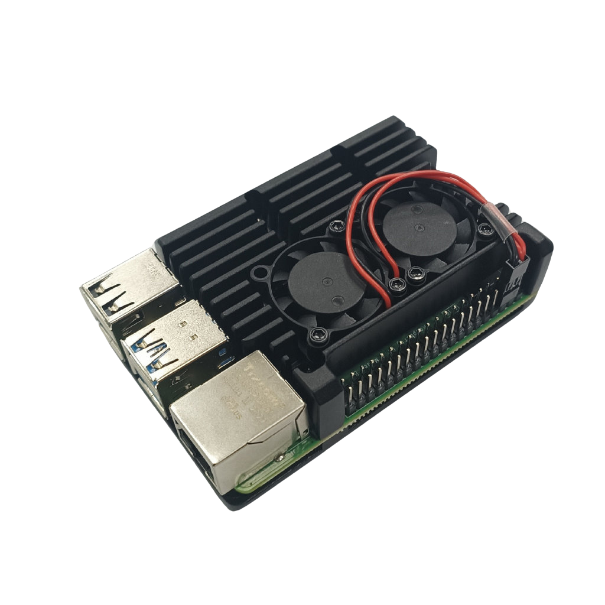

# 
Controller Selection 
 

Jetson Nano and Raspberry Pi are commonly available low-cost controllers in Taiwan with AI image recognition capabilities, suitable for various applications, including programming instruction in education, smart home devices, autonomous vehicles, and DIY projects.

## Jetson Nano & Raspberry Pi Controller Comparison
The comparison is shown in the table below.

<table>
<tr>
<th rowspan="2" width=300>Photo</th>
<th>Nvidia Jetson Nano</th>
<th>Raspberry Pi 4B</th>
</tr><tr>
<td>
</td>
<td>
</td>
</tr><tr>
<th>Number of Pins</th>
<td>40P</td>
<td>40P</td>
</tr><tr>
<th>CPU</th>
<td>Quad-core ARM® Cortex®-A57 MPCore</td>
<td>1.5GHz 64-bit Quad-core ARM Cortex-A72 CPU</td>
</tr><tr>
<th>GPU</th>
<td>NVIDIA Maxwell™ architecture with 128 NVIDIA CUDA®  cores</td>
<td>Broadcom VideoCore VI  H.265 (4kp60 decode)  H264 (1080p60 decode, 1080p30 encode) OpenGL ES 3.1  Vulkan 1.0</td>
</tr><tr>
<th>Storage Spac</th>
<td>4 GB 64-bit LPDDR4</td>
<td>8GB LPDDR4-3200 SDRAM</td>
</tr><tr>
<th>Built-in Bluetooth and Wireless WiFi Connectivity</th>
<td>Requires external Bluetooth and wireless WiFi connectivity</td>
<td>Built-in</td>
</tr><tr>
<th>Gflops</th>
<td>472</td>
<td>13.5</td>
</tr><tr>
<th>Price</th>
<td>Expensive</td>
<td>Cheap</td>  
</tr>
</table>

 
  Based on last year’s unsuccessful experience and the world championship-winning model, along with the comparison of advantages and disadvantages of the controllers below, we found that the Jetson Nano significantly outperforms the Raspberry Pi 4 in image recognition. Therefore, we decided to use the Jetson Nano as the main controller in the 2024 WRO World Championship.

 ***
- ### Supplementary Information
#### Here's our comparison of the jetson nano and the Raspberry Pi
  #### 1. Hardware architecture
   - Jetson Nano: Equipped with a quad-core ARM Cortex-A57 CPU and a 128-core NVIDIA Maxwell GPU, with 4GB LPDDR4 memory.
   - Raspberry Pi 4: Equipped with a quad-core ARM Cortex-A72 CPU, with a maximum memory option of 8GB, but lacks a dedicated GPU.
  #### 2. Deep learning acceleration
   - Jetson Nano: Supports NVIDIA CUDA and cuDNN, which can accelerate deep learning workloads. For tasks like image classification and object detection, the GPU in Jetson Nano significantly enhances processing speed.
   - Raspberry Pi 4: Lacks a dedicated GPU and deep learning acceleration capabilities; image recognition tasks rely entirely on CPU processing, which is far less efficient than the GPU acceleration of Jetson Nano.
  #### 3. OpenCV performance
   - Jetson Nano：Due to its CUDA support, it performs better when processing image recognition tasks based on deep learning. OpenCV can take advantage of NVIDIA GPUs to accelerate image processing operations.
   - Raspberry Pi 4：Processing power relies on the CPU, so it is slower when faced with the same tasks. For simple image processing tasks, the Pi 4's CPU is also capable, but its efficiency will significantly lag behind when handling more complex neural network inference.
  #### 4. Power consumption
   - Jetson Nano：The power consumption is large, about 5W - 10W in typical usage scenarios, especially when using GPU for acceleration, the power consumption will be higher.
   - Raspberry Pi 4：The power consumption is low, usually about 3.5W - 7W, which is suitable for application scenarios that are sensitive to power consumption requirements.
  #### 5. Performance comparison in actual application scenarios
   - Jetson Nano：When using OpenCV and DNN modules for real-time object detection, image classification and other tasks, the speed is significantly better than Raspberry Pi 4. With CUDA acceleration, Jetson Nano can process video streams faster and perform on-the-fly inference.
   - Raspberry Pi 4：It is suitable for processing tasks that do not require high performance, such as simple image processing operations or non-real-time image recognition tasks.
  #### 6. Development ecology
   - Jetson Nano's development ecosystem is specially designed for AI and computer vision tasks. There is JetPack SDK provided by NVIDIA, which includes optimized OpenCV to facilitate developers to quickly deploy deep learning models.
   - Although Raspberry Pi 4 also supports OpenCV, it lacks dedicated hardware acceleration and its support for complex deep learning tasks is not as good as Jetson Nano.

# 
[Return Home](../../)
 
