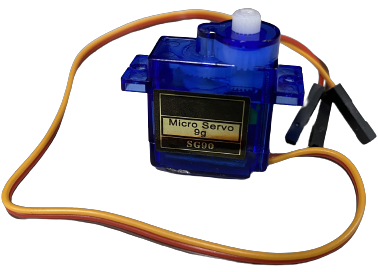

# 
 Motor Selection
 
To ensure smooth vehicle operation, choosing the right drive motors is essential. The motors responsible for controlling the vehicle’s movement include the steering motor and the rear-drive DC motor. Below are our considerations and decisions in selecting these motors:

- Steering Motor Selection
When choosing the steering motor, we prioritized motor precision and torque. Since the steering system requires precise control of the steering angle, we selected a servo motor capable of providing high-precision control, ensuring stable and flexible operation during steering maneuvers.

- Rear-Drive DC Motor Selection
The rear-drive DC motor provides the vehicle’s driving power, so we focused on its power and torque performance to ensure sufficient power for various terrains and obstacles. Additionally, to improve driving efficiency, we chose a high-power-density DC motor, ensuring optimal acceleration and driving stability during the competition.

Through careful selection of these two motors, we enhanced vehicle performance and addressed last year's challenges related to power transmission and steering control.

### Front Steering Mechanism by Servo Motor
- The MG90S and SG90 are commonly available and easy-to-purchase servo motors in Taiwan. Their specifications, including weight, rotation angle, and torque, meet our requirements.
- Considering durability, we selected the __MG90S__ with metal gears as the steering control motor for the competition to ensure stability and reliability during high-intensity operation.

<table>
<tr><th colspan="3" width ="100%">Servo Motor Comparison</th></tr>
<tr align="center">
<th rowspan="2"  ">Model</th>
<th >MG90S</th>
<th >SG90</th>
</tr>
<tr align="center">
<td ></td>
<td > </td>
</tr>
<tr align="center">
<td>Rotation Angle</td>
<td>90° MAX</td>
<td>360° MAX</td>
</tr>
<tr align="center">
<td>Torque</td>
<td>2.0kg/cm</td>
<td>1.4 kg/cm</td>
</tr>
<tr align="center">
<td>Speed</td>
<td>0.11s</td>
<td>0.1S</td>
</tr>
<tr>
<tr align="center">
<td>Material</td>
<td>Metal copper gears</td>
<td>Plastic gears</td>
</tr>
</table>

### Rear-Drive DC Motor
- When selecting a DC motor among commonly available options in the market, considering factors such as weight, rotational speed, and torque, we have identified the following four suitable DC motors.
- Among them, the three types of motors, JGA25, have different model numbers but share a similar physical appearance, and their differences are as follows.

<table>
<tr ><th colspan="8">DC Motor Comparison</th></tr>
<tr align="center">
<th rowspan="2" >Model</th>
<th >JGA25 370</th>
<th >MG513-P20</th>
<th >MG513-P30</th>
<th >JGB37-520</th>
</tr>
<tr align="center">
<td ></td>
<td colspan="2"></td>
<td ></td>
</tr>
<tr align="center">
<td >Reduction ratio</td> 
<td >9.6</td>
<td >20</td>
<td >30</td>
<td >19</td>
</tr>
<tr align="center">
<td >Speed</td> 
<td >620rpm</td>
<td >549rpm</td>
<td >366rpm</td>
<td >530rpm</td>
</tr>
<tr align="center">
<td>Torque</td>
<td>0.22kg.cm</td>
<td>0.66kg.cm</td>
<td>1kg.cm</td>
<td>2.2kg.cm</td>
</tr>
</table>

Reference Link：
[JGA25 370](https://img.alicdn.com/imgextra/i2/1816775355/O1CN01CzcWlm1pQdvWW5V7g_!!1816775355.jpg)
[MG513    ](https://img.alicdn.com/imgextra/i4/723377223/O1CN01KXs4PS23EBmTEHNLS_!!723377223.jpg)
[JGB37-520](https://img.alicdn.com/imgextra/i2/1991552278/O1CN01dCTXFL1ShMoMXovK4_!!1991552278.png)

- As shown in the table above, we initially planned to use the previously selected DC motor, JGA25, but due to space constraints in the newly designed chassis, it could not be accommodated. Therefore, we chose to compare the shorter MG513 and JGB37 motors and conducted relevant experiments.
- After considering the motor’s speed, torque, compatibility with the vehicle structure, and actual experimental results, we selected the __MG513-P20__ as the rear-wheel drive DC motor for the vehicle.

### Motor Drive Controller
- Since the DC motor requires a motor driver controller to achieve forward and reverse control of the vehicle, we selected the commonly available L293D IC, L298N module, and TB6612FNG module on the Taiwan market for experimental testing to find the most suitable driving solution.   
- __As shown in the table below, under the conditions met, the L293D IC best meets our requirements, considering the vehicle’s size and weight..__

<table>
<tr><th colspan="4">Motor Control Comparison</th></tr>
<tr align="center" >
<th rowspan="2">Model</th>
<th>L293D</th>
<th>L298N</th>
<th>TB6612FNG</th>
</tr>
<tr align="center">
<td> </td>
<td ></td>
<td ></td>
</tr>
<tr align="center">
<td>Occupied Area(mm)</td>
<td>29.5x8</td>
<td>43.5x43.5</td>
<td>20.5x20.4</td>
</tr>
<tr align="center">
<td>Output Voltage</td>
<td>4.5V to 36V</td>
<td>5V to 46V</td>
<td>2.5V to 13.5V</td>
</tr>
<tr align="center">
<td>Rated Power </td>
<td>5W</td>
<td>10W</td>
<td>1.36W</td>
</tr>
</table>

***
- ### Supplementary information
  #### Introduction to Motor Driver Controllers
    #### 1.L293D Driver Chip
    - __Function__: The L293D is a quad-channel driver suitable for driving DC motors and stepper motors. Each channel can independently control one motor.
    - __Voltage Range__: The output voltage can reach 36V, and the maximum current is 600mA.
    - __Features__: It has built-in diodes, providing overcurrent and reverse voltage protection, making it suitable for small robot projects.
    - __Advantages__: High cost-performance ratio and widely applicable, suitable for driving smaller motors.

    #### 2.L298N Driver Module
    - __Function__: The L298N is a driver that can simultaneously control two DC motors or one stepper motor. The module usually comes with a heat sink to assist with cooling.
    - __Voltage Range__: The maximum input voltage can reach 46V, and the peak current can reach 2A per channel.
    - __Features__: It includes built-in reverse voltage protection diodes and supports PWM speed control, making it suitable for medium-sized robot and motor projects.
    - __Advantages__: Provides high output current and a wider operating voltage range, suitable for motors requiring higher power.

    #### 3.TB6612FNG Driver Module
    - __Function__: The TB6612FNG is a driver that supports two DC motors. This module is more efficient, smaller in size, and can provide higher output current.
    - __Voltage Range__: It supports input voltages from 2.5V to 13.5V, with a maximum continuous current of 1.2A per channel and a peak current of 3.2A.
    - __Features__: It has lower power consumption and higher output efficiency, and supports built-in PWM control functions.
    - __Advantages__: With low internal resistance and minimal heat generation, it is suitable for small and medium-sized robot projects, as well as systems with low power consumption requirements.

# 
[Return Home](../../)
  
