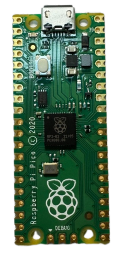
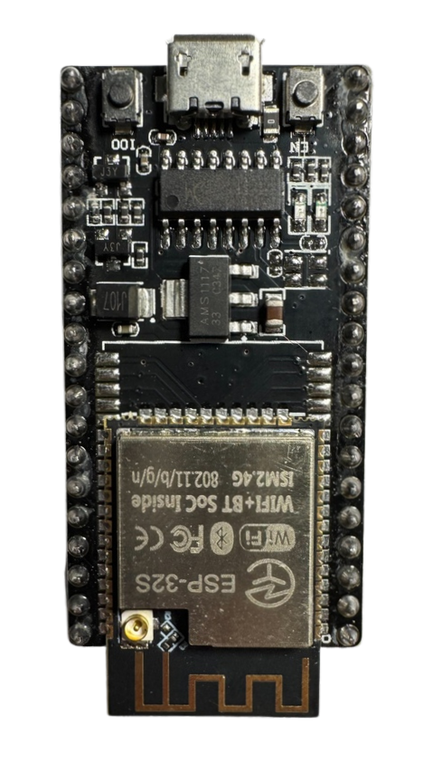
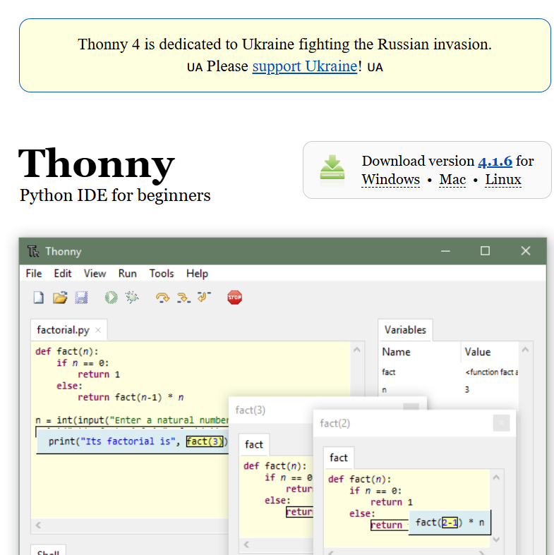

## 
Motor & Sensor Intermediate I/O controller Selection 
 

- After reviewing the I/O control aspects of the Jetson Nano, we identified the following drawbacks:
  - __Processing Limitations:__ While the Jetson Nano excels in handling AI and machine learning tasks, its CPU is relatively limited and may face performance bottlenecks when performing extensive I/O control tasks, especially when handling complex computations and I/O operations simultaneously.
  - __GPIO Latency:__ Compared to dedicated microcontrollers (such as Arduino, ESP32, etc.), the Jetson Nano may have higher latency when using Python or other high-level languages for GPIO control, which affects applications requiring high real-time performance.
  - __Limited Hardware Interfaces:__ The number of GPIO pins provided by the Jetson Nano is relatively limited. If a large number of I/O interfaces are needed, expansion boards may be required, increasing development costs and complexity. 
  - __Voltage Incompatibility:__ The GPIO on the Jetson Nano typically operates at 3.3V, which can be incompatible with some 5V I/O devices, necessitating the use of voltage converters for level matching.

- Due to the Jetson Nano's inability to handle too many sensors simultaneously, we need to use additional microcontrollers as extension boards to facilitate more efficient signal communication between the sensors and the Jetson Nano main controller.
- The Raspberry Pi Pico and ESP32 WiFi, two commonly used microcontroller boards in Taiwan, are well-equipped to handle sensor data and motor control tasks.
- To facilitate the selection of the optimal intermediate I/O controller for our autonomous vehicle, we will conduct a comparative analysis of the specifications and costs of these two options.

### Raspberry Pi Pico & Esp32 wifi Controller Comparison
Here is a specification comparison between the two:

<table>
<tr>
<th rowspan="2" width=300>Photo</th>
<th>Raspberry Pi Pico</th>
<th>Esp32 wifi</th>
</tr><tr>
<td>
</td>
<td>
</td>
</tr><tr>
<th>CPU</th>
<td>Dual-core ARM Cortex-M0+ @ 133 MHz</td>
<td>Dual-core Xtensa LX6 @ 160/240 MHz</td>
</tr>
<tr>
<th>RAM</th>
<td>264 KB SRAM</td>
<td>520 KB SRAM</td>
</tr>
<tr>
<th>WIFI</th>
<td>None</td>
<td>Wi-Fi 802.11b/g/n (2.4 GHz), Bluetooth (v4.2)</td>
</tr>
<tr>
<th>Storage</th>
<td>2 MB Flash</td>
<td>Supports external Flash (typically 4 MB to 16 MB)</td>
</tr>
<tr>
<th>GPIO</th>
<td>26 GPIO pins</td>
<td>34 GPIO pins</td>
</tr>
<tr>
<th>ADC</th>
<td>3-channel ADC (12-bit).</td>
<td>18-channel ADC (12-bit).</td>
</tr>
<tr>
<th>PWM</th>
<td>Configurable PWM output.</td>
<td>Supports multi-channel PWM</td>
</tr>
<tr>
<th>Data transmission interface</th>
<td>I2C, SPI, UART</td>
<td>I2C, SPI, UART, CAN, I2S</td>
</tr>
<tr>
<th>Voltage input</th>
<td>1.8V - 5.5V</td>
<td>2.2V - 3.6V</td>
</tr>
<tr>
<th>size</th>
<td>51 x 21 mm</td>
<td>18 x 25 mm</td>
</tr>
<tr>
<th>Price</th>
<td>cheap</td>
<td>Relatively expensive</td>
</tr>
<tr>
<th>Development environment</th>
<td>MicroPython、C/C++</td>
<td>Arduino IDE、MicroPython、ESP-IDF</td>
</tr>
</tbody>
</table>

The Raspberry Pi Pico  offers simplicity, low power consumption, and affordability, making it ideal for applications with low wireless demands. It also aligns well with the requirements of this competition. Therefore, we have chosen the Raspberry Pi Pico as a relay management controller for the Nvidia Jetson Nano, responsible for managing motors and sensors.

 ***
- ### Supplementary Information

  __Introduction to  Thonny software__
  - In this competition, we chose to use Thonny software to write programs for the Raspberry Pi Pico control board.
  - Due to MicroPython's dedicated features for various microcontrollers (such as the Raspberry Pi Pico, ESP8266, ESP32, etc.), development on these boards becomes more convenient. Therefore, we chose Thonny as our development tool. Thonny not only supports MicroPython development but also allows direct connection to microcontroller boards, making it easier to write, test, and debug code. This combination simplifies the development process and enables quick deployment and verification of programs on the hardware.

  
    

    <table>
    <tr>
    <th>Thonnry Website</th>
    </tr><tr>
    <td>
</td>
    </tr>
    </table>
       
    <a href="https://thonny.org/">Thonnry Website</a>    
    

# 
[Return Home](../../)
 
