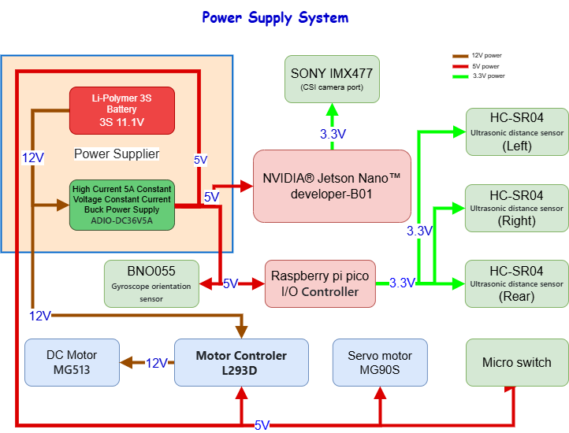

## 
Vehicle Power Supply System Introduction
 
- ###  Power Supply Operation System Overview Diagram
  

- ###  Physical Connection Diagram of Power Supply System
  

- ### Power Supply System Operation Instructions
  Each electronic component requires a specific operating voltage to function properly, and the configuration is as follows:
    - The 3S Li-Polymer battery provides 11.1V, which powers the buck converter module and the L293D motor control chip to drive the 12V DC motor.
    - The 5A constant voltage and constant current buck power module steps down the 11.1V to 5V, supplying power to components requiring a 5V operating voltage, including the Nvidia Jetson Nano, Raspberry Pi Pico, L293D dual H-bridge DC motor driver IC, BNO055 gyroscope orientation sensor, and the MG90S front steering servo motor.
    - The Nvidia Jetson Nano control board further supplies 3.3V to the camera module.
    - The Raspberry Pi Pico control board provides 3.3V to the HC-SR04 ultrasonic distance sensor.
  
  This configuration ensures all components operate stably at their required working voltages.

# 
[Return Home](../../)
  

