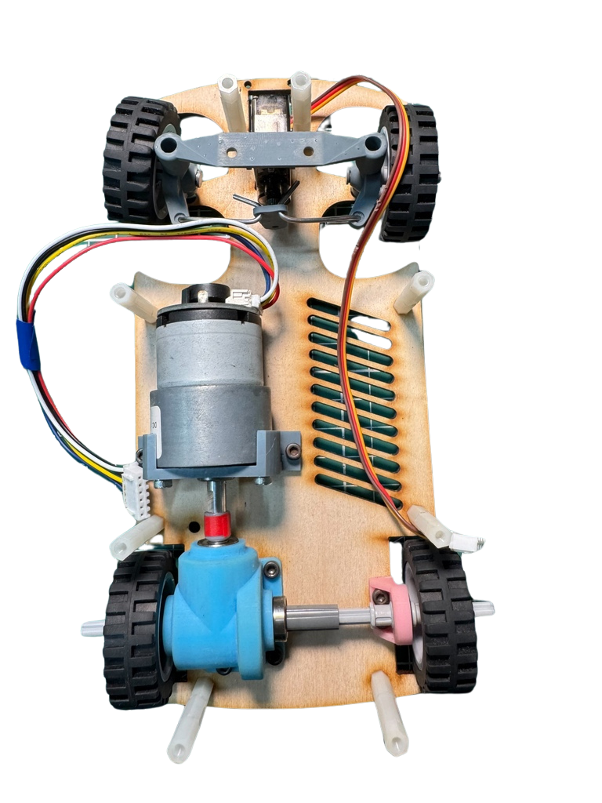
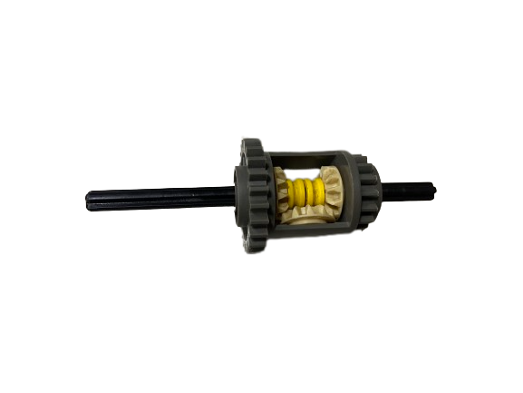

## 
Vehicle Chassis Design Process
 

- ### Vehicle Chassis Design
  - The design inspiration for both the hardware and software of this self-driving car came from last year’s model created by our sister team (Shinan-Fire-On-All-Cylinders) and drew upon the strengths of the world championship-winning model from last year. Based on this, we made improvements by upgrading the main controller from the "Raspberry Pi 4B" to the "Nvidia Jetson Nano" to enhance performance and introduce innovative design elements, making the vehicle more competitive.
  - The vehicle chassis used in this competition is self-designed and developed.
  - We applied Ackermann steering geometry to the vehicle chassis and made improvements based on the shortcomings of last year’s mechanism, resulting in smoother obstacle avoidance and U-turns.
  - The following table shows the 3D models and finished products of the vehicle chassis.

    |3D Vehicle Chassis Design| Vehicle Chassis Top View | Vehicle Chassis Bottom View|
    |:----:|:----:|:----:|
    ||||

  - We can customize the size and shape of parts according to the specific needs of the vehicle and use Stereolithography (SLA) 3D printers and laser cutters to design and manufacture all parts of the vehicle chassis, except for the gears, Lego 62821Gear Differential and tires.
  - To reduce rotational friction of the shafts, we integrated bearings into the vehicle's support frame, thereby increasing the vehicle's speed.
  - To precisely control the vehicle's optimal turning radius and flexibly adjust the Ackermann ratio, we used Stereolithography (SLA) 3D printers and 3D modeling technology to design the support frame for the Ackermann steering geometry on the vehicle chassis based on specific requirements.

- #### Vehicle Chassis Improvement Record

  - The following is a comparison between last year’s model (Shinan-Fire-On-All-Cylinders) and this year’s improved model, recorded in the table below:
  ### __2023 Competition Prototype__

  

  <table>
  <tr align=center>
  <th>2023 Competition Prototype </th>
  <th>2023 Competition Prototype</th>
  <th>Explanation</th>
  </tr><tr >
  <td width="30%"></td>
  <td width="30%"></td>
  <td>Last year's vehicle chassis had several issues:  
    <ol>
      <li>The position of the front steering servo motor was too low, causing it to easily rub against the ground.</li>
      <li>The 3D-printed steering knuckle part was prone to breaking upon collision with walls.</li>
      <li>The gear differential was not compatible with the configuration of the front and rear DC motors, limiting the overall vehicle design.</li>
    </ol>  
      </td>
    
  </tr>
  </table>
  

 
  ### __Final Build__

  

  <table>
  <tr align=center>
  <th>Photos of the final Build</th>
  <th>3D modeling of the final Build</th>
  <th>Explanation</th>
  </tr><tr>
  <td width="30%"></td>
  <td width="30%"></td>
  <td>In addition to addressing the issues of last year's competition model, we also reduced the vehicle's width to make it easier to maneuver through obstacles.</td>
  </tr>
  </table>
  

- ###  Gear Differential
  For a vehicle's single drive system, a gear differential is an indispensable device because it effectively balances power and distributes it to different wheels, allowing each driven wheel to rotate at different speeds, especially during turns. This is crucial for improving the vehicle's agility and handling performance.

   - #### Modifications and evolution of the gear differential.
      In this competition, we used the LEGO gear differential 62821 combined with a homemade gear differential housing to achieve the vehicle's driving and steering functions.
  

  <table>
  <tr align=center>
  <th>LEGO 6573 Gear Differential</th>
  <th>LEGO 62821 Gear Differential</th>
  <th>Homemade Gear Differential housing</th>

  </tr><tr align=center>
  <td width="30%"></td>
  <td width="30%"></td>
  <td width="30%"></td>
  </tr>
  </table>
  

    - #### Reason for Modification
       - Due to changes in the motor's dimensions this year, the LEGO 6573 gear differential used in last year's model can no longer be utilized. As a result, we need to design a custom differential to accommodate the new dimensions of the vehicle body and ensure the entire vehicle system operates smoothly.
       - By using a custom-made gear differential housing to accommodate gear meshing and fixation, the power transmission loss was reduced.
  

  <table>
  <tr align=center>
  <th>LEGO 6573 Gear Differential</th>
  <th colspa ="2">Homemade Gear Differential</th>
  </tr><tr align=center>
  <td width="50%"></td>
  <td width="50%"></td>
  </tr>
  </table>
  

- ### Supplementary information
    - #### What is an Ackermann Steering Geometry?
      __Ackermann Steering Geometry Introduction__
        - The Ackermann steering geometry, proposed by German automotive engineer Lankensperger in 1817, is a steering system design used in automobiles. It was developed to address the geometric discrepancy in the paths of the inner and outer turning wheels when a vehicle makes a turn.
        - People apply Ackermann steering geometry to the steering mechanism of vehicles. Through the corresponding cranks of the four-linkage system, the steering angle of the wheels relative to the projected tire is increased by about 2 to 4 degrees. This results in the rough convergence of the trajectory centers of all four wheels along the extension line of the rear axle, thereby achieving the vehicle's turning.
      
        

      Reference Link：[Ackermann steering geometry@Wikipedia](https://zh.wikipedia.org/zh-tw/%E9%98%BF%E5%85%8B%E6%9B%BC%E8%BD%89%E5%90%91%E5%B9%BE%E4%BD%95)
      #### The principle of Ackermann steering geometry is based on the following concepts:     
       - __Difference in Turning Radius:__ When the vehicle makes a turn, the two front wheels need to rotate at different angles to allow the vehicle to pivot around a central point.
       - __Turning Angles of the Two Front Wheels:__ The design of the Ackermann steering geometry ensures that both front wheels pass through a central point simultaneously during steering.
    - Compared to the Ackermann steering geometry made from the original 0% LEGO bricks, the steering mechanism of this competition vehicle is designed with reference to an 80% Ackermann steering geometry. It offers advantages such as reduced resistance and smoother turns. The Ackermann steering geometry parts are produced using a stereolithography (SLA) 3D printer. However, the most challenging aspect of the process was adjusting the Ackermann ratio to achieve the ideal turning angle for our vehicle to navigate around blocks effectively.  
  
  - #### Why Choose an 80% Ackermann Ratio?

    - In theory, this design is the optimal choice for smooth and efficient turns. However, it may lead to excessive tire wear. Therefore, in automobile design, a 100% Ackermann ratio is usually not chosen. Compared to a 100% Ackermann ratio, an 80% Ackermann ratio allows for smoother, more predictable turns, improves maneuverability, and reduces tire wear.
  
    - #### Calculating the Ackermann Angle Graphically (a-b = ack)
    

    <table>
    <tr align=center>
    <td></td>
    <td></td>
    </tr>
    </table>
    

    Reference Video website：[汽车转弯 没那么简单: 阿克曼转向几何是个啥？How does Ackerman steering geometry work?](https://www.youtube.com/watch?v=8AimxDPWKcM)

# 
[Return Home](../../)
  
