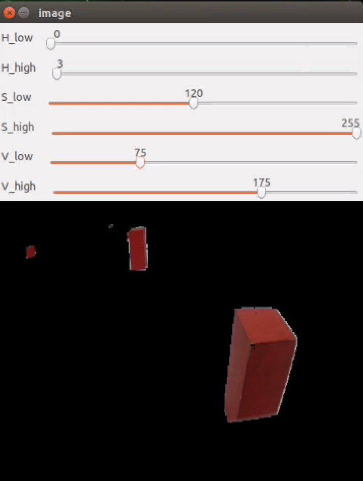
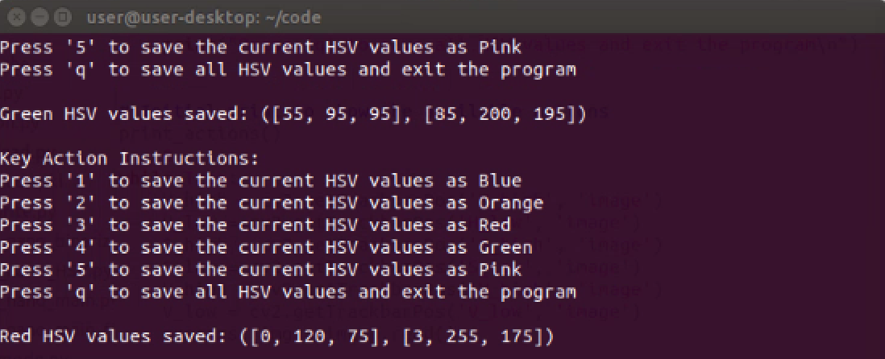
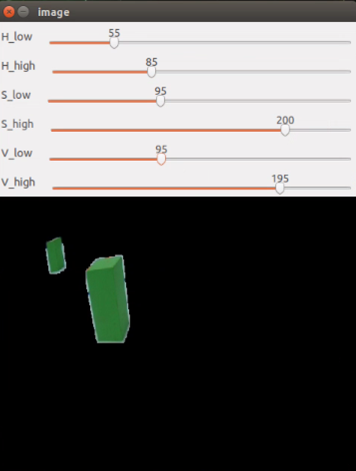
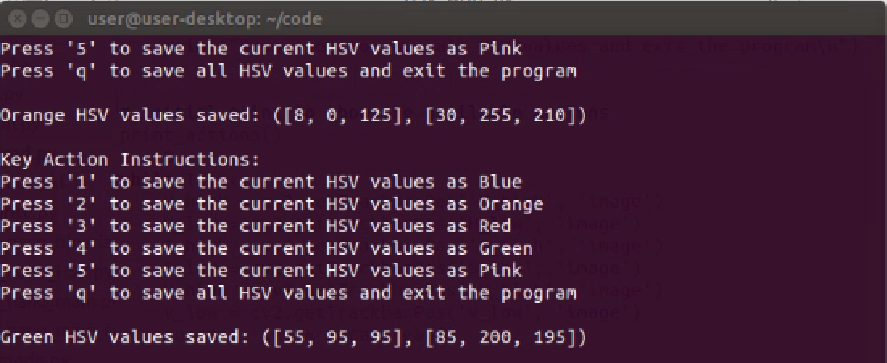
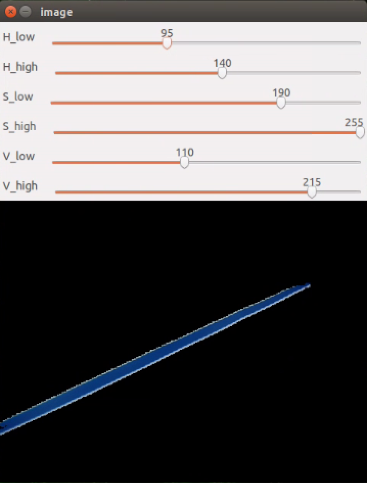
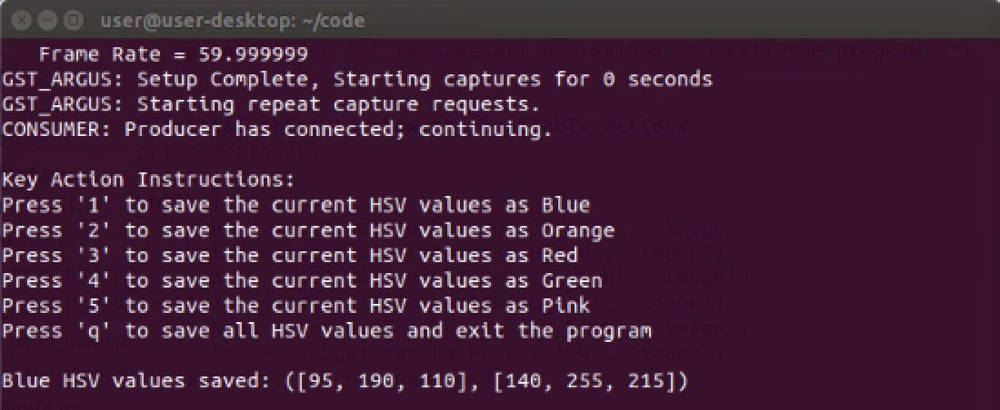
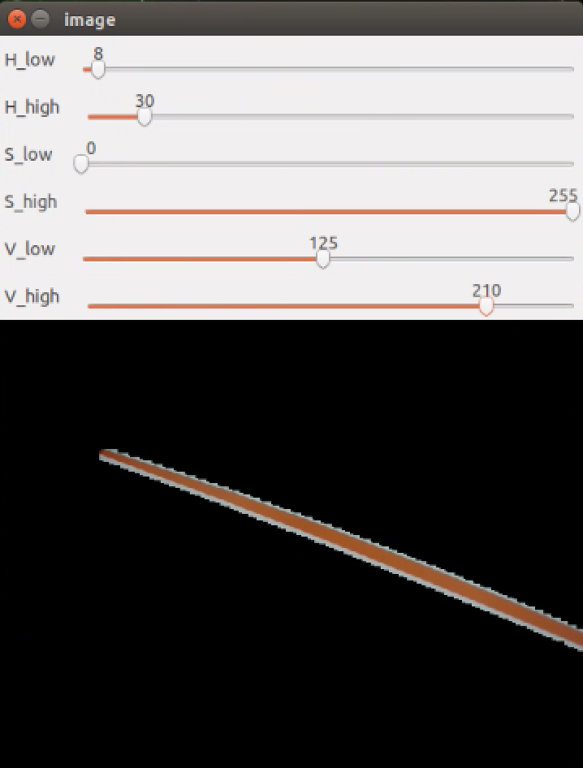
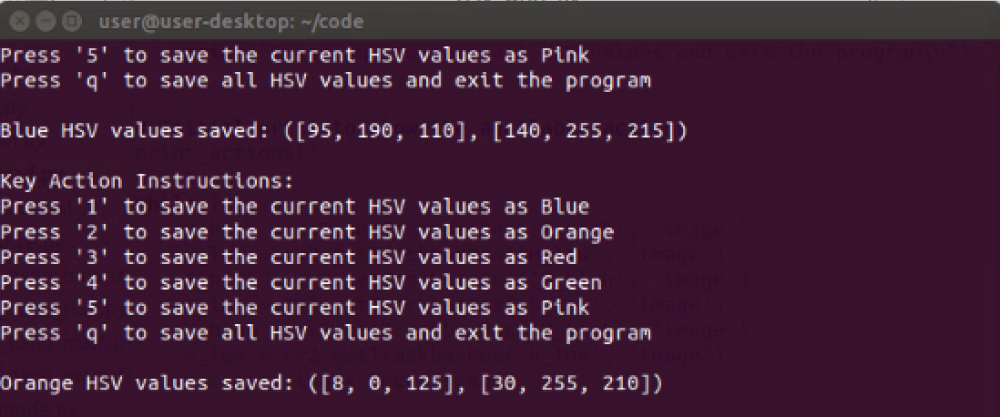
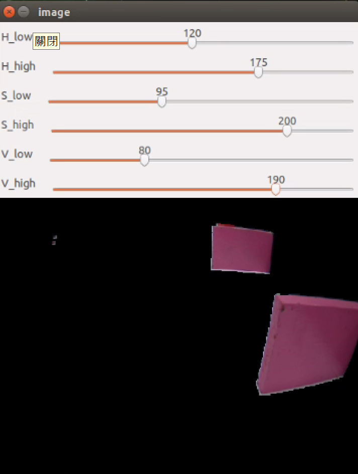
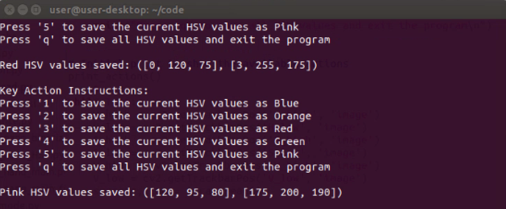

## 
 Automatically record the HSV values of the field
 
To record the colors of traffic sign blocks, parking area sidewalls, and field lines, we wrote a program that automatically saves the finalized HSV values in the Jetson Nano controller. This feature eliminates the need for manual recording, saving time and ensuring data accuracy.

- #### Image processing
    - When processing images, using the [`HSV_write.py`](./code/HSV_write.py) file to convert lines on traffic sign blocks and field base maps into different color spaces is a necessary step to effectively handle specific tasks.
    - We use the `cv2.cvtColor` function to convert the original RGB image into the HSV (hue, saturation, value) color space.
    - Once the image has been converted, we use the `cv2.inRange` function and set six HSV values: `H_low`, `H_high`, `S_low`, `S_high`, `V_low`, and `V_high` to define a color range. The `cv2.inRange` function compares each pixel value in the HSV image with the specified HSV range. If the pixel value falls within this range, it is retained; otherwise, it is filtered out. This process allows us to obtain a filtered image.
    - After obtaining the filtered image, we use the pickle module to save the current six HSV values as data, generating an `hsv_values.pkl` file.
    - In [`function.py`](./code/function.py), the saved HSV values in the `hsv_values.pkl` file are imported into the `hsv_values dictionary`, where the HSV values for the orange and blue lines on the field, red and green traffic sign blocks, and pink boundary walls are assigned to variables corresponding to each color.

**Red traffic sign block**

|Adjusting the HSV Range Values for Red Color|Save the HSV range values for Red|Live image of the Red traffic sign block|
|:----:|:----:|:----:|
||||

**Green traffic sign block**

|Adjusting the HSV Range Values for GreenColor|Save the HSV range values for Green|Live image of the Green traffic sign block|
|:----:|:----:|:----:|
||||

**Blue line**

|Adjusting the HSV Range Values for Blue Color|Save the HSV range values for Blue|Live image of the Blue line|
|:----:|:----:|:----:|
||||

**Orange line**

|Adjusting the HSV Range Values for Orange Color|Save the HSV range values for Orange|Live image of the Orange line |
|:----:|:----:|:----:|
||||

**Pink sidewall**

|Adjusting the HSV Range Values for Pink Color|Save the HSV range values for Pink|Live image of the Pink sidewall|
|:----:|:----:|:----:|
||||

# 
[Return Home](../../)
  
