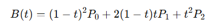

<div align="center"></div>

## <div align="center">Distinctive Pseudo Code</div>
   ### Application of Bézier curves in vehicle steering control.
   - We use a quadratic Bézier curve to guide the vehicle toward the traffic signal block, accurately positioning the block along the curve. The quadratic Bézier curve provides a smooth turning path; by setting a starting point, control point, and endpoint, it can adjust the vehicle’s driving trajectory, ensuring that the vehicle moves steadily toward the block. At the same time, the block’s position can be projected onto the Bézier curve, facilitating precise positioning and avoidance maneuvers by the vehicle.
   - Here are the steps to draw a quadratic Bézier curve and display it on an image:
    <ol>
    <li> Define control points: Each quadratic Bézier curve requires three control points, which determine the curve's starting point, endpoint, and the shape of its bend.</li>
    <li>Calculate the points of the quadratic Bézier curve: Use the Bézier curve formula to generate points on the curve. For a quadratic Bézier curve, the formula is as follows:</li>

       <br>
      P0,𝑃1,and𝑃2 are the three control points, and 𝑡 ranges from [0, 1].
    <li>Draw the curve: Use OpenCV to render the red and green quadratic Bézier curves.</li>
    </ol>

```
  def draw_multiple_curves(undistorted_frame, start_points, end_points, slope_values, curvature_factors, colors, thickness=2):
    """
    Draw multiple curves with different starting points, endpoints, slopes, and curvatures on the image, and return the coordinate list of the red curve.
    """
    red_curve_points = []  # Used to store the point coordinates of the red curve.
    green_curve_points = []  # Used to store the point coordinates of the green curve.

    for start_point, end_point, slope, curvature, color in zip(start_points, end_points, slope_values, curvature_factors, colors):
        x1, y1 = start_point
        x2, y2 = end_point
        # Calculate the position of the intermediate control point to control the degree of curvature
        mid_x = (x1 + x2) // 2
        mid_y = (y1 + y2) // 2
        control_x = mid_x
        control_y = int(mid_y - curvature * slope * (x2 - x1))  # Use curvature and slope to adjust the intermediate control point.
        #  Draw using Bézier curves.
        curve_points = []
        for t in np.linspace(0, 1, 100):
            xt = (1 - t)**2 * x1 + 2 * (1 - t) * t * control_x + t**2 * x2
            yt = (1 - t)**2 * y1 + 2 * (1 - t) * t * control_y + t**2 * y2
            curve_points.append((int(xt), int(yt)))
        # If it is a red curve, save the point coordinates.
        if color == (0, 0, 255):  # Red curve
            red_curve_points = curve_points
        if color == (0, 255, 0):  # green curve
            green_curve_points = curve_points
        # Draw curves with OpenCV.
        for i in range(len(curve_points) - 1):
            cv2.line(undistorted_frame, curve_points[i], curve_points[i + 1], color, thickness)

    return red_curve_points,green_curve_points  # Return the point coordinates of the red and green curves.
```
<div align="center" ></div>


# <div align="center">[Return Home](../../)</div>  
