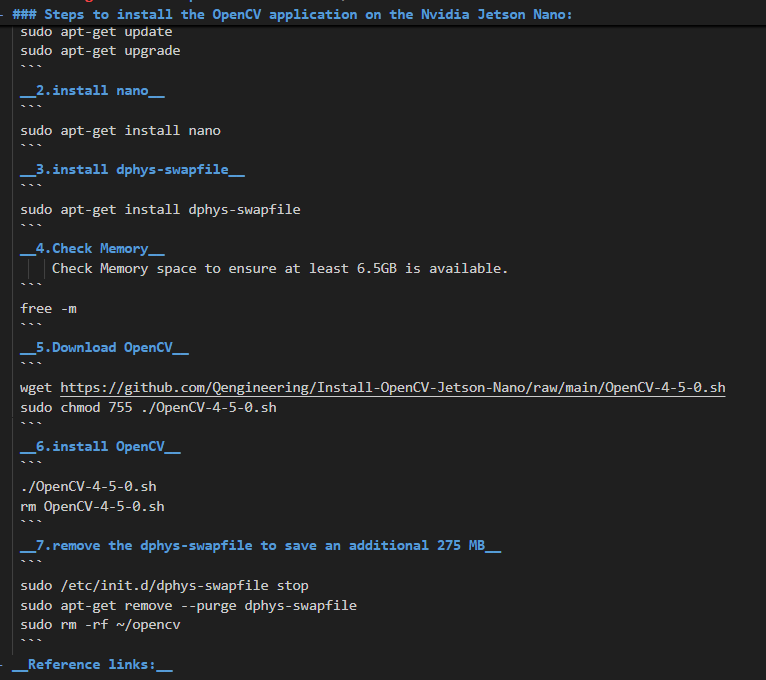
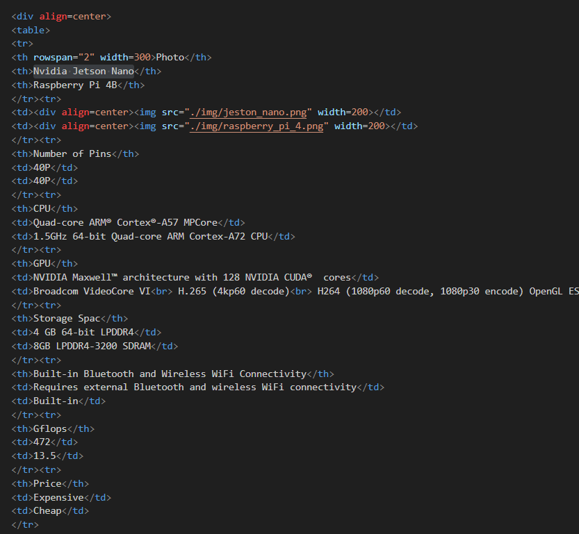

## 
GitHub Web Editing Languages
 

 To write engineering documentation on GitHub, we need to learn the following two types of web markup languages:

  - **HTML (HyperText Markup Language)**: HTML is a markup language used to create and structure webpage content. It defines the structure for elements like text, images, links, and tables, allowing browsers to properly display content. When writing engineering documentation, HTML helps us organize the page structure, making information more readable.
    - #### [HTML Document link](https://www.w3schools.com/html/)

  - **Markdown**: Markdown is a lightweight markup language, especially suited for writing documentation on GitHub. It uses simple syntax to format text, such as headers, lists, links, images, and code blocks. Markdown works seamlessly with GitHub's built-in renderer, making engineering documentation easy to read and maintain. 
    - #### [Markdown Document link](https://markdown.tw/#link)

<table>
<tr align="center" >
<th>Markdown</th>
<th>HTML</th>
</tr>
<tr align="center">
<td> </td>
<td>HTML 語法"/> </td>
</tr>
</table>

# 
[Return Home](../../)
  

