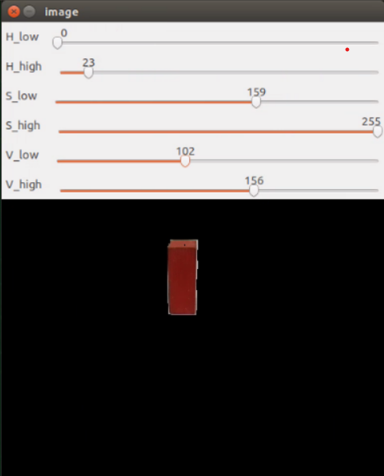
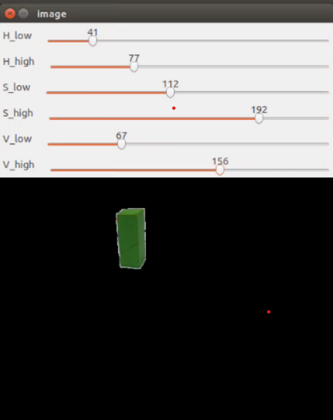
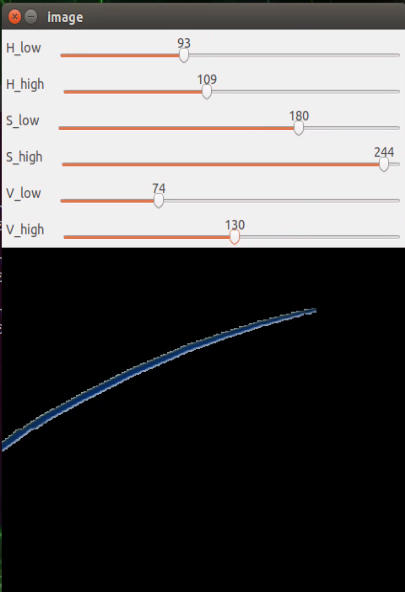
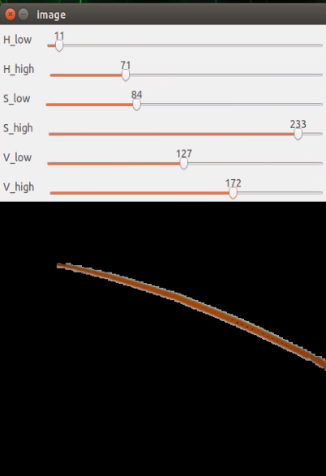
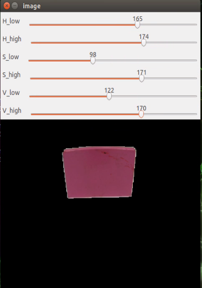
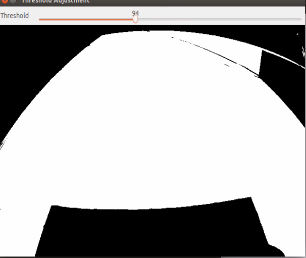
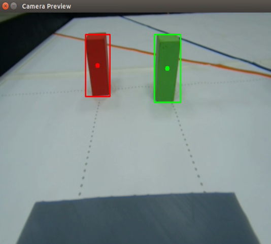
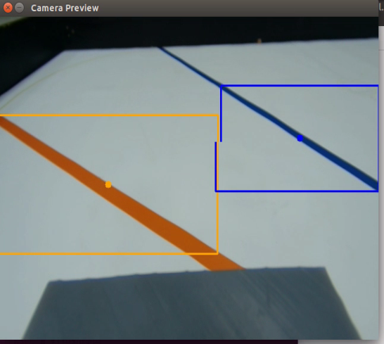
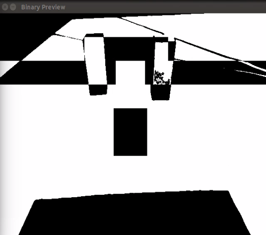

## 
Image Recognition Processing
 
  On the competition field, there are six colors—red, green, blue, orange, pink, and black—that need to be identified through image recognition to determine their locations, enabling the vehicle to successfully avoid obstacles or complete designated tasks.

  We will use the popular image recognition software OpenCV to identify objects on the competition field.
  
- #### Color Detection Using HSV in OpenCV([jetson_nano_HSV.py](../Programming/common/jetson_nano_HSV.py))
  To perform color detection, we convert the RGB color space to HSV and split the HSV values into upper and lower bounds to establish a range, ensuring accurate target detection. The detailed steps are as follows:
    1. **Color Conversion**:  
    Use `cv2.cvtColor(image, cv2.COLOR_BGR2HSV)` to convert the RGB image to HSV color space. The HSV space allows for more intuitive control over color range, making it easier to filter specific colors.
    2. **Adjusting Color Range**:  
    Use the function `cv2.getTrackbarPos()` to get the current value from the trackbar, which is typically used with an OpenCV display window. In real-time image processing, trackbars allow dynamic adjustment of parameters, such as the threshold or color range, making testing and fine-tuning convenient.
    3. **Filtering Target Color**:  
    Use `cv2.inRange()` to set the upper and lower bounds for the color range and create a binary mask image. This function converts out-of-range colors to black (pixel value 0), filtering out noise and retaining only the target color areas, facilitating further processing and analysis.
    

    <table>
    <tr>
    <th>Adjusting the HSV Range Values for Red Color</th>
    <th>Adjusting the HSV Range Values for Green Color</th>
    </tr>
    <tr>
    <td></td>
    <td></td>
    </tr>
    <tr>
    <th>Adjusting the HSV Range Values for Bule Color</th>
    <th>Adjusting the HSV Range Values for Orange Color</th>
    </tr>
    <tr>
    <td></td>
    <td></td>
    </tr>
    </table>
    <table>
    <tr>
    <th>Adjusting the HSV Range Values for Pink Color</th>
    </tr>
    <tr>
    <td></td>
    </tr>
    </table>
    

- #### Adjust floor-to-boundary (black-and-white) threshold([jetson_nano_Binarized.py](../Programming/common/jetson_nano_binarization.py))
  When processing binary images, it is often necessary to convert the original image to grayscale first, followed by binarization, to handle specific tasks more accurately.
    1. **Color Conversion**:  
     We start by using `cv2.cvtColor(image, cv2.COLOR_BGR2GRAY)` to convert the RGB image to grayscale, then apply `cv2.threshold(src, thresh, maxval, type)` to transform the grayscale image into a binary image.
            
    2. **Adjusting Color Range**: 
     To ensure a clear black-and-white boundary between the floor and the sidewalls, we use `cv2.getTrackbarPos()` to dynamically adjust the threshold until the desired boundary effect is achieved.

     

     <table>
     <tr>
     <th>Adjust floor-to-boundary (black-and-white) threshold</th>
     </tr>
     <tr>
     <td></td>
     </tr>
     </table>
     

<table>
<tr>
<th> Obstacle Detection on in Images</th>
<th> Orange and Blue lines Detection on in Images</th>
<th> floor-to-boundary (black-and-white) Detection on in Images</th>
</tr>
<tr>
<td></td>
<td></td>
<td></td>
</tr>
</table>

# 
[Return Home](../../)
  
