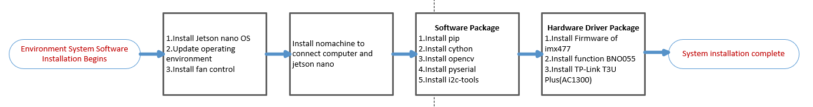
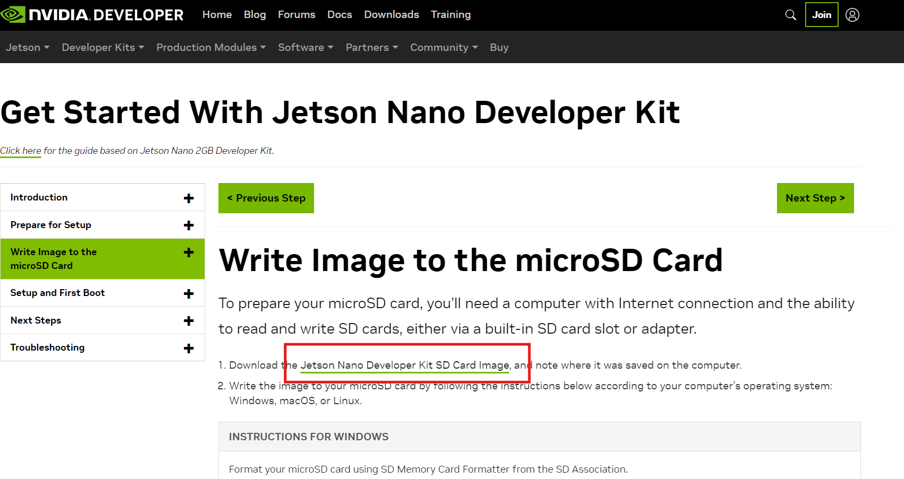
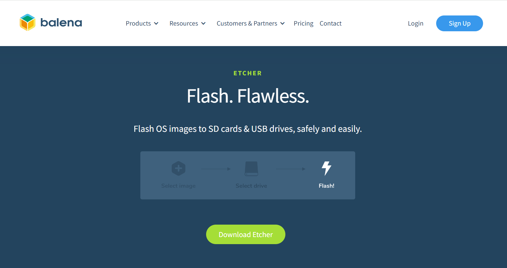
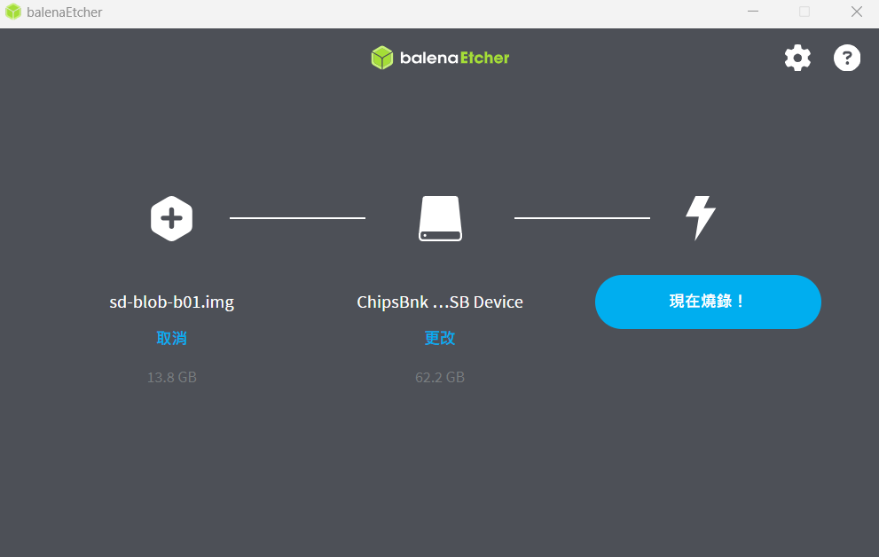
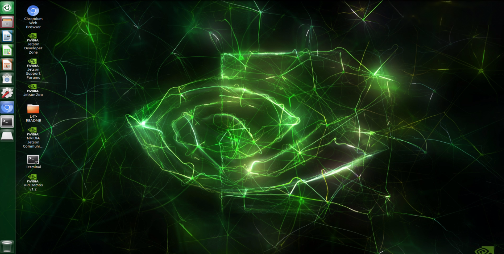

<div align=center>  </div>

## <div align="center">Software Platform Construction </div> 

- ### Installing System Software Required for Self-Driving Cars 
  - #### System Platform Software Installation Process Diagram  
  
    
    <br>

    __1.Install Nvidia Jetson Nano OS(Jetson Nano Developer Kit SD Card Image)__
       - Go to the <a href="https://developer.nvidia.com/embedded/learn/get-started-jetson-nano-devkit#write" target="_blank">NVIDIA official website</a> to download the image file.
       - Download the Jetson Nano Developer Kit SD Card Image, and note where it was saved on the computer. 
        
       - Download the <a href="https://etcher.balena.io/" target="_blank">Etcher</a> tool to flash the image file onto the microSD card.
        
       - Select the image file and SD card, then start the flashing process.
        
       - Insert the SD card into Jetson Nano, complete the basic setup, and enter the main screen.
        

    __2.System environment initial setup Steps__
       - Update the operating environment.  
       ```
         sudo apt-get update
         sudo apt-get upgrade
       ```
       - __Enable automatic fan settings__

         Download the Automagic fan control tool for the Nvidia Jetson Nano.
       ```
         git clone https://github.com/Pyrestone/jetson-fan-ctl.git 
         sudo apt install python3-dev 
         cd jetson-fan-ctl
         sudo ./install.sh #Run the fan program and set it to execute at every startup.
       ```

       __Reference links：__<a href="https://github.com/Pyrestone/jetson-fan-ctl?tab=readme-ov-file" target="_blank">Pyrestone/jetson-fan-ctl</a>

       - Install or update pip.
       ```
         sudo apt-get install python3-pip 
         pip3 install --upgrade pip
       ```
       - Install Cython (to use Python in combination with C)
       ```
         pip3 install Cython
       ```
       - Install i2c-tools libraries.
       ```
         sudo apt update 
         sudo apt install -y i2c-tools  
         sudo i2cdetect -y -r 1 
         sudo i2cdetect -y -r 7 
       ```
       - Update all system packages.
       ```
         sudo apt full-upgrade
       ``` 
       - Install pyserial
       ```
         pip install pyserial
       ```
       - Install driver for the Adafruit-BNO055 gyroscope module. 
       ```
         sudo -H python3 -m pip install Adafruit-BNO055
       ```
       - Install the driver for the Camera Module IMX477
       ```
         cd ~
         wget https://github.com/ArduCAM/MIPI_Camera/releases/download/v0.0.3/install_full.sh 
         chmod +x install_full.sh
         ./install_full.sh -m imx477
       ```
       - Install the USB wireless Wi-Fi module driver TP-Link T3U Plus (AC1300) 
       ```
         git clone "https://github.com/RinCat/RTL88x2BU-Linux-Driver.git" /usr/src/rtl88x2bu-git
         sed -i 's/PACKAGE_VERSION="@PKGVER@"/PACKAGE_VERSION="git"/g' /usr/src/rtl88x2bu-git/dkms.conf
         dkms add -m rtl88x2bu -v git
         dkms autoinstall
       ```
       - install the OpenCV application on the Nvidia Jetson Nano
        The installation method has already been explained in the <a href="../OpenCV/README.md" target="_blank">OpenCV Introduction</a> section.

      __The operating system for Self-Driving Cars has been successfully installed.++__
              
# <div align="center">[Return Home](../../)</div> 
