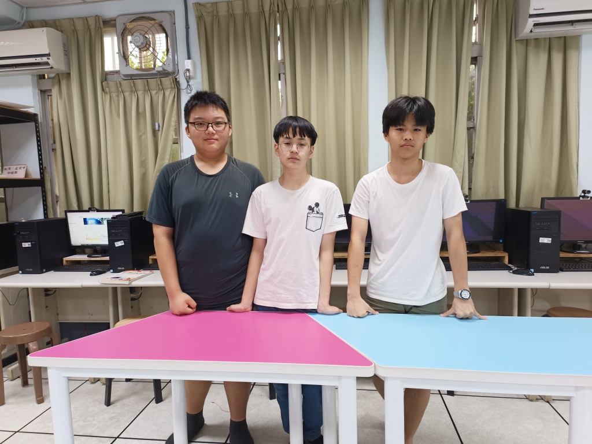
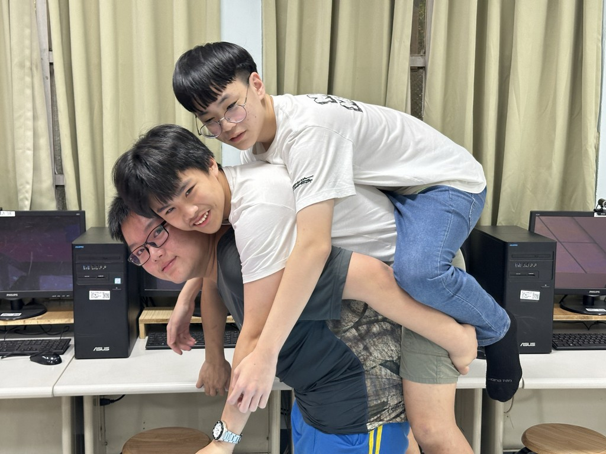
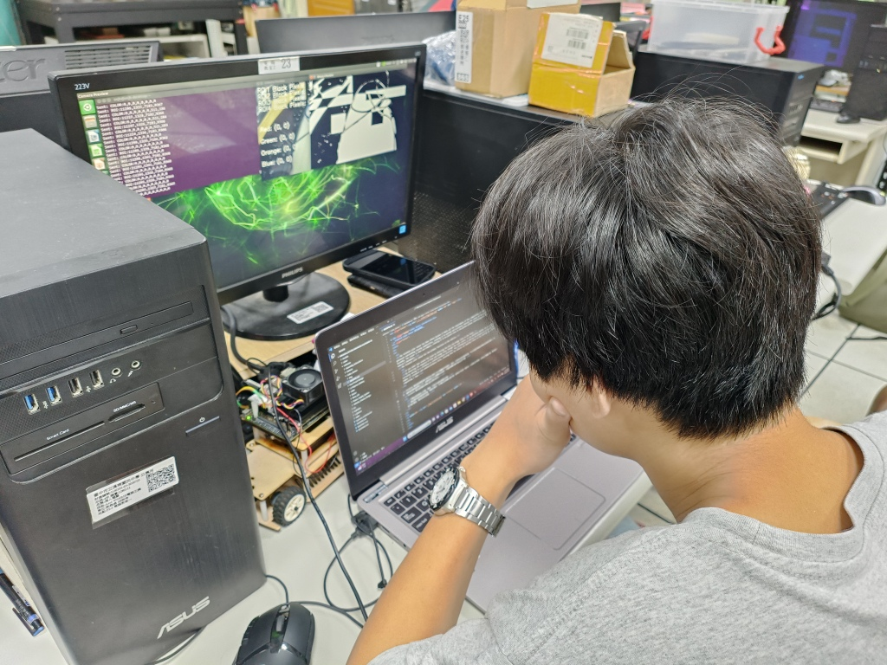
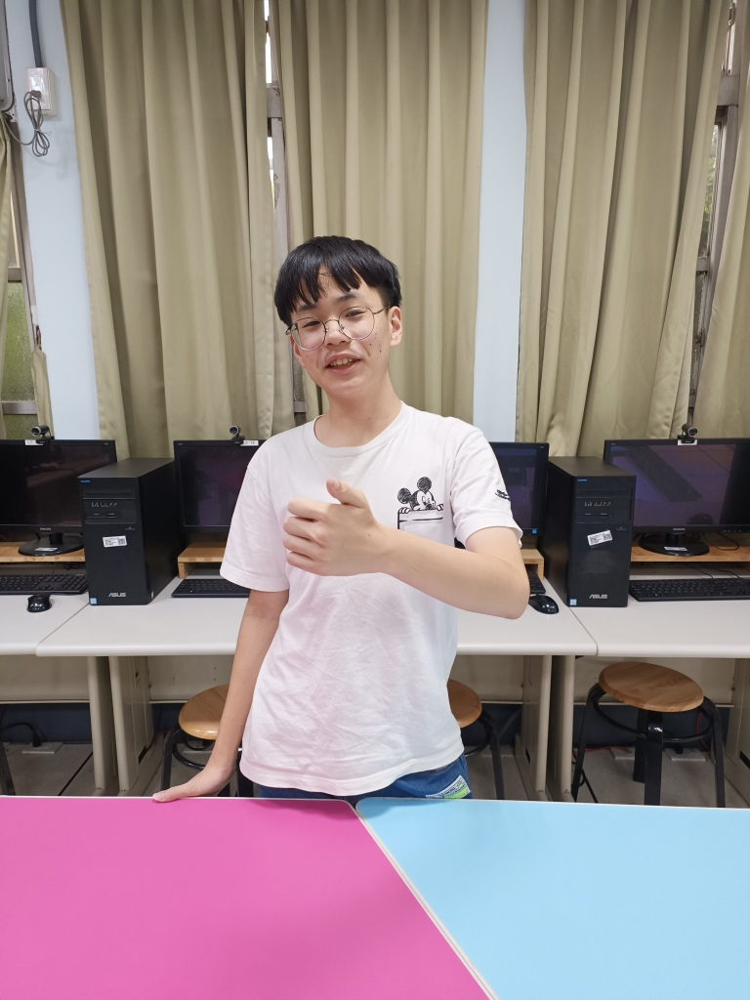
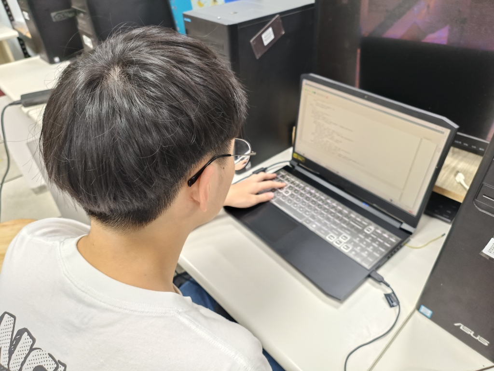
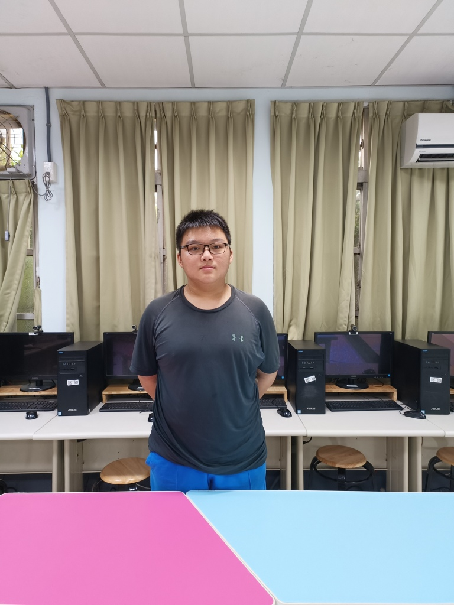
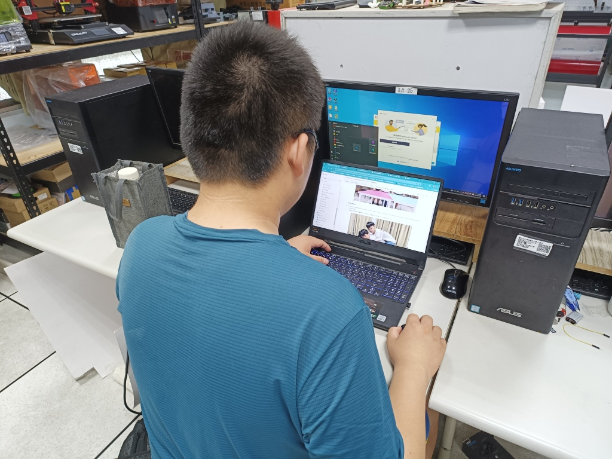

## 
 Team Members Introduction

- ### Team Photo  

  - Today is the first day that our team was established, so I took a photo to commemorate it. The location was chosen in the club classroom.

||
  

- ### Funny Photo
  - This is our attempt to take a photo using the method of stacking Arhats. In fact, the angle of our back is a bit wrong and we almost slipped down.

 
  

## Team Members of Introduction  

<table>
  <tr align="center">
     <th>Personal photo</th>
     <th>Work photo</th>    
  </tr>
  <tr >
      <td align="center">HU,SIAN-YI</td>
      <td align="left">Work Assignments： 
         <ol><li>primarily responsible for writing Code </li>
             <li>Assist in vehicle circuit design </li>
         </ol>
      </td>
  </tr>

  <tr align="center">
      <td> </td>
      <td></td>
  </tr>
    <tr align="center">
     <th>Personal photo</th>
     <th>Work photo</th>    
  </tr>
  <tr align="center">
     <td>LAI,MENG-CHENG</td>
     <td align="left">Work Assignments： 
         <ol><li>primarily responsible for  vehicle hardware integration </li>
             <li>Assist in writing Code </li>
         </ol>
     </td>    
  </tr>

  <tr align="center">
      <td> </td>
      <td></td>
  </tr>
    <tr align="center">
     <th>Personal photo</th>
     <th>Work photo</th>    
  </tr>
   <tr>
     <td align="center">HUANG,KE-FU</td>
     <td align="left">Work Assignments： 
         <ol><li>primarily responsible for  writing Code Report recording and writing.</li>
             <li>Assist in vehicle hardware design.  </li>
         </ol>
     </td>    
  </tr>

  <tr align="center">
      <td> </td>
      <td></td>
  </tr>
</table>

# 
[Return Home](../)
 

