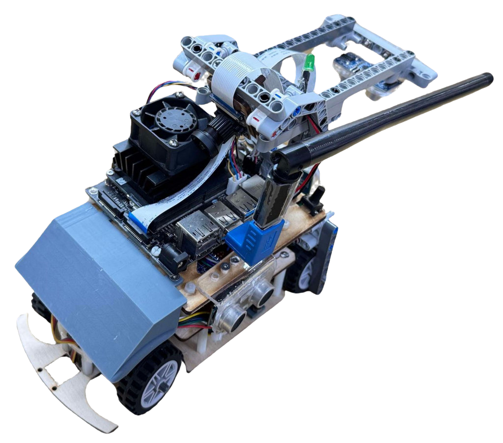
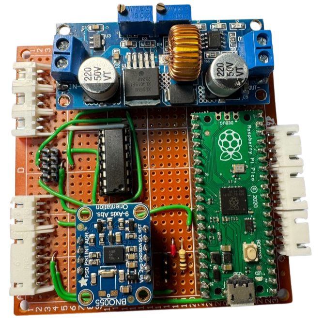

## 
 Vehicle's photos

- ### Vehicle's photos

<table>
  <tr align="center">
    <th>Top View</th>
    <th>Bottom View </th>
  </tr>
    <tr align="center">
    <td> </td>
    <td></td>

  </tr>
    <tr align="center">
    <th>Front view </th>
    <th>Rear view</th>
  </tr>
    </tr>
    <tr align="center">
    <td></td>
    <td></td>
  </tr>
  </tr>
    <tr align="center">
    <th>Left view </th>
    <th>Right view</th>
  </tr>
    </tr>
    <tr align="center">
    <td></td>
    <td></td>
  </tr>
</table>

 

- ### Vehicle Body Structure Display Diagram
  

  <table>
    <tr>
    <th>Top View of the Overall Apparatus</th>
    <th>Middle Layer Structure Top View</th>
    <th>Top View of Vehicle Chassis</th>
    <th>Bottom View of Vehicle Chassis</th>
    </tr>
    <tr align="center">
      <td>  
      </td>
      <td>
      </td>
      <td>
      </td>
      <td></td>
    </tr>
  </table>
  

- ### Circuit Board
    

    <table>
      <tr align="center">
          <th> Circuit Board Top View</th><th>Circuit Board Button View</th>
      </tr>
      <tr align="center">
        <td>  </td><td></td>
      </tr>
    </table>
    

# 
[Return Home](../)
 
