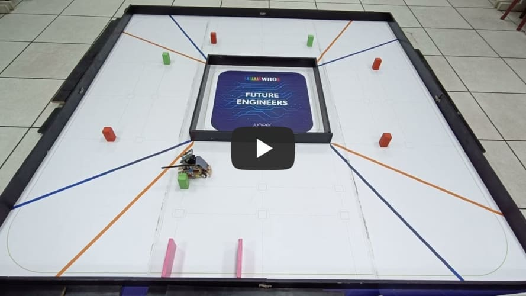
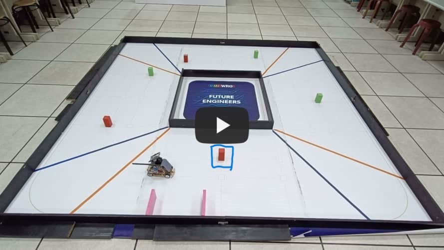
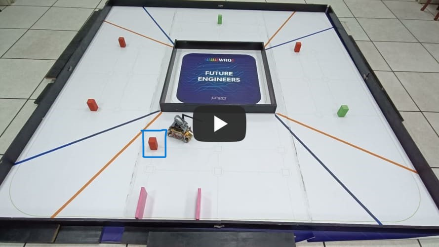
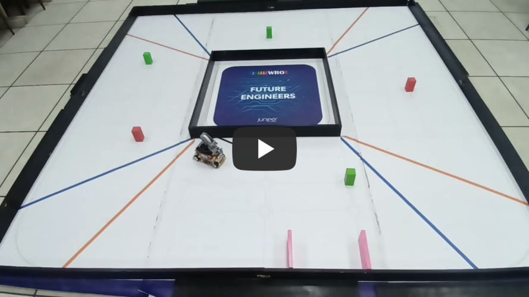
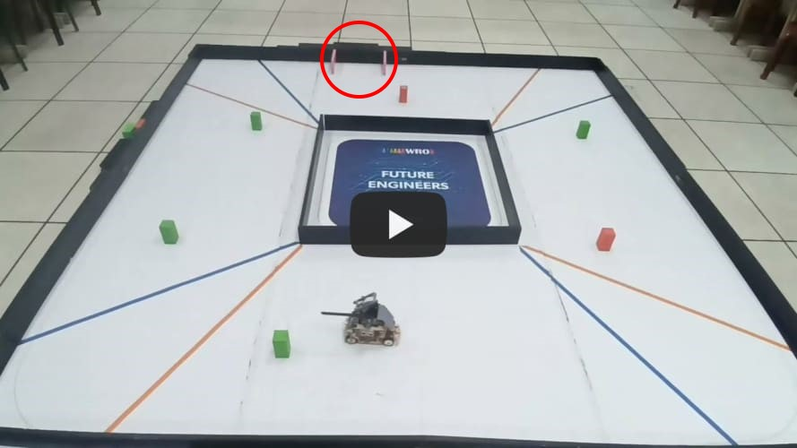
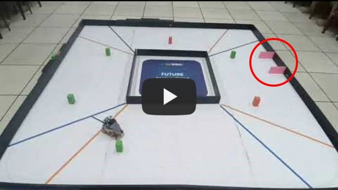
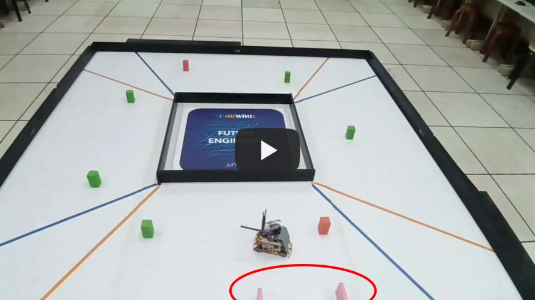
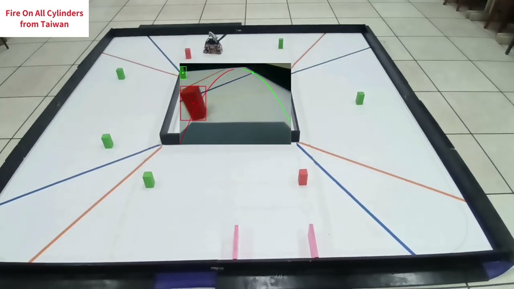

## 
Testing Video of Self-Driving Car in Obstacle Challenge

- #### The last traffic light on the second lap is a green signal.(No need to turn around ) 

  Here is a test video of a vehicle on the second lap, with the last traffic light being green. 
  

  <table >
    <tr >
       <th align="center">The last traffic light on the second lap is a green signal</th>

    </tr>
    <tr >
       <td  width="500" > </td>

    </tr>
    </table>  
    

- #### The last traffic light on the second lap is red.(Need to turn around)  

  Here are test videos of the last traffic light being red in different positions on the second lap.  

  

  <table >
    <tr >
       <th align="center">At Position 1</th>
       <th align="center">At Position 2</th>
       <th align="center">At Position 3</th>
    </tr>
    <tr >
       <td  width="500" > </td>
       <td  width="500" > </td>
       <td  width="500" > </td>
    </tr>
    </table>  
    

- #### Video of parking tests at different positions.
  
  

  <table >
    <tr >
       <th align="center">Position is on the Left</th>
       <th align="center">Position is at the top</th>
       <th align="center">Position is on the right</th>
       <th align="center">Position is at the bottom</th>
    </tr>
    <tr >
       <td  width="500" > </td>
       <td  width="500" > </td>
       <td  width="500" > </td>
       <td  width="500" > </td>
    </tr>
    </table>  
    

 - ### Explanation to Obstacle Challenge

  

  <table >
    <tr >
       <th align="center">ALL Fire On All Cylinders</th>
    </tr>
    <tr >
       <td  width="500" > </td>
    </tr>
    </table>  
  

# 
[Return Home](../../)
  

