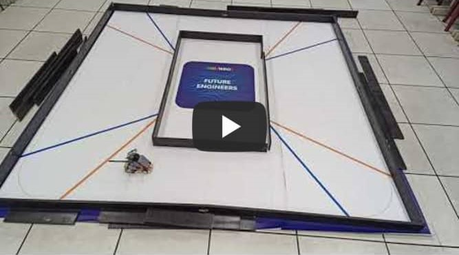

## 
Testing Video of Self-Driving Car in Open Challenge
 

  Here are test videos of vehicles in different power and field combinations.

- ### Full width

  This is a test video of a vehicle in a field set to "wide-wide-wide-wide".
<table>
  <tr align="center">
     <th>Power 50</th>
     <th>Power 70</th>    
  </tr>
  <tr >
     <td width="40%"> </td>
     <td width="40%"></td>
  </tr>
  </table>

- ### Half-width half-narrow
 
  This is a test video of a vehicle in a "wide-narrow-wide-narrow" field configuration, which is more difficult.
<table>
  <tr align="center">
     <th>Power 50</th>
     <th>Power 70</th>    
  </tr>
  <tr >
     <td width="40%"> </td>
     <td width="40%"></td>
  </tr>
  </table>

- ### Full narrow
  This is a testing video of the vehicle on a course set as 'narrow-narrow-narrow-narrow.' As all road widths have been reduced, this results in a limited correction space for the machine, making it easy for it to overshoot during turns and potentially collide with the walls.
<table>
  <tr align="center">
     <th>Power 50</th>
     <th>Power 70</th>    
  </tr>
  <tr >
     <td width="40%"> </td>
     <td width="40%"></td>
  </tr>
  </table>  

- ### wide narrow wide narrow

  These are test videos of a vehicle in a "wide-narrow-wide-narrow" field configuration, recorded clockwise and counterclockwise.
<table>
  <tr align="center">
     <th>Clockwise</th>
     <th>Counter Clockwise</th>    
  </tr>
  <tr >
     <td width="40%"> </td>
     <td width="40%"></td>
  </tr>
  </table>  

# 
[Return Home](../../)
  

